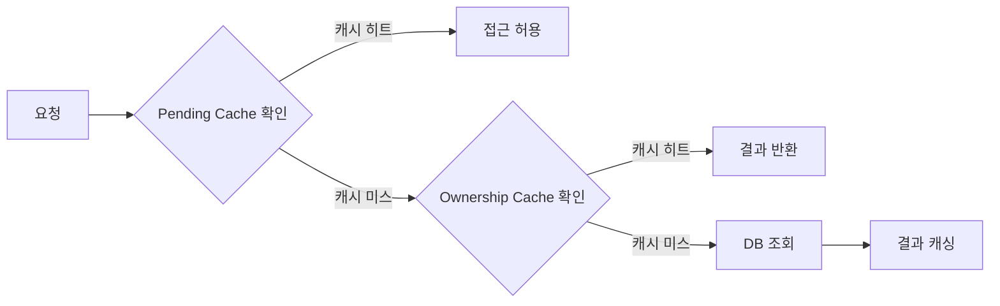
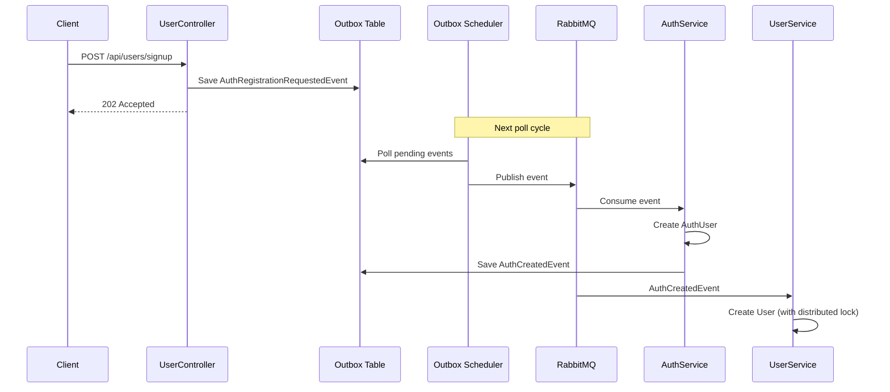

# 📋 백엔드 비즈니스 규칙 분석 리포트

> 이 시스템은 헥사고날 아키텍처와 DDD 원칙을 따르는 Todo 관리 애플리케이션입니다.
> 단순 CRUD를 넘어서는 다양한 비즈니스 규칙, 워크플로우, 제약조건이 구현되어 있습니다.

---

## 1. 📊 상태 전이 규칙 (State Transition Rules)

### 1.1 Task 상태 (TaskStatus)

| 상태 | 설명 | 용도 |
|------|------|------|
| `PENDING` | 시작 전 | 초기 상태 |
| `IN_PROGRESS` | 진행 중 | 작업 시작 |
| `DONE` | 완료 | 성공적 완료 (completedAt 설정) |
| `FAIL` | 실패 | 시도했으나 실패 |
| `CANCELED` | 취소 | 사용자가 중단 |
| `OVERDUE` | 기한 초과 | 마감일 지남 |
| `DEFERRED` | 연기 | 일정 재조정 |
| `SKIPPED` | 건너뜀 | 루틴 건너뛰기 |
| `DELETED` | 소프트 삭제 | 논리적 삭제 |

```java
// Task.java - 상태 변경 시 삭제된 Task 변경 금지 규칙
private void updateStatus(TaskStatus newStatus) {
  if (isDeleted()) {
    throw new TaskValidationException("Cannot change the status of a deleted task");
  }
  this.status = newStatus;
  this.updatedAt = LocalDateTime.now();
}
```

**핵심 규칙:**
- 삭제된 Task는 상태 변경 불가
- `DONE` 상태 전이 시 `completedAt` 자동 설정
- 그 외 상태 전이 시 `completedAt` null 설정

### 1.2 Project 상태 (ProjectStatus)

| 상태 | 설명 |
|------|------|
| `IN_PROGRESS` | 진행 중 (기본값) |
| `DONE` | 완료 |

```java
public void done() {
  if (this.status == ProjectStatus.DONE) return;  // 멱등성
  updateStatus(ProjectStatus.DONE);
  this.completedAt = LocalDateTime.now();
}

public void uncompleted() {
  if (this.status == ProjectStatus.IN_PROGRESS) return;  // 멱등성
  updateStatus(ProjectStatus.IN_PROGRESS);
  this.completedAt = null;
}
```

### 1.3 SubTask 상태 (SubTaskStatus)

| 상태 | 설명 |
|------|------|
| `PENDING` | 미완료 |
| `DONE` | 완료 |
| `DELETED` | 삭제됨 |

```java
public void toggleStatus() {
  if (isDeleted()) {
    throw new SubTaskValidationException("Cannot change the status of a deleted subtask");
  }
  if (this.status == SubTaskStatus.DONE) {
    markPending();
  } else {
    markDone();
  }
}
```

---

## 2. 🔐 권한 검증 규칙 (Authorization Rules)

### 2.1 프로젝트 소유권 검증

**핵심 컴포넌트:**
- `ProjectAccessVerifier.java`
- `ProjectOwnershipPersistenceAdapter.java`

```java
// ProjectAccessVerifier.java
public void verify(UUIDv7 projectId, UUIDv7 userId) {
  boolean isOwner = projectOwnershipPort.isOwner(projectId, userId);
  if (!isOwner) {
    log.warn("[ProjectAccessDenied] requestedUserId={}, projectId={}...");
    throw new ForbiddenProjectAccessException();
  }
}
```

**권한 검증 흐름:**



### 2.2 SubTask 접근 검증

**위치:** `SubTaskAccessVerifier.verify(projectId, taskId, userId)`

1. Project 소유권 확인
2. Task가 해당 Project에 속하는지 확인

---

## 3. 🚫 중복 방지 규칙 (Duplicate Prevention)

### 3.1 사용자 중복 검증

```java
// UserDomainService.java

// 이메일 중복 검증
public void validateEmailPolicy(Email email) {
  if (isEmailDuplicated(email)) {
    throw new UserValidationException("이미 사용 중인 이메일입니다.");
  }
}

// 닉네임 중복 + 예약어 검증
public void validateNicknamePolicy(NickName nickName) {
  if (isNicknameReserved(nickName)) {
    throw new UserValidationException("예약된 닉네임입니다.");
  }
  if (isNicknameDuplicated(nickName)) {
    throw new UserValidationException("이미 사용 중인 닉네임입니다.");
  }
}

// 예약된 닉네임 목록
private static final List<String> RESERVED_NICKNAMES = 
    List.of("admin", "root", "system");
```

### 3.2 Reorder 중복 ID 검증

```java
// ReorderTasksCommandHandler.java
private void validateDuplicates(List<TaskReorderCommand> commands) {
  long distinct = commands.stream()
      .map(TaskReorderCommand::taskId)
      .distinct()
      .count();
  if (distinct != commands.size()) {
    throw new IllegalArgumentException("Duplicate taskId detected in reorder commands");
  }
}
```

**적용 대상:**
- Task Reorder
- Project Reorder
- SubTask Reorder

---

## 4. ⚡ 멱등성 처리 (Idempotency)

### 4.1 삭제 작업의 멱등성

**위치:**
- `DeleteTaskCommandHandler.java`
- `DeleteProjectCommandHandler.java`
- `DeleteSubTaskCommandHandler.java`

```java
// 멱등성: 이미 삭제되었거나 존재하지 않는 Task는 경고 로그만 남기고 정상 처리
if (!Boolean.TRUE.equals(isDeleted)) {
  log.warn(StructuredLog.json(Map.of(
      "message", "Task already deleted or not found (idempotent skip)",
      "taskId", command.taskId().value().toString())));
  return; // 예외 없이 정상 종료
}
```

**적용 원칙:**
- 이미 삭제된 리소스 삭제 요청 → 예외 없이 정상 응답
- 존재하지 않는 리소스 삭제 요청 → 예외 없이 정상 응답
- WARN 레벨 로그로 기록

### 4.2 도메인 모델의 상태 전이 멱등성

```java
// Project.java
public void done() {
  if (this.status == ProjectStatus.DONE) {
    return;  // 이미 완료 상태면 아무것도 하지 않음
  }
  // ...
}
```

---

## 5. 🔒 분산 락 (Distributed Lock)

```java
// DistributedLockService.java
@Service
public class DistributedLockService {
  private static final String USER_CREATION_LOCK_PREFIX = "user_creation_lock:";
  private static final String AUTH_USER_CREATION_LOCK_PREFIX = "auth_user_creation_lock:";
  
  public boolean tryLock(String lockKey, long timeout, TimeUnit timeUnit) {
    // Redis SETNX 기반 분산 락
    Boolean acquired = redisTemplate.opsForValue()
      .setIfAbsent(fullLockKey, LOCK_VALUE, Duration.ofMillis(timeUnit.toMillis(timeout)));
    return Boolean.TRUE.equals(acquired);
  }
}
```

**사용 위치:** `UserCreationEventHandler.java` - 사용자 생성 시 중복 생성 방지

```java
String lockKey = DistributedLockService.createUserCreationLockKey(event.userId());
if (!distributedLockService.tryLock(lockKey, 30, TimeUnit.SECONDS)) {
  log.warn("⚠️ Failed to acquire lock for user creation: userId={}", event.userId());
  return;
}
try {
  // 사용자 생성 로직
} finally {
  distributedLockService.unlock(lockKey);
}
```

---

## 6. 🏃 Race Condition 해결: Pending Cache

**문제:** 프로젝트 생성 후 즉시 Task 생성 시, 비동기 처리로 인해 프로젝트가 아직 DB에 없을 수 있음

**해결책:** `ProjectPendingCachePort`

```java
// ProjectCommandService.java - 프로젝트 생성 시
public void createProject(CreateProjectCommand command) {
  // 1. Pending Cache에 프로젝트 저장 (Race Condition 해결)
  pendingCachePort.savePendingProject(
      command.id().value().toString(), 
      command.userId().value().toString());
  
  // 2. 비동기 메시지 전송
  messageProducerPort.sendCreateProject(command);
}

// ProjectOwnershipPersistenceAdapter.java - 소유권 검증 시
public boolean isOwner(UUIDv7 projectId, UUIDv7 userId) {
  // 1. 먼저 Pending Cache 확인 (트랜잭션 없음)
  if (projectPendingCachePort.isPending(projectId.value().toString(), userId.value().toString())) {
    return true;  // 새 프로젝트 생성 직후 접근 허용
  }
  // 2. DB 조회
  return self.checkOwnershipInDb(projectId, userId);
}
```

---

## 7. 📋 유효성 검증 규칙 (Validation Rules)

### 7.1 Value Objects의 자체 검증

| Value Object | 검증 규칙 |
|-------------|----------|
| `Email` | 정규식 패턴 검증, 필수값 |
| `NickName` | 2~30자, 필수값 |
| `Age` | 1~120세 |

### 7.2 도메인 모델 유효성

```java
// Task.java
private void validateTitle(String title) {
  if (title == null || title.trim().isEmpty()) {
    throw new TaskValidationException("Title is required");
  }
  if (title.length() > 255) {
    throw new TaskValidationException("Title cannot be longer than 255 characters");
  }
}

private void validateDescription(String description) {
  if (description != null && description.length() > 1000) {
    throw new TaskValidationException("Description cannot be longer than 1000 characters");
  }
}
```

**Project 검증 (동일 패턴):**
- Title: 필수, 255자 이하
- Description: 1000자 이하
- Position: 0 이상

### 7.3 삭제된 엔티티 수정 금지

모든 도메인 모델에서 일관되게 적용:

```java
// 삭제된 엔티티 업데이트 방지
public void updateTitle(String title) {
  if (isDeleted()) {
    throw new TaskValidationException("Cannot update a deleted task");
  }
  // ...
}
```

---

## 8. 🔄 Position Reorder 워크플로우

### 8.1 Unique Constraint 충돌 방지 2-Phase Commit

```java
// ReorderTasksCommandHandler.java
private List<Task> persistNormalized(UUIDv7 projectId, List<Task> tasks) {
  // Phase 1: 임시 음수 position으로 변경 (Unique Constraint 회피)
  AtomicInteger tempIndex = new AtomicInteger(0);
  sorted.forEach(task -> task.updatePositionForReorder(-tempIndex.incrementAndGet()));
  taskRepositoryPort.saveAll(sorted);
  
  // Phase 2: Flush 강제
  taskRepositoryPort.findMaxPositionByProjectId(projectId);
  
  // Phase 3: 최종 position으로 정규화
  AtomicInteger normalizer = new AtomicInteger(0);
  sorted.forEach(task -> task.updatePosition(normalizer.getAndIncrement()));
  return taskRepositoryPort.saveAll(sorted);
}
```

**이유:** `(project_id, position)` 복합 유니크 제약조건 충돌 방지

---

## 9. 📬 도메인 이벤트 & Outbox 패턴

### 9.1 도메인 이벤트 발행

**주요 이벤트:**
- `TaskCreatedEvent`, `TaskUpdatedEvent`, `TaskDeletedEvent`
- `ProjectCreatedEvent`, `ProjectDeletedEvent`
- `SubTaskCreatedEvent`, `SubTaskUpdatedEvent`, `SubTaskDeletedEvent`
- `UserRegisteredEvent`, `UserUpdatedEvent`, `UserDeletedEvent`
- `AuthCreatedEvent`

**패턴:** 트랜잭션 내에서 이벤트 발행 → `@TransactionalEventListener`로 처리

```java
// CreateTaskCommandHandler.java
Task saved = transactionTemplate.execute(status -> {
  Task task = taskRepositoryPort.create(...);
  // IMPORTANT: 트랜잭션 내부에서 이벤트 발행
  eventPublisher.publishEvent(new TaskCreatedEvent(task.getId(), projectId));
  return task;
});
```

### 9.2 Outbox 패턴 (At-Least-Once 보장)

**위치:** `OutboxPort`, `OutboxEventAuthEntity`, `OutboxEventUserEntity`

```java
// UserCreationEventHandler.java
if (!event.isOAuth2User()) {
  outboxPort.save(
    "User",
    new UserRegisteredEvent(
      savedUser.getId(),
      savedUser.getEmail().value(),
      // ...
    )
  );
}
```

**흐름:**
1. 도메인 트랜잭션 + Outbox 테이블 저장 (단일 트랜잭션)
2. 스케줄러가 Outbox 폴링 → MQ 발행
3. 컨슈머가 이벤트 처리

---

## 10. 👤 사용자 생성 워크플로우

### 10.1 일반 회원가입 플로우



### 10.2 OAuth2 로그인 플로우

```java
// OAuth2UserService.java
@Transactional
public AuthUser oAuth2Login(OAuth2UserInfo userInfo, String provider) {
  return authUserRepositoryPort.findByEmail(userInfo.getEmail())
      .map(existing -> handleExistingUser(existing))
      .orElseGet(() -> handleNewOAuth2User(userInfo, provider));
      // Outbox에 AuthCreatedEvent 저장
}
```

---

## 11. 🛡️ User 도메인 잠금(Lock) 규칙

```java
// User.java
public void lock() {
  if (isDeleted()) {
    throw new UserValidationException("삭제된 사용자는 잠글 수 없습니다.");
  }
  if (this.locked) {
    throw new UserValidationException("이미 잠금 상태입니다.");
  }
  this.locked = true;
  this.updatedAt = LocalDateTime.now();
}

public void unlock() {
  if (isDeleted()) {
    throw new UserValidationException("삭제된 사용자는 잠금 해제할 수 없습니다.");
  }
  if (!this.locked) {
    throw new UserValidationException("이미 잠금 해제 상태입니다.");
  }
  // ...
}
```

---

## 12. 📊 비즈니스 규칙 요약 표

| 카테고리 | 규칙 | 위치 |
|---------|------|------|
| **상태 전이** | 삭제된 엔티티 상태 변경 불가 | Task, Project, SubTask 도메인 |
| **상태 전이** | DONE 상태 시 completedAt 설정 | `Task.done()`, `Project.done()` |
| **권한** | 프로젝트 소유자만 접근 가능 | `ProjectAccessVerifier` |
| **권한** | Pending Cache로 Race Condition 해결 | `ProjectOwnershipPersistenceAdapter` |
| **중복 방지** | 이메일/닉네임 중복 검증 | `UserDomainService` |
| **중복 방지** | 예약 닉네임 사용 금지 | `UserDomainService` |
| **중복 방지** | Reorder 시 중복 ID 검증 | `Reorder*CommandHandler` |
| **멱등성** | 삭제 작업 멱등성 보장 | `Delete*CommandHandler` |
| **동시성** | 분산 락으로 사용자 중복 생성 방지 | `UserCreationEventHandler` |
| **유효성** | Title 필수, 255자 제한 | Task, Project, SubTask |
| **유효성** | Description 1000자 제한 | Task, Project |
| **유효성** | Age 1~120세 제한 | `Age` Value Object |
| **유효성** | Position 0 이상 | Task, Project, SubTask |
| **워크플로우** | 2-Phase Reorder (Unique 충돌 방지) | `ReorderTasksCommandHandler` |
| **워크플로우** | Outbox 패턴으로 이벤트 발행 보장 | `Outbox*`, `*EventHandler` |
| **잠금** | 삭제된 사용자 잠금/해제 불가 | `User.lock()`, `unlock()` |
| **잠금** | 이미 잠긴 사용자 재잠금 불가 | `User.lock()` |

---

## 🎯 결론

이 시스템은 DDD + 헥사고날 아키텍처를 충실히 따르며, 다음과 같은 패턴을 구현합니다:

| 패턴 | 설명 |
|------|------|
| **상태 기계 패턴** | TaskStatus의 다양한 상태 전이 규칙 |
| **분산 락** | Redis 기반 동시성 제어 |
| **Pending Cache** | 비동기 처리 시 Race Condition 해결 |
| **Outbox 패턴** | 이벤트 발행의 At-Least-Once 보장 |
| **2-Phase Reorder** | Unique Constraint 충돌 방지 |
| **Value Objects** | 도메인 불변성과 자체 검증 |
| **멱등성** | 삭제 작업의 안전한 재시도 |

