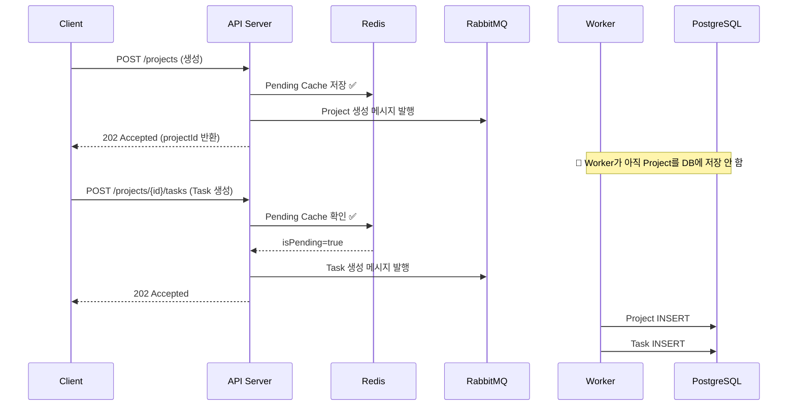
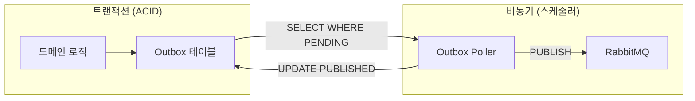
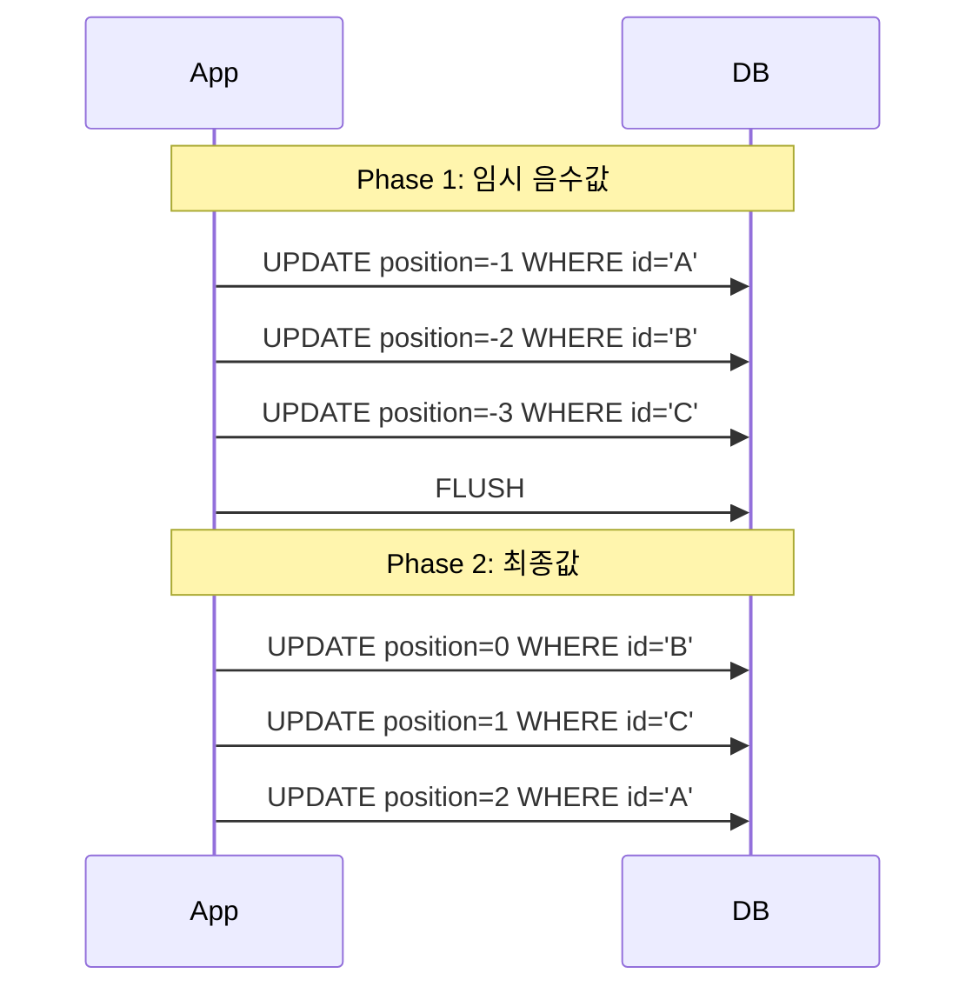
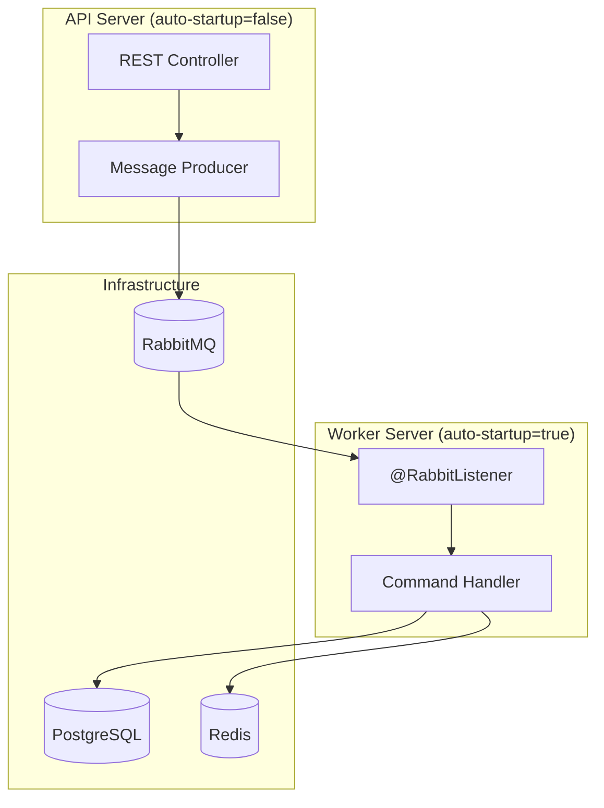
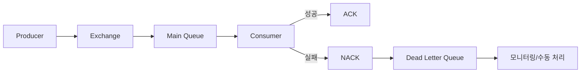

# 🔒 동시성 제어 및 비동기 처리

> 분산 환경에서의 Race Condition 해결, 중복 방지, 안전한 재시도 및 비동기 처리 전략

---

## 📋 목차

1. [동시성 제어](#1-동시성-제어)
   - Pending Cache (Race Condition 해결)
   - 분산락 (중복 생성 방지)
   - Outbox + 멱등 처리
   - 2-Phase Reorder
2. [비동기 처리 흐름](#2-비동기-처리-흐름-apiworker-분리)
3. [Retry / DLQ 설계](#3-retry--dlq-설계)

> 💡 **도메인 규칙(상태 전이, 권한 검증, 유효성 검증)** 상세는 [BusinessRules.md](./BusinessRules.md) 참조

---

## 1. 동시성 제어

<a id="lm-backend-spring-api-write"></a>
### 1.1 Pending Cache (Race Condition 해결)

**문제 상황**: 프로젝트 생성 후 즉시 Task 생성 시, 비동기 처리로 인해 프로젝트가 아직 DB에 없을 수 있음



**적용 도메인**: Project

**구현 위치**:
- `ProjectPendingCachePort.java` - 포트 인터페이스
- `RedisProjectPendingCacheAdapter.java` - Redis 어댑터
- `ProjectOwnershipPersistenceAdapter.java` - 소유권 검증

**핵심 코드**:

```java
// ProjectOwnershipPersistenceAdapter.java
@Override
public boolean isOwner(UUIDv7 projectId, UUIDv7 userId) {
  // 1. 먼저 Pending Cache 확인 (트랜잭션 없음, Redis만)
  if (projectPendingCachePort.isPending(
      projectId.value().toString(), 
      userId.value().toString())) {
    return true;  // 새 프로젝트 생성 직후 접근 허용
  }
  // 2. DB 조회 (짧은 readOnly 트랜잭션 + @Cacheable)
  return self.checkOwnershipInDb(projectId, userId);
}

// RedisProjectPendingCacheAdapter.java
@Override
public void savePendingProject(String projectId, String userId) {
  String key = PREFIX + projectId + ":" + userId;
  redisTemplate.opsForValue().set(key, "pending", ttl, TimeUnit.MINUTES);
}
```

---

### 1.2 분산락 (사용자 중복 생성 방지)

**적용 도메인**: User, AuthUser

**구현 위치**:
- `DistributedLockService.java`
- `UserCreationEventHandler.java`

**구현 방식**: Redis SETNX

```java
// DistributedLockService.java
public boolean tryLock(String lockKey, long timeout, TimeUnit timeUnit) {
  String fullLockKey = LOCK_KEY_PREFIX + lockKey;
  Boolean acquired = redisTemplate.opsForValue()
      .setIfAbsent(fullLockKey, LOCK_VALUE, Duration.ofMillis(timeUnit.toMillis(timeout)));
  return Boolean.TRUE.equals(acquired);
}

public static String createUserCreationLockKey(String userId) {
  return USER_CREATION_LOCK_PREFIX + userId;
}
```

**사용 예시**:

```java
// UserCreationEventHandler.java
public void handleUserCreationRequested(UserCreationRequestedEvent event) {
  String lockKey = DistributedLockService.createUserCreationLockKey(event.userId());
  
  if (!distributedLockService.tryLock(lockKey, 30, TimeUnit.SECONDS)) {
    log.warn("⚠️ Failed to acquire lock for user creation: userId={}", event.userId());
    return;  // 다른 워커가 처리 중 → 스킵
  }
  
  try {
    // 사용자 생성 로직
    createUser(event);
  } finally {
    distributedLockService.unlock(lockKey);
  }
}
```

---

### 1.3 Outbox + 멱등 처리 (안전한 재시도)

**적용 도메인**: Auth, User



**구현 위치**:

| 컴포넌트 | 도메인 | 파일 |
|---------|-------|------|
| Outbox Entity | Auth | `OutboxEventAuthEntity.java` |
| Outbox Entity | User | `OutboxEventUserEntity.java` |
| Publisher | Auth | `OutboxEventAuthPublisher.java` |
| Processor | Auth | `OutboxEventAuthProcessor.java` |

**Outbox 폴링 코드**:

```java
// OutboxEventAuthPublisher.java
@Scheduled(fixedDelayString = "${auth.outbox.publisher.fixed-delay:1000}")
public void publishPendingEvents() {
  Pageable page = PageRequest.of(0, batchSize, Sort.by("createdAt", "id"));
  List<OutboxEventAuthEntity> batch = outboxEventAuthRepository
      .findByStatus(OutboxEventAuthEntity.Status.PENDING, page);
  if (batch.isEmpty()) return;
  for (OutboxEventAuthEntity entity : batch) {
    outboxEventAuthProcessor.processOne(entity);  // REQUIRES_NEW 트랜잭션
  }
}
```

**멱등성 처리**:

```java
// DeleteTaskCommandHandler.java
if (!Boolean.TRUE.equals(isDeleted)) {
  log.warn(StructuredLog.json(Map.of(
      "message", "Task already deleted or not found (idempotent skip)",
      "taskId", command.taskId().value().toString())));
  return;  // 예외 없이 정상 종료 (멱등성)
}
```

**적용 대상**:
- Task 삭제 (`DeleteTaskCommandHandler`)
- Project 삭제 (`DeleteProjectCommandHandler`)
- SubTask 삭제 (`DeleteSubTaskCommandHandler`)

---

### 1.4 2-Phase Reorder (Unique 충돌 회피)

**적용 도메인**: Task, Project, SubTask

**문제 상황**:

```sql
-- 기존 상태
task_id=A, position=0
task_id=B, position=1
task_id=C, position=2

-- 순서 변경: A→2, B→0, C→1
UPDATE tasks SET position=2 WHERE id='A';  -- ❌ UNIQUE 충돌! (C가 이미 2)
```

**해결: 2-Phase Commit**



**구현 위치**: `ReorderTasksCommandHandler.java`

**핵심 코드**:

```java
// ReorderTasksCommandHandler.java
private List<Task> persistNormalized(UUIDv7 projectId, List<Task> tasks) {
  // 1. Phase 1: Temporary Update (Negative Range)
  AtomicInteger tempIndex = new AtomicInteger(0);
  sorted.forEach(task -> task.updatePositionForReorder(-tempIndex.incrementAndGet()));
  taskRepositoryPort.saveAll(sorted);
  
  // 2. Force Flush (Trigger DB Query)
  taskRepositoryPort.findMaxPositionByProjectId(projectId);
  
  // 3. Phase 2: Final Update (Normalized Range)
  AtomicInteger normalizer = new AtomicInteger(0);
  sorted.forEach(task -> task.updatePosition(normalizer.getAndIncrement()));
  
  return taskRepositoryPort.saveAll(sorted);
}
```

---

<a id="lm-backend-spring-worker-consume"></a>
## 2. 비동기 처리 흐름 (API/Worker 분리)

### 아키텍처 개요



### 환경변수 기반 역할 분리

```yaml
# application-dev.yml (API Server)
spring:
  rabbitmq:
    listener:
      simple:
        auto-startup: false  # 리스너 OFF → 메시지 소비 안 함

# application-dev-worker.yml (Worker Server)
spring:
  rabbitmq:
    listener:
      simple:
        auto-startup: true   # 리스너 ON → 메시지 소비
        concurrency: 5
        max-concurrency: 10
        prefetch: 10
```

### 적용 도메인별 큐 구성

| 도메인 | Queue | DLQ | Exchange |
|--------|-------|-----|----------|
| Project | `todo.project.queue` | `todo.project.dlq` | `todo.exchange` |
| Task | `todo.task.queue` | `todo.task.dlq` | `todo.exchange` |
| SubTask | `todo.subtask.queue` | `todo.subtask.dlq` | `todo.exchange` |
| Auth | `app.events.auth` | `app.events.auth.dlq` | `app.events` |
| User | `app.events.user` | `app.events.user.dlq` | `app.events` |

### 메시지 리스너 구현

```java
// TaskEventListener.java
@RabbitListener(queues = RabbitConfig.QUEUE_TASK)
public void receive(List<Message> messages) {
  log.info("[TASK] Received batch of {} messages", messages.size());
  
  for (Message message : messages) {
    try {
      Object event = messageConverter.fromMessage(message);
      handleEvent(event);
    } catch (Exception e) {
      log.error("[TASK] Failed to process message: {}", e.getMessage(), e);
      // 개별 메시지 실패는 로깅만 하고 계속 진행 (batch 전체 실패 방지)
    }
  }
}

private void handleEvent(Object event) {
  switch (event) {
    case TaskCreatedEvent e -> crudHandler.handleCreate(e);
    case TaskUpdatedEvent e -> crudHandler.handleUpdate(e);
    case TaskDeletedEvent e -> crudHandler.handleDelete(e);
    case TaskStatusChangedEvent e -> statusChangeHandler.handleChangeStatus(e);
    case TaskBatchReorderEvent e -> reorderHandler.handleReorder(e);
    default -> log.warn("[TASK] Unknown message type");
  }
}
```

---

## 3. Retry / DLQ 설계

### DLQ (Dead Letter Queue) 구성

**구현 위치**:
- `RabbitConfig.java`
- `RabbitMQConfig.java`

**핵심 설정**:

```java
// RabbitConfig.java
private List<Declarable> createQueueAndBindings(
    String queueName, String dlqName, String routingKey, TopicExchange exchange) {
  
  // 1. DLQ 생성
  Queue dlq = QueueBuilder.durable(dlqName).build();
  
  // 2. Main Queue에 DLQ 연결
  Queue queue = QueueBuilder.durable(queueName)
      .withArgument("x-dead-letter-exchange", "")
      .withArgument("x-dead-letter-routing-key", dlqName)  // 실패 시 이동
      .build();
  
  Binding binding = BindingBuilder.bind(queue).to(exchange).with(routingKey);
  
  return List.of(dlq, queue, binding);
}
```

### DLQ 흐름



### 재시도 정책

```yaml
# application-dev.yml
spring:
  rabbitmq:
    listener:
      simple:
        default-requeue-rejected: false  # 실패한 메시지를 큐에 다시 넣지 않음 (DLQ로 이동)
```

**정책**:
- ❌ 자동 재시도 없음 (`default-requeue-rejected: false`)
- ✅ 실패 시 즉시 DLQ로 이동
- ✅ DLQ 메시지는 수동 분석 후 재처리

### Outbox 실패 처리

```java
// OutboxEventAuthProcessor.java
@Transactional(propagation = Propagation.REQUIRES_NEW)
public void processOne(OutboxEventAuthEntity entity) {
  try {
    messagePublisherPort.publish(topic, key, payloadJson, headers);
    entity.markPublished(Instant.now());  // 성공: PUBLISHED
  } catch (Exception ex) {
    log.error("[AUTH] Failed to publish outbox event id={}", entity.getId());
    entity.markFailed(ex.getMessage());   // 실패: FAILED
  }
  outboxEventAuthRepository.save(entity);  // 상태 업데이트
}
```

**Outbox 상태**:
| 상태 | 의미 |
|------|------|
| `PENDING` | 발행 대기 |
| `PUBLISHED` | 발행 완료 |
| `FAILED` | 발행 실패 (수동 분석 필요) |

---

## 📊 도메인별 적용 현황 요약

| 기능 | Task | Project | SubTask | User | Auth |
|------|:----:|:-------:|:-------:|:----:|:----:|
| Pending Cache | - | ✅ | - | - | - |
| 분산락 | - | - | - | ✅ | ✅ |
| Outbox 패턴 | - | - | - | ✅ | ✅ |
| 멱등 삭제 | ✅ | ✅ | ✅ | - | - |
| 2-Phase Reorder | ✅ | ✅ | ✅ | - | - |
| 비동기 처리 | ✅ | ✅ | ✅ | ✅ | ✅ |
| DLQ | ✅ | ✅ | ✅ | ✅ | ✅ |
