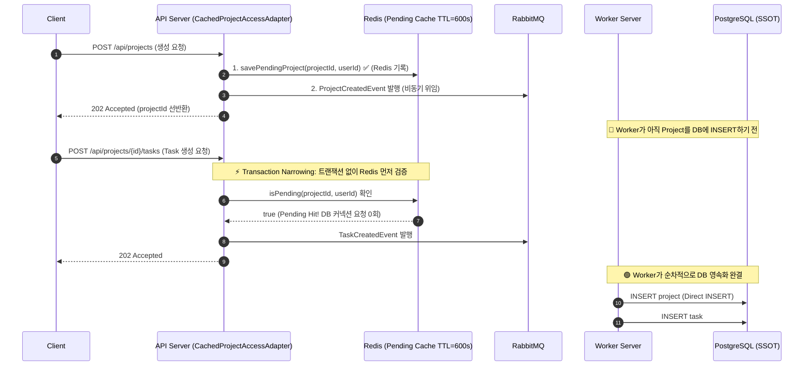
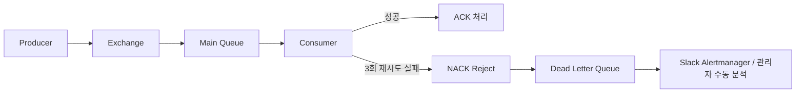

# 🔒 동시성 제어 및 비동기 처리 아키텍처

> **분산 고부하(1000VU) 환경에서의 Race Condition 해결, JPA Direct INSERT 최적화, 가상 스레드 피닝 방어, Outbox 멱등 처리 및 안전한 비동기 백프레셔 전략**

---

## 📋 목차

1. [동시성 및 트랜잭션 제어 (Concurrency & Transaction)](#1-동시성-및-트랜잭션-제어)
   - 1.1 [Pending Cache & Transaction Narrowing (생성 직후 Race Condition 방어)](#11-pending-cache--transaction-narrowing-생성-직후-race-condition-방어)
   - 1.2 [Persistable.isNew() Direct INSERT (UUIDv7 merge 2배 I/O 병목 제거)](#12-persistableisnew-direct-insert-uuidv7-merge-2배-io-병목-제거)
   - 1.3 [AsyncMessagePublishingDecorator & Semaphore(100) (피닝 및 백프레셔 밸브)](#13-asyncmessagepublishingdecorator--semaphore100-피닝-및-백프레셔-밸브)
   - 1.4 [TransactionAwareCacheEvictor (afterCommit 트랜잭션 인지형 무효화)](#14-transactionawarecacheevictor-aftercommit-트랜잭션-인지형-무효화)
   - 1.5 [분산락 (사용자 중복 생성 및 이벤트 중복 처리 방지)](#15-분산락-사용자-중복-생성-및-이벤트-중복-처리-방지)
   - 1.6 [Transactional Outbox + 멱등 처리 (메시지 유실 0건 보장)](#16-transactional-outbox--멱등-처리-메시지-유실-0건-보장)
   - 1.7 [2-Phase Reorder (위치 변경 동시성 충돌 방지)](#17-2-phase-reorder-위치-변경-동시성-충돌-방지)
2. [비동기 처리 흐름 (API / Worker 물리 분리)](#2-비동기-처리-흐름-apiworker-물리-분리)
   - 2.1 [아키텍처 개요 및 런타임 분리](#21-아키텍처-개요-및-런타임-분리)
   - 2.2 [환경변수 기반 역할 분리 (YAML 설정)](#22-환경변수-기반-역할-분리-yaml-설정)
   - 2.3 [적용 도메인별 큐/Exchange 구성](#23-적용-도메인별-큐exchange-구성)
   - 2.4 [배치 메시지 리스너 구현체](#24-배치-메시지-리스너-구현체)
3. [Retry / DLQ 2단계 장애 복구 설계](#3-retry--dlq-2단계-장애-복구-설계)
   - 3.1 [DLQ (Dead Letter Queue) 바인딩 팩토리](#31-dlq-dead-letter-queue-바인딩-팩토리)
   - 3.2 [DLQ 메시지 라우팅 흐름](#32-dlq-메시지-라우팅-흐름)
   - 3.3 [Outbox REQUIRES_NEW 독립 실패 격리](#33-outbox-requires_new-독립-실패-격리)
4. [📊 도메인별 동시성 제어 적용 현황 요약](#4--도메인별-동시성-제어-적용-현황-요약)

> 💡 **도메인 규칙(상태 전이, 권한 검증, 유효성 검증)** 상세는 [BusinessRules.md](./BusinessRules.md) 참조

---

## 1. 동시성 및 트랜잭션 제어

<a id="lm-backend-spring-api-write"></a>
### 1.1 Pending Cache & Transaction Narrowing (생성 직후 Race Condition 방어)

**문제 상황**: 
사용자가 프로젝트를 생성(202 Accepted 비동기 접수)한 직후 즉시 상세 페이지로 진입하거나 태스크를 생성할 때, 비동기 Worker에 의한 DB 저장이 완료되기 전이라도 소유권 인가가 100% 정상 통과되어야 하며, 이 과정에서 DB 커넥션 풀(HikariCP)이 `idle in transaction` 상태로 낭비되는 것을 방지해야 합니다.



**적용 도메인**: Project, Task, SubTask

**구현 위치**:
- `ProjectPendingCachePort.java` - 포트 인터페이스
- `RedisProjectPendingCacheAdapter.java` - Redis Pending 캐시 어댑터
- `CachedProjectAccessAdapter.java` - Zero-Qualifier POJO / 비트랜잭션 캐시 진입점
- `CachedProjectJpaReader.java` - 짧은 `readOnly` 트랜잭션 및 L2 캐시 리더

**핵심 코드**:

```java
// CachedProjectAccessAdapter.java
@RequiredArgsConstructor
public class CachedProjectAccessAdapter implements ProjectAccessPort {

  private final ProjectAccessPort projectAccessPort;
  private final ProjectPendingCachePort projectPendingCachePort;

  @Override
  public boolean isOwner(final UUIDv7 projectId, final UUIDv7 userId) {
    // 1단계: 트랜잭션 없는 상태에서 Redis Pending Cache 먼저 확인 (DB 커넥션 점유 0ms)
    boolean isPending = projectPendingCachePort.isPending(
        projectId.value().toString(), userId.value().toString());
    
    if (isPending) {
      return true; // DB 커넥션 획득 없이 O(1) 즉시 반환 (Short-Circuit)
    }

    // 2단계: Pending 미스 시에만 하위 리더로 위임 (짧은 readOnly 트랜잭션 가동)
    return projectAccessPort.isOwner(projectId, userId);
  }
}

// RedisProjectPendingCacheAdapter.java
@RequiredArgsConstructor
public class RedisProjectPendingCacheAdapter implements ProjectPendingCachePort {

  private final RedisTemplate<String, Object> redisTemplate;

  @Override
  public void savePendingProject(final String projectId, final String userId) {
    String key = CacheKeyGenerator.generateKey(CacheRegion.PROJECT_PENDING, projectId);
    redisTemplate.opsForValue().set(key, userId, Duration.ofSeconds(CacheConstants.PENDING_PROJECT_TTL_SECONDS));
  }

  @Override
  public boolean isPending(final String projectId, final String userId) {
    String key = CacheKeyGenerator.generateKey(CacheRegion.PROJECT_PENDING, projectId);
    Object cachedUserId = redisTemplate.opsForValue().get(key);
    return cachedUserId instanceof String && cachedUserId.equals(userId);
  }
}
```

---

### 1.2 Persistable.isNew() Direct INSERT (UUIDv7 merge 2배 I/O 병목 제거)

**문제 상황**: 
분산 환경 확장을 위해 `UUIDv7` 식별자를 애플리케이션에서 사전 할당할 때, Spring Data JPA는 식별자 필드가 존재하면 신규 엔티티가 아닌 기존 엔티티로 오판하여 `EntityManager.merge()`를 호출합니다. 이로 인해 **매 쓰기마다 불필요한 `SELECT` 쿼리가 선행되어 DB I/O가 2배로 폭증하고 심각한 락 경합**이 발생했습니다.

**해결책**:
`Persistable<UUID>`를 엔티티에 구현하고 `version == null` 여부로 `isNew()`를 직접 오버라이딩하여, 불필요한 SELECT를 100% 생략하고 즉시 `persist()`(Direct INSERT)를 유도했습니다.

```java
// AuthUserEntity.java / TaskEntity.java / SubTaskEntity.java
@Entity
@Table(name = "auth_user")
@Getter
@NoArgsConstructor(access = AccessLevel.PROTECTED)
public class AuthUserEntity implements Persistable<UUID> {

  @Id
  @Column(nullable = false, updatable = false)
  private UUID id; // 애플리케이션에서 사전 할당된 UUIDv7

  @Version
  @Column(nullable = false)
  private Long version; // 낙관적 락 버전 필드

  /**
   * 식별자가 존재하더라도 version이 null이면 신규 엔티티로 판단하여
   * 불필요한 SELECT(merge) 쿼리를 생략하고 즉시 INSERT 실행
   */
  @Override
  public boolean isNew() {
    return this.version == null;
  }

  @Override
  public UUID getId() {
    return id;
  }
}
```

---

### 1.3 AsyncMessagePublishingDecorator & Semaphore(100) (피닝 및 백프레셔 밸브)

**문제 상황**: 
Java 21 가상 스레드 환경에서 RabbitMQ의 `rabbitTemplate.convertAndSend()`를 동기 호출할 경우, `amqp-client` 내부의 `synchronized` 블록으로 인해 가상 스레드가 플랫폼 스레드(Carrier Thread)에서 언마운트되지 못하고 발이 묶이는 **Carrier Thread Pinning**이 발생하여 전체 JVM 스케줄러가 마비되었습니다.

**해결책**:
1. 발행부(Producer)를 전용 **플랫폼 스레드 풀(FixedThreadPool)**로 물리 격리.
2. `Semaphore(100)` 백프레셔 밸브를 장착하여 동시 발행량을 시스템 한계치(100개)로 제한.

```java
// AsyncMessagePublishingDecorator.java
@Slf4j
public class AsyncMessagePublishingDecorator {

  private final ExecutorService executor; // 전용 플랫폼 스레드 풀 (FixedThreadPool)
  private final Semaphore semaphore;       // 동시 발행 상한선 가드 (Backpressure Valve)
  private final PublishingFailurePort publishingFailurePort;

  public AsyncMessagePublishingDecorator(
      final ExecutorService executor,
      final int maxConcurrentPublishes,
      final PublishingFailurePort publishingFailurePort) {
    this.executor = executor;
    this.semaphore = new Semaphore(maxConcurrentPublishes); // 100개 상한선 고정
    this.publishingFailurePort = publishingFailurePort;
  }

  public void executeAsync(final String exchange, final String destination, final Object payload, final Runnable publishTask) {
    executor.execute(() -> {
      try {
        semaphore.acquire(); // 동시성 상한선(100) 가드 (Fail-safe Backpressure)
        try {
          publishTask.run(); // RabbitMQ convertAndSend 실행
        } finally {
          semaphore.release(); // 리소스 즉시 반환
        }
      } catch (InterruptedException e) {
        Thread.currentThread().interrupt();
        publishingFailurePort.handleFailure(exchange, destination, payload, e, "interrupted");
      } catch (Exception e) {
        publishingFailurePort.handleFailure(exchange, destination, payload, e, "failed");
      }
    });
  }
}
```

---

### 1.4 TransactionAwareCacheEvictor (afterCommit 트랜잭션 인지형 무효화)

**문제 상황**: 
데이터 수정/삭제 중 트랜잭션 내부에서 즉시 Redis 캐시를 무효화(Evict)하면, 만약 이후 비즈니스 예외로 인해 DB 트랜잭션이 롤백되었을 때 캐시만 삭제되거나 불일치하는 상태 오염이 발생합니다.

**해결책**:
`TransactionSynchronizationManager.registerSynchronization`을 활용하여 **DB 트랜잭션이 최종 `commit`된 직후(`afterCommit`)에만 캐시를 Evict**하도록 보장했습니다.

```java
// TransactionAwareCacheEvictor.java
@Slf4j
public class TransactionAwareCacheEvictor {

  private final CacheManager cacheManager;

  public TransactionAwareCacheEvictor(final CacheManager cacheManager) {
    this.cacheManager = cacheManager;
  }

  public void evict(final String cacheName, final Object key) {
    if (TransactionSynchronizationManager.isActualTransactionActive()) {
      TransactionSynchronizationManager.registerSynchronization(new TransactionSynchronization() {
        @Override
        public void afterCommit() {
          performEvict(cacheName, key); // 커밋 완료 후 안전하게 무효화 실행
        }
      });
    } else {
      performEvict(cacheName, key);
    }
  }

  private void performEvict(final String cacheName, final Object key) {
    try {
      Cache cache = cacheManager.getCache(cacheName);
      if (cache != null) {
        cache.evict(key);
      }
    } catch (Exception e) {
      log.error("캐시 키 무효화 실패: key={}, cache={}", key, cacheName, e);
    }
  }
}
```

---

### 1.5 분산락 (사용자 중복 생성 및 이벤트 중복 처리 방지)

**적용 도메인**: User, AuthUser

**구현 위치**:
- `DistributedLockService.java`
- `UserCreationEventHandler.java`

**구현 방식**: Redis SETNX

```java
// DistributedLockService.java
public boolean tryLock(String lockKey, long timeout, TimeUnit timeUnit) {
  String fullLockKey = LOCK_KEY_PREFIX + lockKey;
  Boolean acquired = redisTemplate.opsForValue()
      .setIfAbsent(fullLockKey, LOCK_VALUE, Duration.ofMillis(timeUnit.toMillis(timeout)));
  return Boolean.TRUE.equals(acquired);
}

public static String createUserCreationLockKey(String userId) {
  return USER_CREATION_LOCK_PREFIX + userId;
}
```

**사용 예시**:

```java
// UserCreationEventHandler.java
public void handleUserCreationRequested(UserCreationRequestedEvent event) {
  String lockKey = DistributedLockService.createUserCreationLockKey(event.userId());
  
  if (!distributedLockService.tryLock(lockKey, 30, TimeUnit.SECONDS)) {
    log.warn("⚠️ Failed to acquire lock for user creation: userId={}", event.userId());
    return;  // 다른 워커가 처리 중 → 스킵 (중복 방어)
  }
  
  try {
    // 사용자 생성 로직
    createUser(event);
  } finally {
    distributedLockService.unlock(lockKey);
  }
}
```

---

### 1.6 Transactional Outbox + 멱등 처리 (메시지 유실 0건 보장)

**적용 도메인**: Auth, User, Task

메인 비즈니스 엔티티 저장과 Outbox 이벤트를 **단일 PostgreSQL ACID 트랜잭션** 안에 원자적으로 영속화하여, 브로커 전송 전 서버가 다운되더라도 100% 무손실(At-Least-Once) 배달을 보장합니다.

```mermaid
flowchart LR
    subgraph 트랜잭션["단일 ACID 트랜잭션"]
        A[비즈니스 엔티티 저장] --> B[OutboxEventEntity (status=PENDING)]
    end
    
    subgraph 비동기릴레이["비동기 Poller & 릴레이"]
        B -->|부분 인덱스 고속 스캔| C[OutboxEventAuthPublisher]
        C -->|Semaphore 100 비동기 발행| D[RabbitMQ]
        D -->|발행 성공 시| E[status = PUBLISHED 갱신]
    end
```

**부분 인덱스(Partial Index) 최적화 DDL**:
```sql
-- PENDING 상태만 인덱싱하여 수백만 건 데이터 속에서도 O(log N) 고속 폴링
CREATE INDEX idx_auth_outbox_pending ON outbox_events_auth (occurred_at, id) 
  WHERE status = 'PENDING';
```

---

### 1.7 2-Phase Reorder (위치 변경 동시성 충돌 방지)

**적용 도메인**: Task, SubTask (순서 변경)

드래그 앤 드롭으로 인한 대량 순서 변경 시 발생하는 DB Unique Index(`project_id, position`) 충돌을 방지하기 위해 2단계 업데이트 전략을 사용합니다:
1. **Phase 1**: 변경 대상의 position을 음수(`-position - 10000`)로 임시 변경하여 Unique 제약 회피.
2. **Phase 2**: 최종 정렬된 양수 position으로 일괄 재배치 및 캐시 즉시 무효화.

```java
// ReorderTaskDomainService.java
@Transactional
public void reorderTasks(UUIDv7 projectId, List<TaskReorderItem> items) {
  // Phase 1: 음수 임시 업데이트 (Unique 충돌 회피)
  for (TaskReorderItem item : items) {
    taskRepository.updatePositionTemporary(item.taskId(), -item.newPosition() - 10000);
  }
  
  // Phase 2: 최종 정렬 양수 업데이트
  for (TaskReorderItem item : items) {
    taskRepository.updatePosition(item.taskId(), item.newPosition());
  }
}
```

---

## 2. 비동기 처리 흐름 (API / Worker 물리 분리)

### 2.1 아키텍처 개요 및 런타임 분리

단일 Docker 이미지를 환경변수로 분리하여, API 서버는 웹 요청에만 집중하고 Worker 서버는 백그라운드 메시지 소비에 집중하도록 역할을 물리 격리했습니다.

```mermaid
flowchart TB
    subgraph API["API Server (auto-startup=false)"]
        RC[REST Controller]
        MP[Message Producer (Async Decorator)]
    end
    
    subgraph Worker["Worker Server (auto-startup=true)"]
        RL["@RabbitListener (Virtual Threads)"]
        CH[Command Handler]
    end
    
    subgraph Infrastructure
        MQ[(RabbitMQ Cluster)]
        DB[(PostgreSQL SSOT)]
        Redis[(Redis Cache)]
    end
    
    RC --> MP
    MP --> MQ
    MQ --> RL
    RL --> CH
    CH --> DB
    CH --> Redis
```

---

### 2.2 환경변수 기반 역할 분리 (YAML 설정)

```yaml
# application-dev.yml (API Server 설정)
spring:
  rabbitmq:
    listener:
      simple:
        auto-startup: false  # API 서버에서는 리스너 비활성화 (메시지 소비 안 함)

# application-dev-worker.yml (Worker Server 설정)
server:
  port: 0                   # 웹 포트 비활성화
spring:
  rabbitmq:
    listener:
      simple:
        auto-startup: true   # Worker 서버에서만 리스너 활성화
        concurrency: 20
        max-concurrency: 64
        prefetch: 200
```

---

### 2.3 적용 도메인별 큐/Exchange 구성

| 도메인 | Queue | DLQ | Exchange | Routing Key |
|:---|:---|:---|:---|:---|
| **Project** | `todo.project.queue` | `todo.project.dlq` | `todo.exchange` | `project.#` |
| **Task** | `todo.task.queue` | `todo.task.dlq` | `todo.exchange` | `task.#` |
| **SubTask** | `todo.subtask.queue` | `todo.subtask.dlq` | `todo.exchange` | `subtask.#` |
| **Auth** | `app.events.auth` | `app.events.auth.dlq` | `app.events` | `auth.user.created` |
| **User** | `app.events.user` | `app.events.user.dlq` | `app.events` | `user.profile.updated` |

---

### 2.4 배치 메시지 리스너 구현체

```java
// TaskEventListener.java
@RabbitListener(queues = RabbitConfig.QUEUE_TASK)
public void receive(List<Message> messages) {
  log.info("[TASK] Received batch of {} messages", messages.size());
  
  for (Message message : messages) {
    try {
      Object event = messageConverter.fromMessage(message);
      handleEvent(event);
    } catch (Exception e) {
      log.error("[TASK] Failed to process message: {}", e.getMessage(), e);
      // 개별 메시지 실패는 로깅 및 DLQ 격리 처리하고 배치 전체 취소 방지
    }
  }
}

private void handleEvent(Object event) {
  switch (event) {
    case TaskCreatedEvent e -> crudHandler.handleCreate(e);
    case TaskUpdatedEvent e -> crudHandler.handleUpdate(e);
    case TaskDeletedEvent e -> crudHandler.handleDelete(e);
    case TaskStatusChangedEvent e -> statusChangeHandler.handleChangeStatus(e);
    case TaskBatchReorderEvent e -> reorderHandler.handleReorder(e);
    default -> log.warn("[TASK] Unknown message type: {}", event.getClass());
  }
}
```

---

## 3. Retry / DLQ 2단계 장애 복구 설계

### 3.1 DLQ (Dead Letter Queue) 바인딩 팩토리

```java
// RabbitConfig.java
private List<Declarable> createQueueAndBindings(
    String queueName, String dlqName, String routingKey, TopicExchange exchange) {
  
  // 1. DLQ 생성
  Queue dlq = QueueBuilder.durable(dlqName).build();
  
  // 2. Main Queue에 DLQ 연결 (x-dead-letter 속성)
  Queue queue = QueueBuilder.durable(queueName)
      .withArgument("x-dead-letter-exchange", "")
      .withArgument("x-dead-letter-routing-key", dlqName)  // 실패 시 DLQ로 이동
      .build();
  
  Binding binding = BindingBuilder.bind(queue).to(exchange).with(routingKey);
  
  return List.of(dlq, queue, binding);
}
```

---

### 3.2 DLQ 메시지 라우팅 흐름



```yaml
# application-dev.yml
spring:
  rabbitmq:
    listener:
      simple:
        default-requeue-rejected: false  # 실패한 메시지를 본 큐에 무한 재인입하지 않고 DLQ로 격리
```

---

### 3.3 Outbox REQUIRES_NEW 독립 실패 격리

```java
// OutboxEventAuthProcessor.java
@Transactional(propagation = Propagation.REQUIRES_NEW)
public void processOne(OutboxEventAuthEntity entity) {
  try {
    messagePublisherPort.publish(topic, key, payloadJson, headers);
    entity.markPublished(Instant.now());  // 성공: PUBLISHED
  } catch (Exception ex) {
    log.error("[AUTH] Failed to publish outbox event id={}", entity.getId());
    entity.markFailed(ex.getMessage());   // 실패: FAILED 격리
  }
  outboxEventAuthRepository.save(entity);  // 독립 트랜잭션으로 상태 커밋
}
```

**Outbox 상태 관리 체계**:
| 상태 | 의미 | 후속 조치 |
|:---|:---|:---|
| `PENDING` | 발행 대기 중 | Poller가 부분 인덱스로 고속 수집 및 발행 |
| `PUBLISHED` | 발행 완료 | 정상 완결 상태 |
| `FAILED` | 발행 실패 (재시도 초과) | `republishFailedEvents()` 스케줄러로 지연 재발행 또는 관리자 조사 |

---

## 4. 📊 도메인별 동시성 제어 적용 현황 요약

| 기능 / 전략 | Task | Project | SubTask | User | Auth |
|:---|:---:|:---:|:---:|:---:|:---:|
| **Pending Cache ($O(1)$ Short-Circuit)** | - | ✅ | - | - | - |
| **Direct INSERT (`Persistable.isNew`)** | ✅ | ✅ | ✅ | ✅ | ✅ |
| **Async Semaphore(100) 백프레셔** | ✅ | ✅ | ✅ | ✅ | ✅ |
| **Transaction-Aware Cache Eviction** | ✅ | ✅ | ✅ | - | - |
| **Redis 분산락 (SETNX / Redisson)** | - | - | - | ✅ | ✅ |
| **Transactional Outbox 패턴** | - | - | - | ✅ | ✅ |
| **멱등 삭제 (Idempotent Delete)** | ✅ | ✅ | ✅ | - | - |
| **2-Phase Reorder (Unique 충돌 회피)** | ✅ | ✅ | ✅ | - | - |
| **비동기 API/Worker 물리 분리** | ✅ | ✅ | ✅ | ✅ | ✅ |
| **DLQ (Dead Letter Queue) 격리** | ✅ | ✅ | ✅ | ✅ | ✅ |
