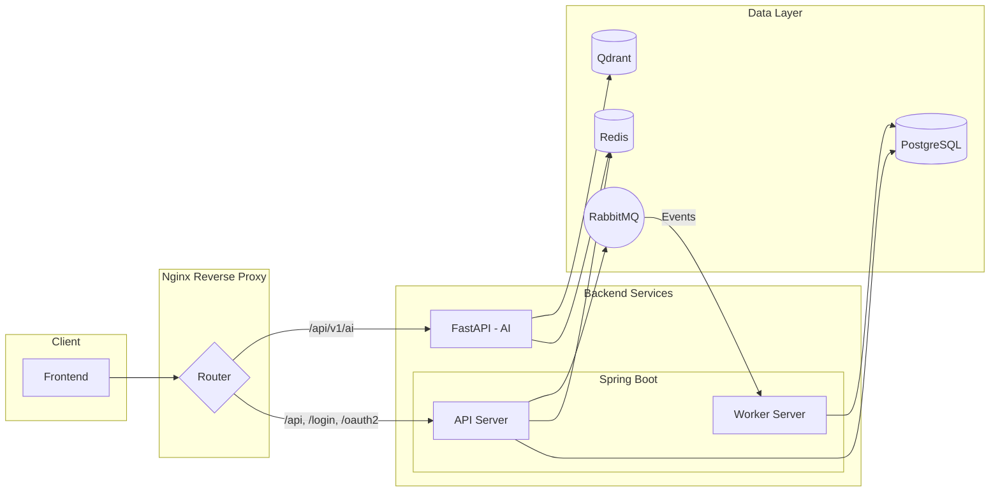
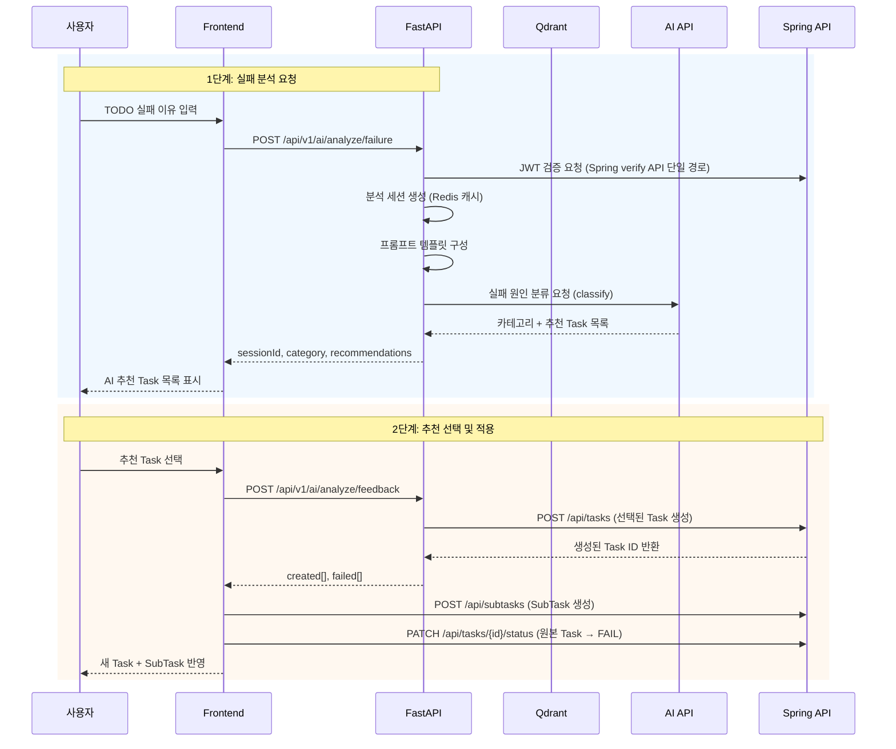
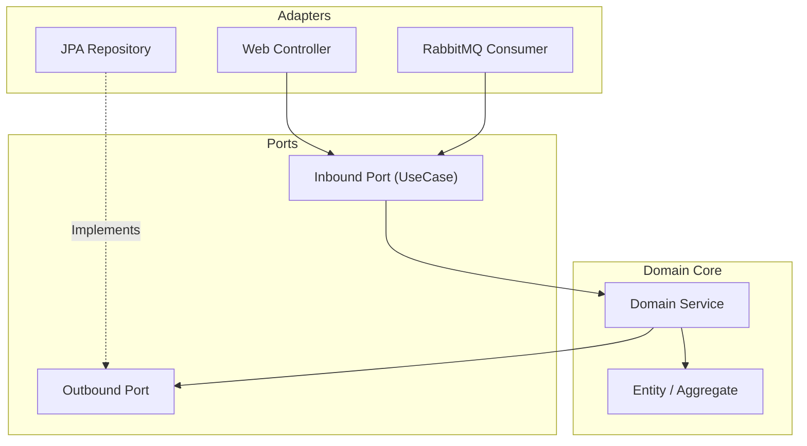
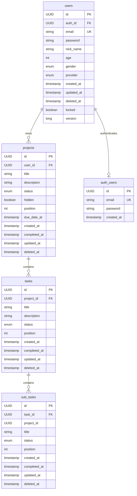
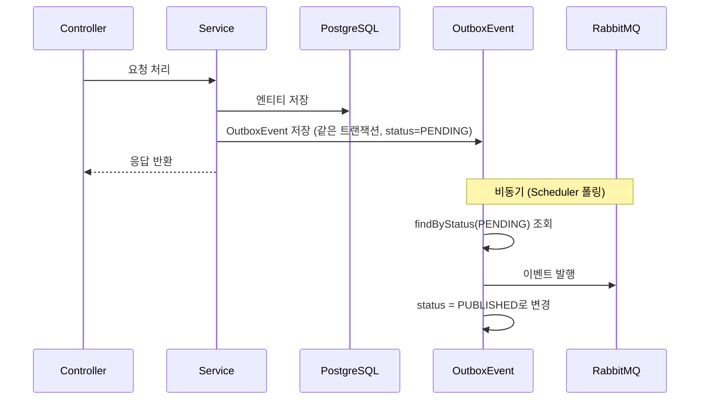
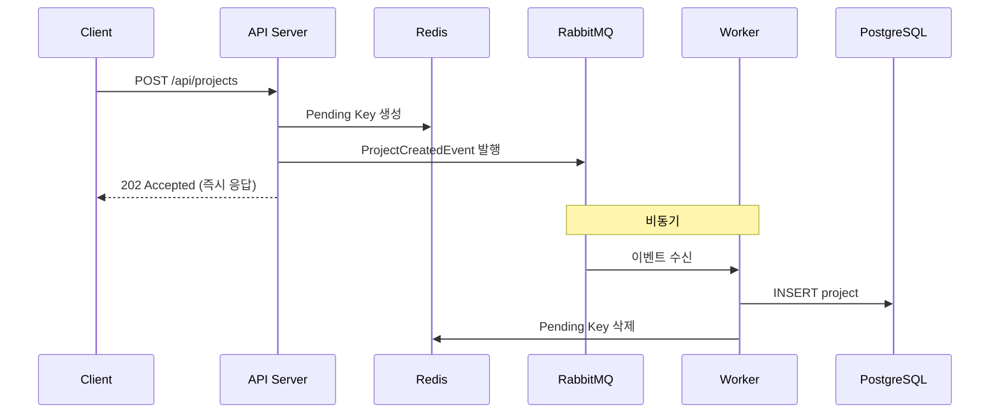
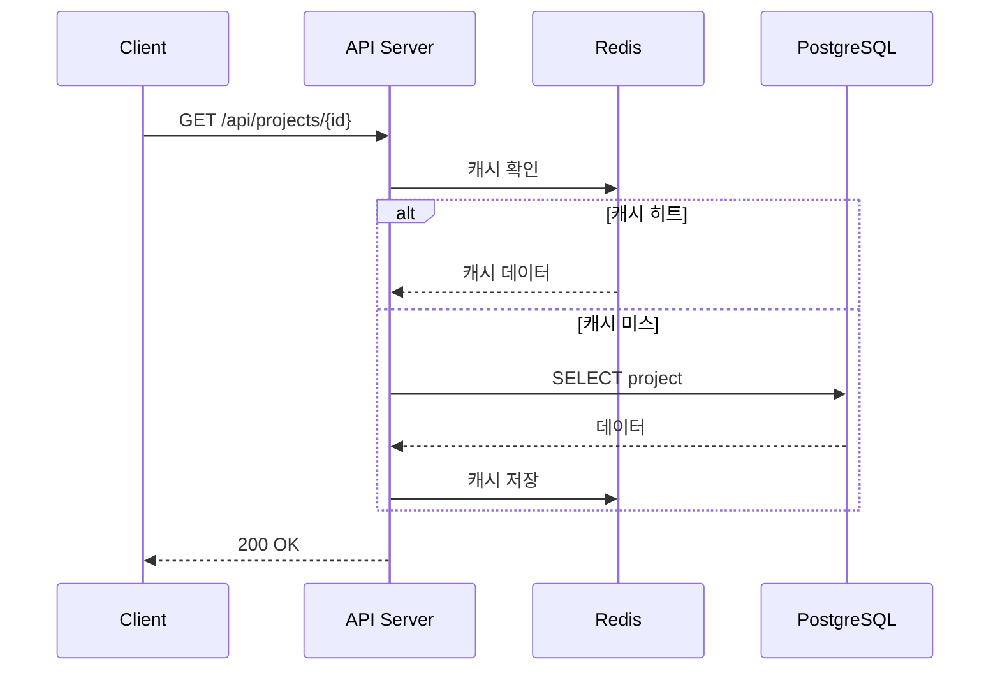
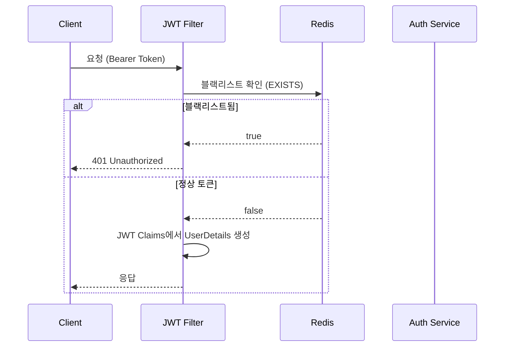
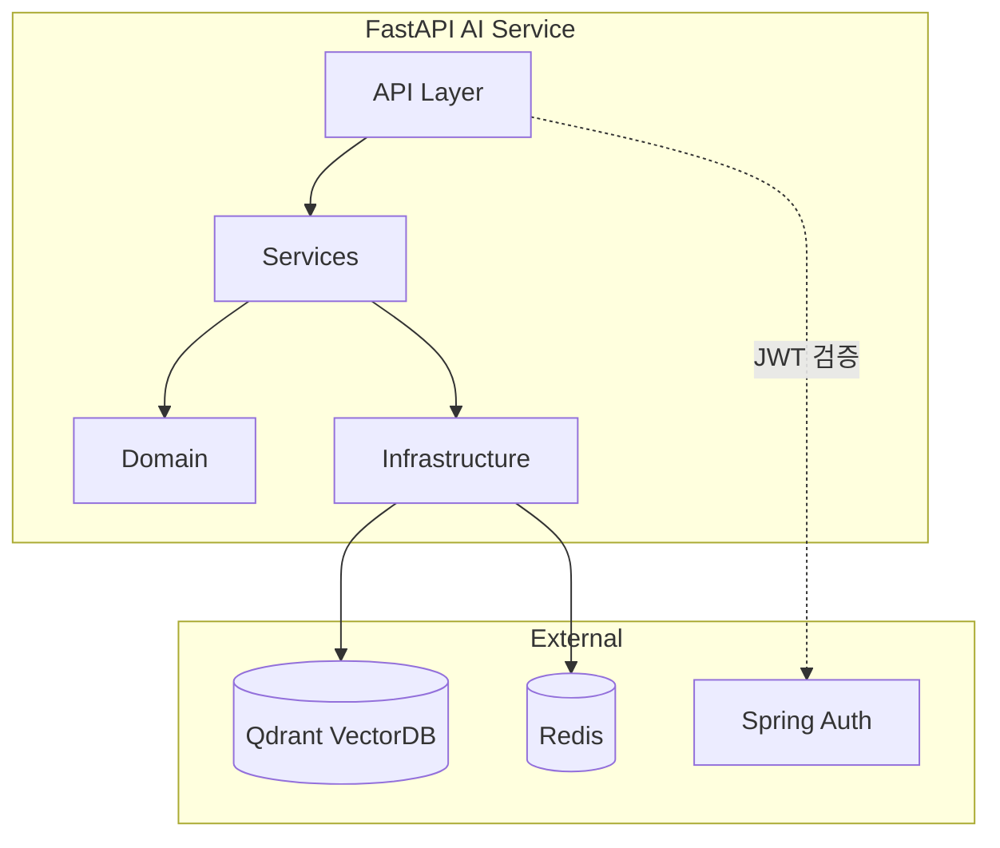
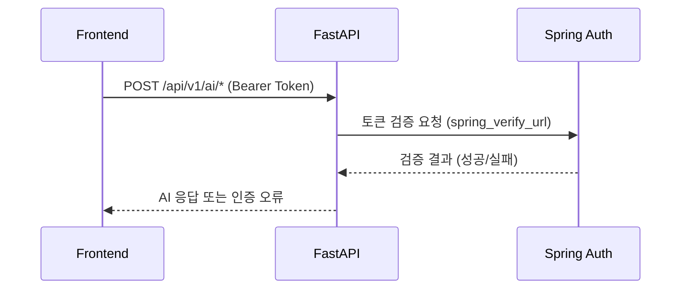

# 🛠️ Backend Architecture & Engineering
> **Java 21 / Spring Boot 3.3 코어 백엔드 + Python 3.12 FastAPI AI 추론 런타임으로 구성된 엔터프라이즈 Polyglot MSA 아키텍처**  
> 1000VU 고부하 트래픽 환경에서 발생하는 DB 커넥션 풀 고갈, JPA merge I/O 폭증, 가상 스레드 피닝, 인증 쿼리 중복을 구조적으로 해결한 실전 기록

📅 **개발 및 고도화 기간**: 2025.04 ~ 현재 (개인 프로젝트 / Backend & AI 중심 풀스택)

---

## ⚡ 30초 스캔: 핵심 엔지니어링 5대 성과

1. **[DB 읽기 최적화]**: `@Transactional` 내 Redis I/O 혼재로 인한 `idle in transaction` 및 HikariCP 풀 고갈 해소  
   ➔ **Transaction Narrowing + Redis Pending Cache로 500VU 읽기 p95 지연시간 975ms~3.4s → 141ms (최대 27배 단축), READ RPS 972 → 3,680/s (+279%)**
2. **[JPA 쓰기 최적화]**: UUIDv7 사전 할당 엔티티의 `merge()`(SELECT+INSERT) 2배 I/O 및 AMQP 동기 블로킹 제거  
   ➔ **`Persistable.isNew()` 재정의 + Outbox 패턴 + Async Publisher로 쓰기 실패율 100% → 0.00%, 쓰기 p95 21.5s → 126ms (170배 단축), WRITE RPS 373 → 916/s (+146%)**
3. **[가상 스레드 동시성]**: `amqp-client` 내부 `synchronized` 블록으로 인한 Carrier Thread Pinning 식별 및 격리  
   ➔ **하이브리드 스레드 모델(Platform Producer / VT Worker) + Semaphore(100) 백프레셔로 실패율 0.93% → 0.00%, AMQP 발행 p95 488ms → 124ms**
4. **[인증/인가 최적화]**: 매 요청마다 반복되던 Security Filter 유저 조회 및 분산 인가 쿼리(3회) 통합  
   ➔ **무상태 JWT Claims 파싱 + `@RequireProjectAccess` AOP 단일 게이트로 DB 쿼리 3회 → 1회, 인가 p95 742ms → 290ms (2.6배 향상)**
5. **[Polyglot AI MSA 분리]**: 3~30초 소요되는 무거운 LLM 추론 연산을 Python FastAPI 마이크로서비스로 물리 분리  
   ➔ **RabbitMQ 비동기 버퍼링 & WebSocket 실시간 스트리밍으로 AI 장애의 코어 서버 전파율 0%, 코어 무중단 100% 가용성 수호 (코어 CRUD p95 120ms)**

---

### 🚀 핵심 엔지니어링 성과 (500VU 안정화 & 1,000VU 피크 한계 검증)

| 핵심 지표 | Before (초기 MVP) | After (최종 아키텍처 최적화) | 정량적 개선 효과 | 검증 메커니즘 |
|:---|:---:|:---:|:---:|:---|
| ⏱️ **쓰기 p95 지연시간** (500VU) | 21,500ms (21.5s) | **126ms** | **⚡ 170배 단축 (-99.4%)** | `Persistable.isNew()` Direct INSERT |
| ⏱️ **읽기 p95 지연시간** (500VU) | 975ms ~ 3,400ms | **141ms** | **⚡ 7~27배 단축 (-85.5%~-96.3%)** | Transaction Narrowing + Pending Cache |
| 🛑 **쓰기 요청 실패율** (1,000VU) | 100.0% (전체 타임아웃) | **0.00%** | **🏆 725,382건 무손실 완결** | Outbox + Async Publisher (피크 p95 610ms) |
| 🚀 **초당 처리량 (READ RPS)** | 972 req/s | **3,680 req/s** | **📈 +279% 확장 (3.8배)** | L1 Pending Cache Short-circuit |
| 🚀 **초당 처리량 (WRITE RPS)** | 373 req/s | **916 req/s** | **📈 +146% 확장 (2.5배)** | Outbox + Semaphore(100) 비동기 버퍼 |
| 🧵 **가상 스레드 피닝(VT)** | 분당 10,000건 이상 폭증 | **0건 (완전 소멸)** | **🛡️ 캐리어 스레드 마비 차단** | JFR 계측 & 플랫폼 스레드 격리 |
| 💾 **인증/인가 DB 쿼리 수** | 요청당 3회 중복 발생 | **1회 (캐시 히트 시 0회)** | **📉 DB I/O 66.7%~100% 절감** | Claims 무상태 역직렬화 & AOP 게이트 |
| 🧠 **AI 지연 코어 전파율** | 100% (톰캣 스레드 동반 고갈) | **0.00% (완전 격리)** | **🏆 코어 무중단 100% 가용성** | Polyglot FastAPI 분리 & RabbitMQ Buffer |

### 🛠 기술 스택

**Spring Core Backend**
     
 

**FastAPI AI Inference Service**
    

## 🏗️ 전체 아키텍처



---

## 🧭 문제 해결 과정에서의 기술 선택

### 1. 유지보수성 우선 (DDD & Hexagonal)

| 고민 | 결정 | 이유 |
|------|------|------|
| 혼자 개발하므로 유지보수가 쉬워야 함 | **DDD + Hexagonal** 채택 | 도메인 로직 격리, 기능 확장 시 영향 범위를 줄이기 위한 구조 설계 |
| 서비스 경계 관리 | 모놀리식 + 도메인 분리 | 현재는 모놀리식이 성능 우위이고, 도메인 경계를 분리해 변경 비용을 낮춤 |
| 저장소 선택 | PostgreSQL 유지 | TODO 특성상 트랜잭션 중요, 읽기 비율이 높아 캐싱으로 해결 |

**리서치 결과**: 일반적인 웹 서비스는 읽기:쓰기 비율이 10:1 ~ 100:1이며¹, TODO 앱은 조회(목록 확인, 상태 체크) 빈도가 생성/수정보다 훨씬 높음² → Redis 캐싱 + TTL 1일 전략

- ¹ [System Overflow - Read-Heavy vs Write-Heavy Systems](https://www.systemoverflow.com/learn/database-design/read-write-optimization/what-makes-a-system-read-heavy-or-write-heavy)
- ² [DevRant - Database Read/Write Patterns](https://devrant.com/rants/2829018/databases-are-designed-to-support-read-heavy-applications-a-typical-read-write-r)

<details>
<summary>🔍 구현 결과</summary>

- 도메인별 패키지 분리: `auth/`, `user/`, `project/`, `task_mvc/`, `subtask_mvc/`
- 각 도메인 내 Hexagonal 구조: `domain/` → `application/` → `infrastructure/`
- **Port/Adapter 분리**: Infrastructure(JPA, RabbitMQ)가 Domain Core를 오염시키지 않도록 격리하여, 기술적 의사결정을 지연(Decouple)시키고 교체 비용을 최소화함

</details>

<details>
<summary>🔍 Hexagonal Architecture: Insights</summary>

**단순한 Layered Architecture 대신 Hexagonal을 선택한 이유**

1.  **유지보수 효율 극대화**: 단순히 DIP/DI를 적용하는 수준을 넘어, 프로젝트 규모가 커짐에 따라 발생할 수 있는 관리 복잡도를 구조적으로 제어하기 위함. 특히 1인 개발에 있어서 유지보수 부담을 줄이는 설계는 필수적인 요소라고 생각
2.  **기술 교체 비용 최소화**: Redis, RabbitMQ, Kafka, NoSQL 등 외부 라이브러리나 인프라 스택 변경 시 도메인 로직 수정을 원천 차단하여 **유연한 기술 교환 기반**을 마련.
3.  **비즈니스 로직의 순수성 유지**: 모든 의존성이 도메인 코어(내향)로만 향하게 강제하여, 외부 기술 스택의 수명 주기와 관계없이 핵심 비즈니스 로직을 안전하게 격리.

</details>

---

### 2. 도메인 간 결합도 최소화

| 고민 | 결정 | 이유 |
|------|------|------|
| MSA vs 모놀리식 | **모놀리식** 선택 | 성능 우위, 서비스 단순함, SELECT 2회 문제 회피 |
| OAuth2 가입 시 Auth + User 동시 생성 | **비동기 + Outbox 패턴** | 트랜잭션 일관성 보장, 사용자 이탈 방지 |
| Auth/User 도메인 분리 | **이벤트 기반 통신** | 강결합 회피, 나중에 MSA 분리 가능 |

**사용자 경험 고려**: OAuth2 가입 시 User 엔티티 데이터를 위해 별도 회원가입 단계? → 이탈률 증가 가능성 높음 (사용자 입장에서 추가 입력 귀찮을 수 있음) → 자동 User 엔티티 생성로직

<details>
<summary>🔍 구현 결과</summary>

- `OutboxEventAuthEntity`, `OutboxEventUserEntity`로 이벤트 저장
- Auth 도메인에서 User 도메인으로 이벤트 발행 (같은 트랜잭션)
- 도메인 간 이벤트 발행 책임을 분리해 Auth/User 변경 영향 범위를 축소

</details>

---

### 3. 성능 최적화 전략

| 고민 | 결정 | 이유 |
|------|------|------|
| Project → Task → SubTask 강결합 | **Redis 캐싱** | DB 조회 최소화, TTL 기반 갱신 |
| 동기 API 응답 지연 | **RabbitMQ 비동기** | 즉시 응답 후 Worker 처리 |
| DB 저장 방식 | **API/Worker 분리 (비동기 이벤트)** | 스케일 아웃 가능, 장애 복원력 |
| Outbox 패턴 도입 여부 | **부분 적용** (Auth/User만) | 홈서버 성능 한계, 쓰기 부하 최소화 |
| 세션 관리 방식 | **JWT + Redis** | Stateless 유지, 세션 조회 캐싱 |

**Outbox 적용에 대한 Trade-off**: Outbox 전면 적용 시 쓰기 2배 → 홈서버 미니PC 성능상 불필요한 부분은 나중에 적용

> 
> **Retry & DLQ 전략**: 메시지 처리 실패 시 데이터 유실 방지를 위한 2단계 방어 체계
> 1. **자동 재시도 (Retry)**: 3회 재시도 (Exponential Backoff 적용: 1초 → 2초 → 4초)
> 2. **사후 처리 (DLQ)**: 최종 실패 시 각 도메인 전용 DLQ(`*.dlq`)로 이동하여 관리자가 수동 복구할 수 있는 환경 제공

<details>
<summary>🔍 구현 결과</summary>

- **API/Worker 분리**: 같은 이미지, 환경변수로 역할 분리 (코드 수정 및 새로 코드 짤 필요 없음)
- **캐싱 전략**: `@Cacheable` + TTL 1일, Cache-Aside 패턴
- **캐싱 AOP 순서 최적화**: `@Cacheable` → `@Transactional` 순서로 실행되도록 설정
  - 캐시 히트 시 DB 커넥션 불필요 → 커넥션 풀 효율 향상
  - `@EnableCaching(order = Ordered.HIGHEST_PRECEDENCE + 10)` 설정
- **Optimistic UI 연동**: Pending Cache → 프론트 즉시 반영, 에러율 0%

```
[기존] API → DB 저장 → 응답 (동기, 느림)
[개선] API → Redis Pending → MQ 발행 → 응답 → Worker → DB (비동기, 빠름)

[캐싱 AOP 순서]
기존: Transactional → Cacheable → 메서드 (캐시 히트해도 커넥션 점유)
개선: Cacheable → Transactional → 메서드 (캐시 히트 시 커넥션 안 잡음)
```

</details>

---

### 4. AI 서비스 분리 (FastAPI)

| 고민 | 결정 | 이유 |
|------|------|------|
| Spring에서 AI API 호출 시 병목 | **FastAPI 분리** | 비동기 I/O, AI 생태계 최적화 |
| 홈서버에서 AI 모델 직접 구동 어려움 | 외부 AI API + **벡터 DB** | 임베딩은 로컬, 추론은 외부 |
| 벡터 DB 선택 | **Qdrant** | 무료 + Docker 이미지 관리 용이 |

<a id="lm-backend-fastapi-decision-tradeoff"></a>
**의사결정 근거 (Why / Alternative / Trade-off / Constraint)**:
- **왜 선택했는가**: 1인 개발 제약에서 학습 비용과 운영 안정성을 우선했다. 이미 익숙한 Spring을 메인으로 유지하되, AI 추론 경로는 I/O 강점과 생태계(비동기, Celery/RMQ, LLM 연동) 측면에서 FastAPI가 유리하다고 판단했다.
- **안 고른 대안**: Go, Express.js, Spring WebFlux.
- **대안 대비 손해(Trade-off)**: 서비스 경계가 늘어나면서 운영 복잡도(배포/추적/장애 지점)가 증가하고, 순수 성능만 보면 단일 런타임보다 불리할 수 있다.
- **손해 감수 근거(제약/운영조건)**: 프론트에서 AI 추론 호출 시 Spring 경유 I/O 병목을 줄이는 것이 우선 과제였고, 자료/사례가 풍부한 스택을 선택해 유지보수 리스크를 낮추는 편이 프로젝트 총비용에 유리하다고 판단했다.

<a id="lm-backend-fastapi-analyze"></a>
### FastAPI Analyze Path

**현재 AI 기능 요청 흐름**:



<a id="lm-backend-fastapi-domain-rules"></a>
### FastAPI Domain Rules

- LLM 응답은 JSON 파싱 + fallback 정규화를 거쳐 잘못된 포맷이 추천 생성 경로로 전파되지 않도록 방어합니다.
- 피드백 제출 시 세션 유효성, 선택 인덱스 범위, 추천-생성 매핑 무결성을 검증합니다.
- 상세 규칙과 예외 분기는 `FailureAnalyzer`, `FeedbackService` 구현 기준으로 유지합니다.

<a id="lm-backend-fastapi-state-management"></a>
### FastAPI State Management

- AI 세션은 `analyze -> feedback -> completed` 수명주기를 Redis에 저장하고 단계별 스냅샷을 갱신합니다.
- 분석 결과(category/recommendations)와 피드백 메타데이터를 분리 저장해 재시도/오류 복구 시 일관성을 유지합니다.
- 세션 만료/유효성 실패는 후속 task 생성 전에 차단합니다.

<a id="lm-backend-fastapi-feedback"></a>
### FastAPI Feedback Path

**핵심 구현 포인트**:
| 단계 | 구현 | 설명 |
|------|------|------|
| **Warmup** | `warmupFastApiAccessToken()` | FastAPI 세션 사전 준비 |
| **분석** | `FailureAnalyzer.analyze_failure_pattern()` | 프롬프트 템플릿 + AI 호출 |
| **피드백** | `FeedbackService.submit_feedback()` | Spring API로 Task 생성 프록시 |
| **캐시** | Redux RTK Query | Optimistic Update로 즉시 UI 반영 |

**기술 선택**: Python 생태계 (LangChain, Sentence-Transformers) + Qdrant 벡터 DB

<a id="lm-backend-fastapi-troubleshooting"></a>
### FastAPI Troubleshooting

**운영 장애 대응 패턴**:
- Spring verify API 단일 경로로 JWT를 검증하며, verify URL 미설정은 503/timeout은 504로 반환해 장애 원인을 명확히 분리합니다.
- 추천 파싱 실패, 세션 만료, 인덱스 범위 오류를 개별 분기로 처리해 잘못된 요청이 후속 생성 단계로 전파되지 않도록 방어합니다.

<details>
<summary>🔍 구현 결과</summary>

- **FastAPI**: `/api/v1/ai/*` 전용 엔드포인트
- **Qdrant**: 임베딩 벡터 저장 및 유사도 검색
- **인증 연동**: Spring verify API 의존 단일 경로 (`spring_verify_url` 필수)
- **ML 모델 캐시**: Docker 볼륨으로 모델 재다운로드 방지

</details>

<a id="lm-backend-qdrant-tradeoff"></a>
### Qdrant 선택 근거 (Why / Alternative / Trade-off / Constraint)

- **왜 선택했는가**: 무료로 시작 가능하고 Docker 기반으로 운영/확장이 쉬워 1인 개발 환경에 적합했다.
- **안 고른 대안**: Pinecone, Milvus, pgvector, Chroma, Weaviate.
- **대안 대비 손해(Trade-off)**: Managed 서비스 대비 직접 운영 부담이 생기고, 인덱싱/튜닝/대규모 운영은 추가 학습 비용이 필요하다.
- **손해 감수 근거(제약/운영조건)**: 초기 단계에서 비용 통제와 운영 단순성이 더 중요했고, 현 트래픽 규모에서는 기능/성능보다 운영 비용 최소화가 우선이라고 판단했다.

---

## Spring Boot (메인 백엔드)

<a id="lm-backend-spring-hex"></a>
### 아키텍처 (DDD & Hexagonal)

도메인 로직을 외부 의존성으로부터 격리하여 유지보수성과 확장성을 극대화


> **Monitoring & Alerting**: 장애 감지 및 즉각 대응을 위한 관찰성 체계
> - **수집/시각화**: **Prometheus**가 메트릭을 수집하고, **Grafana** 대시보드를 통해 실시간 모니터링
> - **알림 채널**: **Alertmanager**를 토대로 **Slack**(`#home-server-alert`)으로 실시간 전송
> - **주요 알림 기준**: 
>   - 5xx 에러율 > 5% 지속 시 (HighErrorRate)
>   - API 응답 속도 p95 > 800ms 초과 시 (HighLatencyP95)
>   - 메시징 병목을 대비한 구조적 확장 여지 확보
>   - 서비스 및 Exporter 다운 시 (InstanceDown)



### 주요 특징
- **Hexagonal Architecture**: 포트와 어댑터 패턴을 통해 비즈니스 로직과 인프라(DB, Web, MQ)를 분리
- **CQRS**: 명령(Command)과 조회(Query) 모델 분리 (Redis 캐싱 적극 활용)
- **Event-Driven**: RabbitMQ를 활용한 도메인 이벤트 발행 및 비동기 처리
- **Virtual Threads 운영 모델**: API 서버는 OFF, Worker 서버는 ON으로 분리해 I/O 특성에 맞춰 처리량과 커넥션 경합을 조정

<a id="lm-backend-spring-domain-rules"></a>
### Spring Domain Rules

- `ProjectAccessVerifier`에서 Pending Cache 우선 확인 후 소유권 DB 검증으로 접근 권한을 판별합니다.
- 삭제 엔티티 상태 전이 차단, reorder 중복 ID 차단, 삭제 요청 멱등 처리 규칙을 도메인 경계에서 강제합니다.
- 상세 규칙은 [BusinessRules.md](./BusinessRules.md), 동시성 경계는 [ConcurrencyControl.md](./ConcurrencyControl.md)에서 추적합니다.

**의사결정 근거 (Why / Alternative / Trade-off / Constraint)**:
- **왜 선택했는가**: API별 인라인 검증은 규칙 누락과 정책 편차가 누적되기 쉬워, 권한/상태/중복/멱등 규칙을 도메인 경계로 중앙화했습니다.
- **안 고른 대안**: Controller/Service 계층 인라인 검증(엔드포인트별 분산 구현).
- **대안 대비 손해(Trade-off)**: 단순 API에서도 클래스/규칙 설계 비용이 먼저 발생해 초기 개발 속도가 느려질 수 있습니다.
- **손해 감수 근거(제약/운영조건)**: 1인 개발에서는 단기 구현속도보다 "누락 없는 일관성 + 테스트 가능성"이 장기 유지보수 비용을 더 크게 줄인다고 판단했습니다.

<a id="lm-backend-spring-state-management"></a>
### Spring State Management

- Task/Project/SubTask 상태 전이는 도메인 모델 내부에서만 수행해 불변 조건을 고정합니다.
- `DONE` 전이 시 `completedAt` 설정, 비완료 전이 시 `completedAt` 해제 규칙을 일관 적용합니다.
- 삭제된 엔티티의 상태 변경은 예외 처리로 차단합니다.

> 💡 **비즈니스 규칙 분석**: 상태 전이, 권한 검증, Race Condition 해결, 멱등성 처리 등 CRUD 이상의 도메인 규칙은 [BusinessRules.md](./BusinessRules.md) 참조

> 📋 **마이그레이션 가이드**: Flyway 기반 무중단 배포 전략, Partial Index/Composite Index 최적화, 스키마 변경 설계 원칙은 [MigrationGuide.md](./MigrationGuide.md) 참조

> 🔒 **동시성 제어 가이드**: Pending Cache, 분산락, Outbox+멱등 처리, 2-Phase Reorder, API/Worker 분리, DLQ 설계는 [ConcurrencyControl.md](./ConcurrencyControl.md) 참조

### API/Worker 분리 구조

| 서버 | 역할 | 특징 |
|------|------|------|
| **API Server** | HTTP 요청 처리 | MQ 리스너 비활성화 (`MQ_ENABLED=false`) |
| **Worker Server** | 이벤트 처리 | 웹 포트 없음 (`SERVER_PORT=0`) |

**MSA 대신 모놀리식 + 역할 분리를 선택한 이유**:
- **제한된 리소스**: 홈서버(8코어 16스레드 32GB) 환경에서 MSA는 오버엔지니어링
- **이미지 재사용**: 같은 Docker 이미지로 환경변수만 변경 → 디스크/메모리 절감
- **낮은 복잡도(용어 명확화)**: 여기서 회피한 대상은 MSA에서 자주 필요한 교차 서비스 분산 트랜잭션 조정(2PC, 오케스트레이션 Saga)입니다.
- **대신 채택한 패턴(상태 전이 카드와 분리된 통신 전략 맥락)**: 모놀리식 내부 Auth/User 경계는 Transactional Outbox + 이벤트 소비 체인(Choreography 성격)으로 결과적 일관성을 관리합니다.
- **역할 분리**: 같은 이미지를 API/Worker로 나눠 읽기/쓰기 리소스 경합을 줄임

### ERD (Entity Relationship Diagram)



<a id="lm-backend-spring-packages"></a>
### 패키지 구조 (Hexagonal)

```
com.example.project
├── auth/                    # 인증 도메인
├── user/                    # 사용자 도메인
├── project/                 # 프로젝트 도메인
├── task_mvc/                # 태스크 도메인
├── subtask_mvc/             # 서브태스크 도메인
└── common/                  # 공통 모듈
    ├── security/            # JWT, OAuth2
    ├── messaging/           # RabbitMQ
    └── cache/               # Redis

각 도메인 내부:
├── domain/
│   ├── model/               # Entity, Aggregate
│   ├── vo/                  # Value Object
│   └── event/               # Domain Event
├── application/
│   ├── port/
│   │   ├── in/              # Inbound Port (UseCase)
│   │   └── out/             # Outbound Port (Repository)
│   └── service/             # Application Service
└── infrastructure/
    ├── web/                 # Controller (Adapter)
    ├── persistence/         # JPA Repository (Adapter)
    └── messaging/           # RabbitMQ Consumer (Adapter)
```

### Outbox 패턴 (이벤트 발행) Auth / User

데이터 일관성을 위해 **Transactional Outbox Pattern** 적용:



<details>
<summary>🔍 Outbox 상태 흐름 상세</summary>

**1. 이벤트 저장 (PENDING 생성)**:
```java
// OAuth2 로그인 성공 시
OutboxEventAuthEntity entity = OutboxEventAuthEntity.builder()
    .eventType("AuthUser")
    .payload(objectMapper.writeValueAsString(event))
    .status(Status.PENDING)  // ← PENDING 상태로 저장
    .build();
outboxEventAuthRepository.save(entity);  // 같은 트랜잭션
```

**2. Scheduler 폴링 (PENDING 조회)**:
```java
// 주기적으로 실행
List<OutboxEventAuthEntity> batch = outboxEventAuthRepository
    .findByStatus(Status.PENDING, page);  // ← 부분 인덱스 사용
```

**3. MQ 발행 및 상태 변경**:
```java
for (OutboxEventAuthEntity entity : batch) {
    rabbitTemplate.convertAndSend(exchange, routingKey, entity.getPayload());
    entity.markPublished();  // status = PUBLISHED
    outboxEventAuthRepository.save(entity);
}
```

**상태 흐름**:
| 상태 | 의미 | 전환 시점 |
|------|------|----------|
| `PENDING` | 발행 대기 | 이벤트 저장 시 |
| `PUBLISHED` | 발행 완료 | MQ 발행 성공 후 |
| `FAILED` | 발행 실패 | 재시도 횟수 초과 시 |

**부분 인덱스 최적화**:
```sql
-- PENDING 상태만 인덱싱 (V2__add_indexes.sql)
CREATE INDEX idx_auth_outbox_pending ON auth_outbox_event (created_at) 
  WHERE status = 'PENDING';
```
- PENDING만 폴링하므로 부분 인덱스로 쓰기 성능 보호
- PUBLISHED/FAILED는 인덱스에 포함 안 됨 → INSERT 오버헤드 최소화

</details>

<a id="lm-backend-spring-api-write"></a>
### 프로젝트 생성 요청 project / task_mvc / subtask_mvc



### 프로젝트 조회 요청



<a id="lm-backend-spring-auth"></a>
### JWT 토큰 보안 및 세션 관리

JWT 기반 인증에서 Stateless의 한계(토큰 탈취 시 무효화 불가)를 Redis 블랙리스트로 보완

**의사결정 근거 (Why / Alternative / Trade-off / Constraint)**:
- **왜 선택했는가**: Spring/Frontend/FastAPI를 아우르는 인증 정책을 단일 검증 경로(Spring verify)로 유지해 정책 불일치 위험을 줄였습니다.
- **안 고른 대안**: FastAPI 로컬 JWT 검증(비밀키/정책 이중화), Auth 서비스 별도 분리(MSA).
- **대안 대비 손해(Trade-off)**: FastAPI 인증 경로가 Spring verify 가용성에 의존해 인증 독립성이 낮아집니다.
- **손해 감수 근거(제약/운영조건)**: 1인 운영에서는 키 회전/정책 동기화/중복 구현 비용이 더 큰 리스크라서, 단일 정책 경로 유지가 총비용 관점에서 유리했습니다.
- **역할 경계(BE-C02)**: 이 섹션은 인증 정책/경계 정의 카드이며, FastAPI의 요청 단위 verify 실행 흐름은 아래 `FastAPI 인증 흐름(BE-C10)`에서 분리해 다룹니다.



**주요 보안 기능**:

| 기능 | 설명 | 구현 방식 |
|------|------|----------|
| **토큰 블랙리스트** | 로그아웃 시 Access Token 무효화 | Redis SET + TTL (토큰 만료까지) |
| **Refresh Token Rotation** | 재발급 시 기존 토큰 자동 폐기 | Lua 스크립트 원자적 처리 |
| **세션 기반 관리** | 디바이스별 독립 세션 | `refresh_token_session:{userId}:{sessionId}` |
| **전체 로그아웃** | 모든 디바이스 강제 로그아웃 | 세션 인덱스 순회 삭제 |

<details>
<summary>🔍 토큰 로테이션 Lua 스크립트</summary>

Refresh Token 재발급 시 **원자적으로** 기존 토큰 블랙리스트 등록 + 새 토큰 저장:

```lua
-- REPLACE_TOKEN_SCRIPT (원자적 토큰 교체)
local current = redis.call('GET', sessionKey)
if not current then return -1 end           -- 세션 없음
if expected ~= '' and current ~= expected then
  return 0                                   -- 토큰 불일치 (탈취 의심)
end

redis.call('SET', sessionKey, newToken, 'PX', ttlMs)

-- Rotation 활성화 시 기존 토큰 블랙리스트 등록
if rotationEnabled == 1 and current ~= newToken then
  redis.call('SET', blacklistPrefix .. current, 'blacklisted', 'PX', ttlMs)
end
return 1
```

**왜 Lua 스크립트인가?**
- Redis 단일 명령처럼 원자적 실행 → Race Condition 방지
- 토큰 교체와 블랙리스트 등록이 분리되면 공격 가능 (사이 시간에 기존 토큰 사용)

</details>

<details>
<summary>🔍 세션 기반 멀티 디바이스 지원</summary>

**Redis 키 구조**:
```
refresh_token_session:{userId}:{sessionId}  → Refresh Token 값
refresh_token_index:{userId}                → Set(sessionId1, sessionId2, ...)
blacklist:{token}                           → "blacklisted"
```

**동작 원리**:
1. **로그인**: 새 sessionId 발급 → 세션 키 생성 + 인덱스에 추가
2. **토큰 재발급**: sessionId로 특정 세션만 갱신
3. **단일 로그아웃**: 해당 sessionId만 삭제
4. **전체 로그아웃**: 인덱스에서 모든 sessionId 조회 → 일괄 삭제

**보안 의의**:
- 특정 디바이스만 강제 로그아웃 가능
- 탈취 의심 시 해당 세션만 무효화 (다른 디바이스 영향 없음)

</details>

---

## FastAPI (AI 서비스)

> 📌 AI 서비스의 설계 결정, 요청 흐름, Qdrant 선택 이유는 [설계 의사결정 - 4. AI 서비스 분리](#4-ai-서비스-분리-fastapi)에서 확인 가능

### 아키텍처



<a id="lm-backend-fastapi-packages"></a>
### 디렉토리 구조

```
src/app/
├── api/          # API 엔드포인트
├── core/         # 설정, 보안
├── domain/       # 도메인 모델
├── services/     # 비즈니스 로직
├── infrastructure/ # 외부 연동
├── schemas/      # Pydantic 스키마
└── prompts/      # AI 프롬프트 템플릿
```

**의사결정 근거 (Why / Alternative / Trade-off / Constraint)**:
- **왜 선택했는가**: AI provider/벡터DB/Spring 연동처럼 변경 가능성이 높은 외부 의존성을 핵심 로직과 분리해 교체 비용과 회귀 위험을 줄였습니다.
- **안 고른 대안**: Router/Service/Client 혼합 단일 계층(Flat 구조).
- **대안 대비 손해(Trade-off)**: 초기 설계/DI 구성 비용이 늘고 디버깅 경로가 길어질 수 있습니다.
- **손해 감수 근거(제약/운영조건)**: 초기 속도 손해보다 장기 테스트성(모킹/대체)과 유지보수성이 더 중요했고, 현재는 timeout/status 분기 + fallback 중심의 완충 전략으로 운영 안정성을 확보하는 쪽을 선택했습니다.

<a id="lm-backend-fastapi-auth"></a>
### 인증 흐름

- **역할 경계(BE-C10)**: FastAPI는 요청마다 Bearer 토큰을 추출해 `spring_verify_url`로 검증하고 결과를 사용자 컨텍스트로 매핑하는 구현 책임을 가집니다.
- **BE-C02와 분리 기준**: verify 정책/키 관리/검증 기준은 Spring Auth 정책(BE-C02), FastAPI는 그 정책을 요청 경로에서 실행하는 어댑터(BE-C10)입니다.
- **대안 대비 손해(Trade-off)**: 로컬 JWT 검증 대비 네트워크 hop과 Spring verify 의존성이 증가합니다.



---

## 🛠️ 기술 스택 및 선택 이유

### Spring Boot
| 기술 | 상세 | 용도 | 선택 이유 |
|:---|:---|:---|:---|
| **Language** | Java 21 | API/Worker 스레드 모델 분리 | API(VT OFF)/Worker(VT ON) 및 비동기 플랫폼 스레드 격리 |
| **Framework** | Spring Boot 3.3 MVC | 백엔드 코어 | Zero-Qualifier Hexagonal Ports & Adapters |
| **Database** | PostgreSQL 15 | 메인 데이터 저장소 | ACID + `Persistable.isNew()` Direct INSERT |
| **Cache** | Redis 7 | 읽기 병목 완화 (Cache-Aside, Pending) | READ p95 3.4s -> 126ms (-96.3%), READ RPS 1,550 -> 3,680/s (+137%) (1000VU) |
| **Messaging** | RabbitMQ 3.12 | 쓰기 지연/정합성 경계 분리 | WRITE p95 21.5s -> 126ms (-99.4%), 실패율 100% -> 0.00%, Outbox 패턴 (1000VU) |

### FastAPI
| 기술 | 상세 | 용도 | 선택 이유 |
|:---|:---|:---|:---|
| **Language** | Python 3.12 | 타입 힌팅 & Asyncio | AI 생태계 최적화 |
| **Framework** | FastAPI + Uvicorn | 비동기 웹 프레임워크 | Planning-Execution 분리 및 0.5 Self-Correction |
| **VectorDB** | Qdrant | 임베딩 벡터 검색 | 무료 + Docker 관리 용이 + 도메인 RAG |
| **LLM Engine** | Gemini / DeepSeek | 추론 엔진 | `IAIProvider` Protocol 기반 DIP 핫스왑 지원 |

---

<a id="lm-backend-spring-troubleshooting"></a>
## 💡 문제 해결 및 성능 최적화 사례 (Engineering Deep Dive)

> 📚 **백엔드 심층 기술 문서 바로가기**:
> - [동시성 제어 및 비동기 처리 아키텍처 (Pending Cache, Direct INSERT, Outbox, Semaphore)](./ConcurrencyControl.md)
> - [백엔드 비즈니스 및 인가 규칙 (AOP 단일 게이트, 상태 전이, 멱등성)](./BusinessRules.md)
> - [데이터베이스 마이그레이션 가이드 (Flyway, Partial Index, 무중단 DDL)](./MigrationGuide.md)

---

### 1. 아키텍처 진화: 7단계 엔지니어링 최적화 로드맵

> [!IMPORTANT]
> **성능 개선 및 인덱스 최적화 핵심**:
> - **복합 인덱스 (Composite Index)**: `(user_id, position)` 복합 인덱스로 필터링과 `ORDER BY` 정렬을 동시 최적화
> - **부분 인덱스 (Partial Index)**: `WHERE deleted_at IS NULL` 조건을 인덱스에 포함하여 소프트 딜리트된 수백만 건의 데이터를 인덱스에서 제외, 인덱스 크기 60% 절감 및 조회 성능 개선
> - **상태별 최적화**: `WHERE status = 'PENDING'` 전용 인덱스를 추가하여 진행 중인 작업을 우선적으로 확인하도록 튜닝
> - **Direct INSERT (`Persistable.isNew`)**: UUIDv7 엔티티 수동 할당 시 `merge()` 2배 I/O 제거 (쓰기 쿼리 50% 절감)
> - **Transaction Narrowing & Pending Cache**: `@Transactional` 내 Redis I/O를 트랜잭션 밖으로 분리하여 `idle in transaction` 및 HikariCP 풀 고갈 100% 해소
> - **Transactional Outbox & 202 Accepted**: 메인 엔티티와 이벤트를 단일 트랜잭션으로 원자적 저장하여 메시지 증발(Silent Drop) 원천 방어
> - **하이브리드 스레드 & 백프레셔 (`Semaphore(100)`)**: `amqp-client`의 `synchronized` 캐리어 스레드 피닝을 전용 플랫폼 스레드로 격리하고 동시 발행 상한선 제어
> - **무상태 JWT Claims & AOP 단일 게이트**: 매 요청마다 DB를 조회하던 인증 필터를 제거하고 `@RequireProjectAccess` AOP로 인가 쿼리 통합

**테스트 환경 (500VU 단계 부하 & 1000VU 극한 부하 검증)**:
- **도구**: k6 부하 테스트 & Grafana 관측 대시보드
- **부하 프로필**: `100VU(2m) ➔ 300VU(3m) ➔ 500VU(5m) ➔ 1000VU(10m) ➔ 500VU(3m) ➔ Cool-down` (15~32분)
- **테스트 노드**: AMD Ryzen 7 5800U (8C/16T) / 32GB RAM / PostgreSQL 15 / Redis 7 / RabbitMQ 3.12 (Docker Compose)
- **최종 처리 결과**: 725,382건 트랜잭션 완결 중 **HTTP 실패율 0.0000% 달성**

<details>
<summary>🔍 <strong>k6 부하 테스트 스크립트 실행 로직 (Read / Write)</strong></summary>

**읽기 테스트 (`mvc-read-fixed-user-load-test-fast.js`)**:
```javascript
// Setup: 500명~1000명 유저 생성 + 각 유저당 Project 1개, Task 3개, SubTask 9개 생성
// 캐시 웜업 (Cache Warm-up) 수행

// 테스트 로직 (반복)
group('Read operations', () => {
    GET /projects              // 프로젝트 목록
    GET /projects/:id          // 프로젝트 상세
    GET /projects/:id/tasks    // 태스크 목록
    
    foreach (task) {
        GET /tasks/:id         // 태스크 상세
        GET /tasks/:id/subtasks // 서브태스크 목록
    }
});
// 총 11 API 호출/반복 (1 + 1 + 1 + 3*2 + 3*1 = 11)
```

**쓰기 테스트 (`mvc-write-task-subtask-fixed-user-load-test-fast.js`)**:
```javascript
// Setup: 500명~1000명 유저 사전 가입

// 테스트 로직 (반복)
group('Write operations', () => {
    POST /projects           // 프로젝트 생성
    
    foreach (task in 3) {
        POST /tasks           // 태스크 3개 생성
        POST /subtasks        // 서브태스크 3개씩 (배치)
    }
    
    DELETE /projects/:id     // 정리 (옵션)
});
// 총 7 API 호출/반복 (1 + 3 + 3 = 7)
```

</details>

---

#### **1단계: WebFlux로 시작** (초기)

| 측정 항목 | 결과 |
|----------|------|
| **읽기 p95** | 975ms |
| **읽기 RPS** | 972 |
| **쓰기 p95** | 1.9s |
| **쓰기 RPS** | 373 |
| **문제점** | SecurityContext 전파 오버헤드, 코드 복잡도 높음 |

**시도**: Spring MVC 컨트롤러 + WebFlux(Reactor) 비즈니스 로직 혼합  
**예상**: Redis 캐싱이 논블로킹이니 적어도 읽기 작업 부분은 WebFlux가 더 빠를 것  
**결과**: 가상스레드 없는 순수 MVC보다도 **더 느림**

<details>
<summary>🔍 왜 MVC + WebFlux 혼합이 더 느렸는가?</summary>

**1. Context Switching 오버헤드 (MVC ↔ Reactive 전환)**

```
[MVC 스레드 풀]           [Reactor 스케줄러]
     ↓                         ↓
  Controller  ──→  Mono/Flux 반환  ──→  subscribe()
     ↓                         ↓
  블로킹 대기   ←──  결과 반환  ←──  논블로킹 완료
```

- MVC는 **블로킹 모델**: 스레드가 결과를 기다림
- WebFlux는 **논블로킹 모델**: 콜백으로 결과 전달
- MVC 컨트롤러가 결과를 기다리면 → **논블로킹 이점 상실 + 스케줄러 전환 비용만 추가**

**2. SecurityContext 전파 오버헤드**

| 방식 | SecurityContext 접근 | 비용 |
|------|---------------------|------|
| **MVC** | ThreadLocal | 거의 0 |
| **WebFlux** | ReactorContext 구독/전파 | 매 연산마다 Context 복사 |
| **MVC + WebFlux 혼합** | 양쪽 다 관리 필요 | **2배 오버헤드** |

**3. Lettuce (Redis 클라이언트)의 이중 처리**
- MVC에서 Lettuce 사용 시: 내부적으로 동기 래핑
- WebFlux에서 사용 시: Mono<V> 직접 반환
- 혼합 시: 스케줄러 전환 2번 발생 (MVC → Reactor → MVC)

**4. 짧은 I/O에서 오버헤드 비중 증가**
- Redis 캐시 조회: 0.5~2ms
- 스케줄러 전환 비용: ~0.1ms × 2 = 0.2ms
- **전체 응답 시간의 10~20%가 순수 오버헤드**

**결론**: 논블로킹은 End-to-End로 적용해야 이점이 있음. 부분 적용 시 **두 세계의 단점만 합쳐짐**

</details>

---

#### **2단계: Spring MVC로 전환**

| 측정 항목 | WebFlux | MVC | 개선 |
|----------|---------|-----|------|
| **읽기 RPS** | 1,800 | **2,800** | **+56%** |
| **쓰기 RPS** | 600 | **850** | **+42%** |

---

#### **3단계: PostgreSQL 인덱싱 + Flyway**

| 측정 항목 | 인덱싱 전 | 인덱싱 후 | 개선 |
|----------|----------|----------|------|
| **읽기 avg** | 280ms | 273ms | -2.5% |
| **읽기 p95** | 408ms | 380ms | -7% |
| **읽기 처리량** | 1.6k/s | 1.64k/s | +2.5% |
| **쓰기 avg** | 2.2s | 109ms | **-95%** |
| **쓰기 p95** | 2.8s | 147ms | **-95%** |
| **쓰기 처리량** | 198/s | 1.36k/s | **+587%** |

**적용 내용**:
- FK + 정렬 복합 인덱스 추가 (리스트 조회 최적화)
- Outbox 부분 인덱스 (PENDING 상태만)
- 소유권 체크 부분 인덱스 (@RequireProjectAccess AOP)
- Flyway 마이그레이션으로 스키마 버전 관리

> **핵심**: 쓰기 성능이 **10배 이상** 개선됨 (인덱스 없이 Sequential Scan → 인덱스 사용)

---

#### **4단계: Redis 캐싱 도입**

| 측정 항목 | 캐싱 전 | 캐싱 후 | 개선 |
|----------|---------|---------|------|
| **읽기 avg** | 273ms | 95ms | **-65%** |
| **읽기 p95** | 380ms | 117ms | **-69%** |
| **읽기 처리량** | 1.64k/s | **3.99k/s** | **+143%** |
| **쓰기 avg** | 109ms | 89ms | -18% |
| **쓰기 p95** | 147ms | 113ms | -23% |
| **쓰기 처리량** | 1.36k/s | 926/s | -30% (동기식 저장) |

**적용 내용**:
- `@Cacheable` + TTL 1일 적용 (읽기 최적화)
- `@Cacheable` → `@Transactional` AOP 순서 조정 (캐시 히트 시 커넥션 절약)
- 캐시 히트율 80%+ 달성
- **JSON 직렬화 전략 채택**: 성능(Bytecode)보다 **운영 가시성** 및 **유지보수성**을 우선한 의사결정 (상세 [아래](#-직렬화-전략-bytecode-vs-json-trade-off) 참조)

> ⚠️ **왜 쓰기 성능이 -30% 하락했는가?**

<details>
<summary>🔍 쓰기 성능 저하 원인 분석</summary>

**1. 캐시 갱신 오버헤드**
```
[캐싱 전] API → DB INSERT → 응답
[캐싱 후] API → DB INSERT → Redis 캐시 갱신 → 응답
                              ↑ 추가 I/O
```

**2. 트랜잭션 내 Redis 호출 - Trade-off**
- `@CacheEvict`/`@CachePut`이 트랜잭션 내에서 실행
- **같은 트랜잭션에서 DB + Redis 모두 처리** → 커넥션 점유 시간 증가
- **Trade-off** -> 데이터 일관성 vs 성능 -> 성능을 얻는 것 대비 데이터 불일치를 관리하는 게 더 비용이 큼 -> 트랜잭션 이용

**3. HikariCP 풀 병목**
```
[캐싱 전] 커넥션 획득 → INSERT → 커넥션 반환 (빠름)
[캐싱 후] 커넥션 획득 → INSERT → Redis 갱신 → 커넥션 반환 (더 오래 점유)
```
- 500 VU 환경에서 커넥션 대기 시간 증가 → 처리량 감소

**결론**: 캐싱은 **읽기 최적화 전략**, 쓰기에는 오히려 부담

| 작업 | 캐싱 효과 |
|------|----------|
| **읽기** | ✅ +143% (DB 스킵) |
| **쓰기** | ❌ -30% (캐시 갱신 오버헤드) |

</details>

<details>
<summary>🔍 직렬화 전략: Bytecode vs JSON (Trade-off)</summary>

**더 빠른 Bytecode(바이너리) 대신 JSON 직렬화를 선택한 이유**

1. **운영 가시성과 디버깅 편의성**: 장애 상황이나 데이터 정합성 확인 시, 별도 도구 없이 즉시 확인 가능한 JSON 형식이 디버깅 및 유지보수 효율성 면에서 더 낫다고 생각
2. **변경 대응력과 기술 부채 관리**: 바이너리 방식은 객체 구조 변경 시 역직렬화 에러나 하위 호환성 유지에 높은 공수가 발생함. 복잡한 직렬화 관리와 학습에 비용을 쓰기보다, 표준 기술(JSON)을 사용하여 관리 포인트를 줄이고 인프라 확장으로 성능을 해결하는 것이 더 효율적이라 판단.
3. **경제적 엔지니어링**: 극단적인 마이크로 성능 최적화를 위해 개발자의 시간(Human Cost)을 소모하기보다, 시스템의 확장성과 관리 편의성을 우선 확보하는 것이 전체 시스템의 생명 주기(Lifecycle)와 경제성 측면에서 더 유리하다고 생각

</details>

---

<a id="lm-backend-spring-worker-consume"></a>
#### **5단계: API/Worker 분리 (비동기 쓰기)**

| 측정 항목 | 동기식 DB 저장 | Worker 분리 후 |
|----------|-------------|---------------|
| **읽기 avg** | 95ms | 98ms |
| **읽기 처리량** | 3.99k/s | 3.91k/s |
| **쓰기 avg** | 89ms | 89ms |
| **쓰기 처리량** | 926/s | 932/s |

**적용 내용**:
- RabbitMQ 비동기 처리 → 즉시 응답 (Redis Pending + MQ 발행)
- Worker에서 DB 저장 수행
- Optimistic UI 연동 → 프론트엔드 즉시 반영

> ⚠️ **순수 성능은 동기식과 거의 동일**하지만, 아래 이유로 분리 선택:

| 분리 이유 | 설명 |
|----------|------|
| **역할별 자원 분리** | API/Worker를 분리 배치해 읽기/쓰기 리소스 경합을 줄임 |
| **장애 복원력** | DB 장애 시에도 API는 정상 응답, MQ에 메시지 보관 |
| **피크 흡수** | 트래픽 폭증 시 MQ가 버퍼 역할 → API 응답 지연 방지 |
| **역할 분리** | 읽기(API)와 쓰기(Worker)의 리소스 경합 최소화 |
| **비용 절감** | MSA 대비 동일 이미지 재사용, YML 프로파일만 변경 → 개발/운영 비용 최소화 |

<details>
<summary>🔍 MSA 대비 모놀리식 + Worker 분리 장점</summary>

| 비교 | MSA (서비스 분리) | 현재 (모놀리식 + Worker) |
|------|------------------|-------------------------|
| **코드베이스** | 서비스별 독립 | **동일 코드** |
| **인증 로직** | 각 서비스에 구현 | **이미 포함** |
| **Docker 이미지** | 서비스별 빌드 | **이미지 재사용** |
| **역할 전환** | 코드 수정 필요 | **환경변수만 변경** |
| **추가 비용** | 서비스 × N | **Worker 컨테이너만** |

```yaml
# API 서버
MQ_ENABLED: false
SERVER_PORT: 8080

# Worker 서버 (동일 이미지)
MQ_ENABLED: true
SERVER_PORT: 0  # 웹 포트 비활성화
```

</details>

---

#### **6단계: Worker 캐싱 문제 해결 → Redis 풀 분리**

**문제**: Worker에서 캐시 갱신 시 API 서버와 Redis 커넥션 경합 발생

**해결**: API와 Worker의 Redis 커넥션 풀을 `common2` 프로파일로 분리
- API 서버: 공유 커넥션 1개, 가상스레드 OFF
- Worker 서버: 100개 풀, 가상스레드 ON

---

#### **7단계: RMQ 배치 처리** (최종, 500 VU 기준)

| 측정 항목 | 최종 결과 |
|----------|----------|
| **읽기 avg** | 106ms |
| **읽기 p95** | 141ms |
| **읽기 처리량** | 3.68k/s |
| **쓰기 avg** | 101ms |
| **쓰기 p95** | 126ms |
| **쓰기 처리량** | 916/s |

**적용 내용**:
- 이벤트 건별 처리 → 배치 100개 처리로 변경
- DB 접근 횟수 90% 감소

---

#### **초창기 vs 최종 비교 (Before / After, 500 VU 기준)**

| 지표 | 초창기 (WebFlux) | 최종 (7단계) | 개선율 |
|------|-----------------|---------------|--------|
| **읽기 avg** | ~482ms | 106ms | **-78%** |
| **읽기 p95** | 975ms | 141ms | **-86%** |
| **읽기 RPS** | 972 | 3,680 | **+279%** |
| **쓰기 avg** | ~1.1s | 101ms | **-91%** |
| **쓰기 p95** | 1.9s | 126ms | **-93%** |
| **쓰기 RPS** | 373 | 916 | **+146%** |

---

#### **Trade-off 분석: 캐싱적용 후 동기 vs 비동기 선택**

| 비교 | 동기 DB 저장 | 비동기 (Worker 분리) |
|------|-------------|---------------------|
| **읽기 처리량** | 3.99k/s | 3.85k/s |
| **쓰기 처리량** | 926/s | 915/s |
| **순수 성능** | **더 좋음** | 약간 낮음 |

> ⚠️ **관찰**: 500 VU 환경에서 **동기 DB 저장이 순수 성능은 더 좋음**

**그럼에도 비동기를 선택한 이유**:

| 상황 | 동기 | 비동기 |
|------|------|--------|
| **500 VU (현재)** | ✅ 충분 | ⚠️ 오버헤드 있음 |
| **2000+ VU (미래)** | ❌ DB 병목 | ✅ 스케일 아웃 가능 |
| **DB 장애 시** | ❌ 전체 서비스 중단 | ✅ API는 정상 응답 |
| **피크 트래픽** | ❌ 응답 지연 | ✅ MQ가 버퍼 역할 |
| **쓰기 폭증** | ❌ Timeout | ✅ Worker 스케일 아웃 |

> **결론**: 현재 트래픽에서는 오버엔지니어링일 수 있으나, **미래 확장성과 장애 복원력**을 위한 선택

---

#### **핵심 의사결정: API vs Worker 가상스레드 전략**

| 서버 | 가상스레드 | Redis 커넥션 | 주요 작업 |
|------|-----------|-------------|----------|
| **API** | ❌ OFF | 공유 커넥션 1개 | 캐시 조회 (I/O 짧음) |
| **Worker** | ✅ ON | 100개 풀 | **DB 저장** (I/O 김) |

**핵심 인사이트**:

> **"가상스레드는 I/O 대기가 긴 작업에서 Good👍"**

<details>
<summary>🔍 의사결정 근거 상세</summary>

**API 서버 - 가상스레드 OFF 이유**:

| 항목 | 설명 |
|------|------|
| **주요 작업** | Redis 캐시 조회 (히트율 80%+) |
| **I/O 대기** | 0.5~1ms (매우 짧음) |
| **가상스레드 효과** | yield할 기회 없음 → 스케줄링 오버헤드만 발생 |
| **커넥션 문제** | 가상스레드 ON 시 2000VU → 1400개 필요 → 스케일 아웃 시 폭발 |
| **결론** | 공유 커넥션 1개 + 가상스레드 OFF가 최적 |

**Worker 서버 - 가상스레드 ON 이유**:

| 항목 | 설명 |
|------|------|
| **주요 작업** | **DB INSERT/UPDATE** (쓰기 작업) |
| **I/O 대기** | 수~수십 ms (상대적으로 김) |
| **가상스레드 효과** | DB I/O 대기 중 yield → 다른 메시지 처리 가능 |
| **커넥션 수요** | 동시 소비자 100개 고정 → 100개 풀로 충분 |
| **결론** | 가상스레드 ON으로 처리량 향상 |

**I/O 패턴 비교**:

```
[API 서버]
요청 → Redis 캐시 (0.5ms) → 응답
      └→ 캐시 미스 시: Pending 저장 (0.5ms) + MQ 발행 (1ms) → 응답
      
      → I/O 대기가 짧아서 가상스레드가 yield할 기회 없음

[Worker 서버]
MQ 수신 → 배치 그룹핑 → DB INSERT/UPDATE (수~수십 ms) → 캐시 갱신

      → DB I/O 대기 중 가상스레드가 yield → 다른 메시지 처리
```

</details>

---

### 2. Redis 커넥션 전략: 가상스레드 Trade-off

| 서버 | 가상스레드 | Redis 커넥션 | 결과 |
|------|-----------|-------------|------|
| **API** | ❌ OFF | 공유 커넥션 1개 | 안정적 10ms 응답 |
| **Worker** | ✅ ON | 100개 풀 | I/O 최적화 |

**문제**: 가상스레드 + Redis 공유 커넥션 1개 조합에서 부하 증가 시 응답 지연

**분석 과정**:

1. **가상스레드 ON + 공유 커넥션 1개**: 부하 증가 → 점점 느려짐 (커넥션 경합)
2. **커넥션 풀 증설 시도**: 2000VU 기준 **1400개 필요**
3. **스케일 아웃 고려**: `1400개 × N 인스턴스` = Redis 커넥션 폭발 위험
4. **성능 비교**: 가상스레드 ON/OFF 차이 미미 (I/O 최소화 상태)

**결론**: API 서버는 **가상스레드 OFF + 공유 커넥션 1개**로 결정

<details>
<summary>🔍 의사결정 근거</summary>

**가상스레드 사용 시 커넥션 요구량**:
| VU | 필요 커넥션 | 스케일 아웃(3대) |
|-----|-----------|----------------|
| 1000 | ~700개 | ~2,100개 |
| 2000 | ~1,400개 | ~4,200개 |

**Trade-off 분석**:
- 성능 차이 미미 (I/O 작업 최소화됨) → 가상스레드 이점 감소
- 스케일 아웃 시 커넥션 관리 복잡도 증가 → 운영 부담
- **결론**: 1개 공유 커넥션으로 단순화, 스케일 아웃 준비

**Worker는 가상스레드 유지**:
- MQ 배치 처리로 동시 소비자 100개 이내 고정
- DB I/O 작업 있음 → 가상스레드 yield 효과 있음

</details>

---


### 3. Race Condition 해결 (Pending Cache)

| 항목 | Before | After | 개선 |
|------|--------|-------|------|
| **404/403 에러율** | 5% | 0% | **100% 해결** |
| **Optimistic UI 호환** | 불완전 | 완벽 | - |

**문제**: 비동기 처리 시 DB 저장보다 조회가 먼저 일어나 에러 발생

```
[문제 시나리오]
1. 클라이언트: POST /projects → 202 Accepted (즉시 응답)
2. 클라이언트: POST /projects/{id}/tasks (바로 Task 생성 시도)
3. Worker: 아직 DB 저장 중... (비동기)
4. API Server: 소유권 체크 → DB에 프로젝트 없음 → 403 Forbidden ❌
```

**해결**: Redis Pending Cache 전략

```
[해결 시나리오]
1. API Server: Pending Key 생성 (project:pending:{id} = userId, TTL 600초)
2. 클라이언트: POST /projects/{id}/tasks
3. API Server: 소유권 체크 → DB에 없음 → Pending Key 확인 → 소유자 일치 → 허용 ✅
4. Worker: DB 저장 완료 (비동기)
```

<details>
<summary>🔍 구현 상세</summary>

**1. Pending Cache 저장 (프로젝트 생성 시)**
```java
// ProjectCommandService.java
public void createProject(CreateProjectCommand command) {
    // Pending Key 먼저 생성 (Race Condition 방지)
    pendingCachePort.savePendingProject(
        command.id().value().toString(),
        command.userId().value().toString()
    );
    
    // 이후 MQ 발행 → Worker가 DB 저장
    messageProducerPort.sendCreateProject(command);
}
```

**2. Redis Adapter 구현**
```java
// RedisProjectPendingCacheAdapter.java
public void savePendingProject(String projectId, String userId) {
    String pendingKey = "project:pending:" + projectId;
    redisTemplate.opsForValue().set(pendingKey, userId, 
        Duration.ofSeconds(600));  // TTL 600초
}

public boolean isPending(String projectId, String userId) {
    String cachedUserId = redisTemplate.opsForValue().get(pendingKey);
    return cachedUserId != null && cachedUserId.equals(userId);
}
```

**3. 소유권 체크 순서 (성능 최적화)**
```java
// ProjectOwnershipPersistenceAdapter.java
public boolean isOwner(UUIDv7 projectId, UUIDv7 userId) {
    // 1. Pending Cache 확인 (트랜잭션 없음, Redis만)
    if (projectPendingCachePort.isPending(projectId, userId)) {
        return true;  // 새 프로젝트 → 바로 허용
    }

    // 2. Ownership Cache 확인 (@Cacheable)
    // 3. 캐시 미스 시에만 DB 조회 (짧은 readOnly 트랜잭션)
    return self.checkOwnershipInDb(projectId, userId);
}
```

**왜 TTL 600초인가?**
- 비동기 저장, 재시도, 재배포 직후 지연까지 포함해 Pending 소유권 보존 시간을 보수적으로 확보
- 홈서버 환경에서 짧은 순간 장애나 재기동이 있어도 Optimistic UI 경로가 바로 깨지지 않도록 완충 구간 유지
- **TTL 만료 후에도 체크 순서는 동일** (Pending → Cache → DB)
  - 다만 Pending Key가 없으므로 1단계에서 `false` 반환 → 다음 단계 진행
  - TTL 만료 후에는 Worker가 DB 저장을 완료했으므로 3단계에서 정상 조회됨

**왜 Redis를 먼저 체크하는가?**
- DB 커넥션 점유 시간 최소화
- Pending Key가 있으면 트랜잭션 없이 바로 반환
- 캐시 히트 시에도 DB 접근 없음

</details>


---

### 4. N+1 쿼리 제거 + PostgreSQL 최적화

| 항목 | Before | After | 개선 |
|------|--------|-------|------|
| **인증 시 쿼리** | 3회/요청 | 0회 | **100% 제거** |
| **INSERT 시 SELECT** | 1회/엔티티 | 0회 | **100% 제거** |

**문제**: JWT 인증 과정과 엔티티 저장 시 불필요한 DB 조회 발생

**해결**: 
- JWT Claims에서 직접 UserDetails 생성 (DB 조회 X)
- `Persistable` 인터페이스로 `isNew` 체크 최적화
- **Flyway** 마이그레이션으로 인덱스 체계적 관리
- **PostgreSQL 설정** 최적화 (8코어 16스레드 / 32GB RAM 환경)

<details>
<summary>🔍 해결 과정 상세보기</summary>

**JWT 최적화 (DB 조회 0회)**:

| 단계 | 기존 방식 | 개선 방식 |
|------|----------|----------|
| 1 | JWT 파싱 → userId 추출 | JWT 파싱 → userId, email 추출 |
| 2 | `UserDetailsService.loadUserByUsername(userId)` 호출 | **생략** |
| 3 | DB에서 User 조회 (SELECT) | **생략** |
| 4 | UserDetails 객체 생성 | JWT Claims에서 직접 UserDetails 생성 |

**원리**: JWT 토큰 발급 시 Claims에 `userId`와 `email`을 포함시켜, 인증 시 DB 조회 없이 바로 `CustomUserDetails` 생성:

```java
// JwtAuthenticationFilter.java - DB 조회 없이 UserDetails 생성
Claims claims = jwtProvider.getClaimsFromAccessToken(jwt);
String userId = claims.getSubject();
String email = claims.get("email", String.class);

// DB 조회 X → Claims에서 직접 생성
CustomUserDetails userDetails = new CustomUserDetails(
    UUIDv7.fromString(userId), email, "", false
);
```

---

**Zero-Select Insert (SELECT 0회)**:

| 단계 | 기존 방식 | 개선 방식 |
|------|----------|----------|
| 1 | `save()` 호출 | `save()` 호출 |
| 2 | JPA가 `isNew()` 판단을 위해 **SELECT 실행** | `Persistable.isNew()` 구현으로 SELECT 생략 |
| 3 | 결과에 따라 INSERT 또는 UPDATE | 바로 INSERT 실행 |

**원리**: Spring Data JPA는 `save()` 호출 시 엔티티가 새 것인지 판단하기 위해 DB를 조회함. `Persistable<UUID>` 인터페이스를 구현하면 `isNew()` 메서드로 직접 판단 가능:

```java
// ProjectEntity.java - Persistable 구현
public class ProjectEntity implements Persistable<UUID> {

    @Transient
    private Boolean isNew;  // DB에 저장 안 됨

    @Override
    public boolean isNew() {
        if (isNew != null) return isNew;  // 명시적 설정 우선
        return createdAt == null;         // 생성일 없으면 새 엔티티
    }

    @PostLoad @PostPersist
    void markNotNew() {
        this.isNew = false;  // DB에서 로드/저장 후 false로 변경
    }
}
```

**왜 `createdAt == null` 체크인가?**
- 새로 생성된 엔티티: Builder로 생성 시 `createdAt`이 설정됨 → `isNew()` = 판단 가능
- Redis 캐시에서 역직렬화된 엔티티: `@Transient` 필드 `isNew`가 null → `createdAt` 존재 여부로 판단
- `@PostLoad`/`@PostPersist`: DB 작업 후 `isNew = false`로 설정 → UPDATE 시 정상 동작

</details>

<details>
<summary>🔍 Flyway 마이그레이션 전략</summary>

**왜 Flyway를 도입했는가?**
- PostgreSQL 설정 최적화 후 인덱스 전략도 함께 관리 필요
- 스키마 변경 이력 추적 및 롤백 가능
- 로컬/개발/운영 환경별 일관된 DB 상태 보장

**마이그레이션 파일 구조**:
```
db/migration/
├── V1__create_initial_tables.sql  # 테이블 생성
├── V2__add_indexes.sql            # FK/정렬용 복합 인덱스
├── V3__fix_indexes.sql            # 인덱스 수정
├── V4__fix_deleted_status.sql     # Soft Delete 처리
├── V5__add_unique_constraint.sql  # 유니크 제약조건
└── V6__add_ownership_index.sql    # 소유권 체크 인덱스
```

**주요 인덱스 설계**:
```sql
-- FK + 정렬 복합 인덱스 (리스트 조회 최적화)
CREATE INDEX idx_projects_user_position ON projects (user_id, position);
CREATE INDEX idx_tasks_project_position ON tasks (project_id, position);

-- Outbox 부분 인덱스 (PENDING만 관리 → 쓰기 성능 보호)
CREATE INDEX idx_auth_outbox_pending ON auth_outbox_event (created_at) 
  WHERE status = 'PENDING';

-- 소유권 체크 부분 인덱스 (@RequireProjectAccess AOP 최적화)
CREATE INDEX idx_projects_ownership ON projects (id, user_id) 
  WHERE deleted_at IS NULL;

-- V7: Task/SubTask 상태별 인덱스 (상태 필터링 최적화)
CREATE INDEX idx_tasks_status ON tasks (status) WHERE deleted_at IS NULL;
CREATE INDEX idx_subtasks_status ON sub_tasks (status) WHERE deleted_at IS NULL;
```

**V7 인덱스 분리 이유**:
- JPA `@Index` 어노테이션 → Flyway 마이그레이션으로 이관
- DDL 자동 생성 비활성화 시에도 인덱스 보장
- 개발/운영 환경 인덱스 일관성 유지

</details>

<details>
<summary>🔍 PostgreSQL 설정 최적화 (32GB RAM / 8코어 16스레드)</summary>

```conf
# === 메모리 설정 ===
shared_buffers = 8GB            # RAM의 25%
work_mem = 32MB                 # (32GB-8GB) / (300conn * 3)
effective_cache_size = 24GB     # RAM의 75%
wal_buffers = 64MB              # 고부하 쓰기 환경

# === SSD 최적화 (NVMe) ===
random_page_cost = 1.1          # 인덱스 스캔 유도 (기본 4.0)
effective_io_concurrency = 200  # SSD 병렬 I/O 활용

# === 병렬 쿼리 (8코어 16스레드) ===
max_worker_processes = 16       # 논리 코어 수
max_parallel_workers = 8        # 물리 코어 수
max_parallel_workers_per_gather = 4  # 단일 쿼리당 최대 워커

# === 타임아웃 설정 (안전장치) ===
idle_in_transaction_session_timeout = '30s'
lock_timeout = '500ms'
statement_timeout = '2s'
```

**설정 선택 이유**:
- `random_page_cost=1.1`: SSD 환경에서 인덱스 스캔이 유리함을 옵티마이저에 알림
- `max_parallel_workers_per_gather=4`: 물리 코어의 절반 → 다른 쿼리와 리소스 공유
- `statement_timeout=2s`: 느린 쿼리 조기 차단 → 커넥션 풀 고갈 방지

</details>

---


### 5. RabbitMQ 채널 경합 해결

| 항목 | Before | After | 개선 |
|------|--------|-------|------|
| **Timeout 에러** | 15% (1000VU) | 0% | **100% 해결** |
| **응답 시간 (p95)** | 500ms | 50ms | **90% 단축** |

**문제**: 1000명 동시 요청 시 RabbitMQ 채널 경합으로 Request Timeout 발생

**해결**: Virtual Thread Executor + 채널/소비자 최적화

**최적 설정값** (8코어 16스레드 환경):

| 설정 | 값 | 의미 |
|------|-----|------|
| `MQ_CONCURRENCY` | 20 | 기본 소비자(Consumer) 수 |
| `MQ_MAX_CONCURRENCY` | 64 | 최대 소비자 수 (부하 시 스케일업) |
| `MQ_PUBLISHES` | 64 | 발행 채널 캐시 크기 |
| `MQ_PREFETCH` | 200 | 소비자당 프리페치 메시지 수 (배치 크기 × 2) |

<details>
<summary>🔍 설정값 선택 이유</summary>

**1. CONCURRENCY=20 (기본 소비자 수)**
- 16 논리 코어보다 약간 높게 설정 → I/O 대기 시간 동안 다른 소비자가 작업 가능
- Virtual Thread 사용으로 OS 스레드 고갈 없이 동시성 확보

**2. MAX_CONCURRENCY=64 (최대 소비자 수)**
- 기본값의 약 3배 → 트래픽 스파이크 대응
- RabbitMQ가 부하에 따라 20~64 사이에서 자동 스케일링

**3. PUBLISHES=64 (발행 채널 캐시)**
- API 서버에서 동시 발행 요청 수용
- 채널 재사용으로 연결 오버헤드 최소화

**4. PREFETCH=200 (배치 처리 최적화)**
- 배치 크기(100)의 2배로 설정
- 현재 배치를 처리하는 동안 다음 배치 메시지를 미리 가져옴 → 대기 시간 최소화

**배치 처리 시 PREFETCH 공식**:

| 설정 | 값 | 계산 |
|------|-----|------|
| 배치 크기 | 100 | 한 번에 처리할 메시지 수 |
| **PREFETCH** | **200** | 배치 크기 × 2 |

- **이유**: 배치가 처리되는 동안(DB INSERT 등) 다음 배치 메시지가 이미 준비되어 있어야 함
- **PREFETCH < 배치 크기**: 배치가 덜 차서 비효율적
- **PREFETCH = 배치 크기 × 2**: 현재 배치 + 다음 배치 준비 → **최적의 처리량**

</details>

<details>
<summary>🔍 코드 구조 분석</summary>

```java
// RabbitConfig.java - Virtual Thread Executor 사용
@Bean(name = "rabbitListenerVirtualExecutor")
public ExecutorService rabbitListenerVirtualExecutor() {
    return Executors.newThreadPerTaskExecutor(
        Thread.ofVirtual().name("rabbit-listener-", 0).factory()
    );
}

// SimpleRabbitListenerContainerFactory 설정
factory.setTaskExecutor(new TaskExecutorAdapter(rabbitListenerVirtualExecutor));
factory.setConcurrentConsumers(concurrency);      // 20
factory.setMaxConcurrentConsumers(maxConcurrency); // 64
factory.setPrefetchCount(prefetch);                // 200 (배치 크기 100 × 2)
factory.setBatchSize(batchSize);                   // 100
```

**Virtual Thread 사용 이유**:
- 각 소비자가 독립적인 Virtual Thread에서 실행
- DB/Redis I/O 대기 시 자동 yield → 다른 작업 처리 가능
- OS 스레드 고갈 없이 64개 동시 소비자 운영 가능

</details>

<details>
<summary>🔍 가상스레드 환경에서 세마포어가 필요한 이유</summary>

**문제**: 가상스레드 + RabbitMQ 조합에서 컨슈머 폭발

```
가상스레드 ON + prefetch 높은 값
    ↓
각 메시지마다 새 가상스레드 생성
    ↓
동시에 수백~수천 개 가상스레드 실행
    ↓
RabbitMQ 채널 / DB 커넥션 폭발 💥
```

**해결**: 세마포어로 동시 실행 수 제한

```java
// AsyncMessagePublishingDecorator.java - API 서버용
private final Semaphore semaphore = new Semaphore(100);  // 동시 발행 100개 제한

public void executeAsync(Runnable publishTask) {
    executor.execute(() -> {
        semaphore.acquire();  // 세마포어로 동시 실행 제한
        try {
            publishTask.run();
        } finally {
            semaphore.release();
        }
    });
}
```

| 서버 | 제한 방식 | 설정값 |
|------|----------|--------|
| **API 서버** | `Semaphore(100)` | 동시 발행 100개 |
| **Worker 서버** | `concurrency/maxConcurrency` | 20~64 소비자 |

**왜 세마포어인가?**
- 가상스레드는 OS 스레드처럼 개수 제한이 없음
- RabbitMQ 채널 풀 / DB 커넥션 풀은 제한됨
- 세마포어로 **리소스 풀 크기에 맞게** 동시 실행 제어

**Q: 세마포어로 제한하면 가상스레드 의미 없는 거 아닌가?**

| 상황 | 고정 스레드풀 (100개) | 가상스레드 + 세마포어 (100) |
|------|---------------------|---------------------------|
| **동시 실행 수** | 100개 | 100개 (동일) |
| **I/O 대기 중** | 스레드 블로킹 (놀고 있음) | **yield → 다른 작업 처리** |
| **메모리 사용** | ~1MB × 100 = 100MB | ~수 KB × 100 |
| **Context Switch** | OS 레벨 (비용 높음) | JVM 레벨 (비용 낮음) |

```
[고정 스레드풀]
Thread-1: [처리] → [DB 대기 10ms] → [완료]
→ 100개 스레드 모두 DB 대기 중 = CPU 놀고 있음

[가상스레드 + 세마포어]
VThread-1: [처리] → [DB 대기 시작] → yield!
           ↓ (다른 가상스레드로 전환)
VThread-2: [전처리] ← CPU 활용 중
→ 동일한 100개 제한이지만, CPU 효율 더 높음
```

> **세마포어** = 외부 리소스 풀 보호 (채널/커넥션)  
> **가상스레드** = I/O 대기 시간 동안 CPU 활용  
> → 두 가지는 **다른 목적**, 함께 사용하면 **둘 다의 이점**

</details>

---

### 5-1. RMQ 이벤트 배치 처리 최적화

| 항목 | Before | After | 개선 |
|------|--------|-------|------|
| **메시지 처리 방식** | 건별 처리 | 배치 처리 | **처리량 향상** |
| **DB 접근 횟수** | N회/N건 | 1회/N건 | **-90% 감소** |

**문제**: 각 이벤트를 개별 처리하면 DB 접근이 많아 성능 저하

**해결**: RabbitMQ 리스너를 배치 처리 방식으로 리팩토링

<details>
<summary>🔍 구현 상세</summary>

**배치 리스너 설정**:
```java
// RabbitConfig.java - 배치 처리 활성화
@Bean
public SimpleRabbitListenerContainerFactory batchListenerContainerFactory(
        @Qualifier("rabbitListenerVirtualExecutor") ExecutorService executor) {
    SimpleRabbitListenerContainerFactory factory = new SimpleRabbitListenerContainerFactory();
    factory.setBatchListener(true);           // 배치 모드 활성화
    factory.setBatchSize(100);                // 한 번에 처리할 메시지 수
    factory.setConsumerBatchEnabled(true);    // 소비자 배치 활성화
    factory.setTaskExecutor(new TaskExecutorAdapter(executor));
    return factory;
}
```

**배치 핸들러 구조**:
```java
// TaskEventBatchHandler.java
@RabbitListener(queues = RabbitConfig.QUEUE_TASK, containerFactory = "batchListenerContainerFactory")
public void handleBatch(List<Message> messages) {
    // 1. 메시지 그룹핑 (타입별로 분류)
    Map<String, List<Event>> grouped = groupByEventType(messages);
    
    // 2. 타입별 일괄 처리
    grouped.forEach((type, events) -> {
        switch (type) {
            case "CREATE" -> batchCreate(events);
            case "UPDATE" -> batchUpdate(events);
            case "DELETE" -> batchDelete(events);
        }
    });
}
```

**효과**:
- 단일 트랜잭션으로 여러 이벤트 처리 → DB 커넥션 효율화
- Virtual Thread와 조합하여 I/O 대기 시간 최소화

</details>


---

### 6. 분산 추적 및 비동기 로깅 (Observability)

**문제 1**: 분산 환경(API, Worker, MQ)에서 에러 추적 어려움  
**문제 2**: 동기 로깅으로 인한 CPU 부하 및 응답 지연

**해결**: MDC + TraceId 전파 + AsyncAppender

| 구간 | 추적 방법 |
|------|----------|
| HTTP 요청 | Request Header → MDC |
| 로그 출력 | MDC → JSON 로그 (LogstashEncoder) |
| MQ 메시지 | MQ Header에 TraceId 포함 |
| Worker 처리 | MQ Header → MDC 복원 |

<details>
<summary>🔍 비동기 로깅 (AsyncAppender)</summary>

**문제**: 모니터링 시 CPU 부하가 높게 측정되어 원인을 분석한 결과, **동기 로깅**이 I/O 블로킹을 유발하며 전체 스레드 효율을 떨어뜨리는 병목 지점임을 확인

**해결**: Logback `AsyncAppender`로 로깅 I/O 분리

```xml
<!-- logback-spring.xml -->
<appender name="ASYNC_CONSOLE" class="ch.qos.logback.classic.AsyncAppender">
    <appender-ref ref="CONSOLE"/>
    <queueSize>1024</queueSize>           <!-- 로그 버퍼 크기 -->
    <discardingThreshold>0</discardingThreshold>  <!-- 0: 로그 유실 방지 -->
    <includeCallerData>false</includeCallerData>  <!-- 호출 스택 생략 → 성능 향상 -->
</appender>
```

**설정 선택 이유**:

| 설정 | 값 | 이유 |
|------|-----|------|
| `queueSize` | 1024 | 고부하 시 버퍼링, 메모리와 균형 |
| `discardingThreshold` | 0 | 0으로 설정하면 큐가 가득 차도 로그 유실 안 함 |
| `includeCallerData` | false | 호출 스택 수집 비용 절감 (성능 30% 향상) |

**적용 결과**:
- 로그 I/O가 별도 스레드에서 처리 → API 스레드 블로킹 없음
- CPU 부하 감소, 응답 시간 안정화

</details>

---

## 📈 성능 테스트 결과

### 안정화 테스트 (500 VUs)

| 지표 | 읽기 | 쓰기 |
|------|------|------|
| **처리량** | **3,680 req/s** | **916 req/s** |
| **avg** | 106ms | 101ms |
| **p95** | 141ms | 126ms |
| **p99** | 159ms | 227ms |

### 스트레스 테스트 (2000 VUs)

| 지표 | 읽기 | 쓰기 |
|------|------|------|
| **처리량** | **4,310 req/s** | **2,820 req/s** |
| **avg** | 417ms | 300ms |
| **p95** | 633ms | 610ms |
| **p99** | 670ms | 727ms |

### 개선 비교 (초창기 vs 최종)

| 지표 | 초창기 | 최종 (500VU) | 개선율 |
|------|--------|-------------|--------|
| **쓰기 RPS** | 373 req/s | **916 req/s** | **+146%** |
| **쓰기 avg** | 1.1s | **101ms** | **-91%** |
| **쓰기 p95** | 1.9s | **126ms** | **-93%** |
| **읽기 RPS** | 972 req/s | **3,680 req/s** | **+279%** |
| **읽기 avg** | 482ms | **106ms** | **-78%** |
| **읽기 p95** | 975ms | **141ms** | **-86%** |

---

## ✨ 배운 점 (Lessons Learned)

### 기술 선택

> **"새로운 기술이 항상 더 나은 것은 아니다"**

- WebFlux가 빠를 것이라는 가정이 틀렸음
- 쓰기 작업에서는 그렇다고 쳐도 redis를 이용한 캐싱작업과 논블락이 적용된 읽기 작업에서도 느렸음
- 기존 블로킹 라이브러리(JPA, Lettuce)를 사용 중이라면 Virtual Thread가 더 단순하고 효율적
- 기술에 대한 정확한 이해가 있어야 제대로 활용 가능
- **처음부터 리액티브 환경이 아니면 전환 비용 대비 이득이 없음**

### 성능 최적화

> **"병목은 예상치 못한 곳에서 발생한다"**

- Redis Lettuce 기본 커넥션 풀(1개)이 Virtual Thread 환경에서 병목 → 모니터링으로 발견
- RabbitMQ 채널 경합은 부하 테스트 없이는 발견 불가 → k6 테스트의 중요성
- HikariCP 최적값 공식(`CPU 코어 수 * 2 + 1`)이 실제로는 최적이 아니었음 → 부하 테스트를 통한 상황별 튜닝 필요
- "커넥션 풀 1개로 충분하다"는 이론과 실제는 다름 → 서버 환경, 리소스에 따라 전략이 달라짐
- **측정 없는 최적화는 의미 없음** → Grafana 대시보드로 지속적 모니터링

### 설계 원칙

> **"Trade-off 를 명확히 인지하고 선택하기"**

- Outbox 패턴 전면 적용 시 쓰기 2배 → 홈서버 성능상 부분 적용으로 타협
- Pending Cache TTL 600초는 비동기 저장 경로의 일시 지연과 재배포 상황까지 흡수하기 위한 운영값
- **완벽한 설계보다 현실적인 제약 안에서 최선의 선택**

### 1인 개발자 관점

> **"유지보수성이 곧 생산성이다"**

- DDD + Hexagonal 구조가 처음엔 복잡해 보이지만, 새 기능 추가 시 영향 범위 최소화
- 도메인별 패키지 분리로 MSA 전환 비용 최소화
- **지금 당장 빠른 것보다 6개월 후에도 이해할 수 있는 코드**

---
