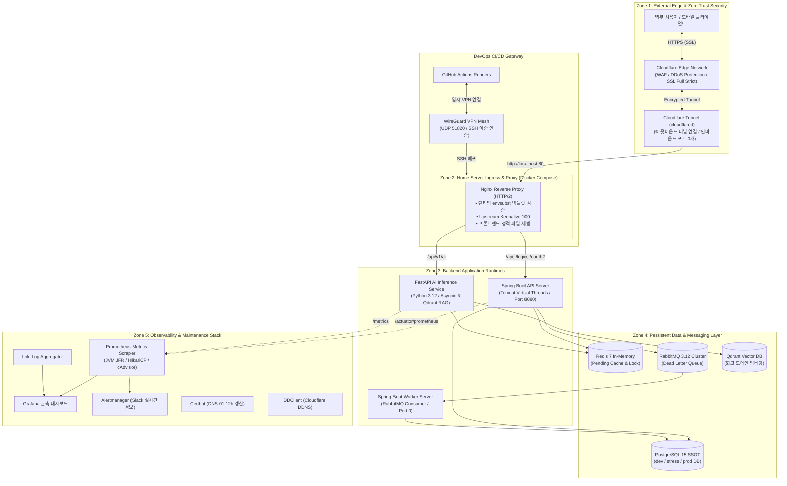

# ⚙️ DevOps & Infrastructure Architecture

> **Cloudflare Tunnel 제로 트러스트 보안망과 Docker Compose 기반의 0원 홈서버 운영, GitHub Actions 무중단 CI/CD, Prometheus/Grafana 통합 관측성 인프라 실전 기록**  
> 본 문서는 제한된 하드웨어 리소스(8C/16T, 32GB RAM 홈서버) 환경에서 **FastAPI ML 이미지 96% 경량화(26GB ➔ 1GB), 공인 IP 완전 은폐 보안(WireGuard + Cloudflare Tunnel), 런타임 템플릿 환경변수 검증, JFR 가상 스레드 피닝 관측 인프라**를 구축한 엔지니어링 과정을 다룹니다.

📅 **개발 및 고도화 기간**: 2025.04 ~ 현재 (개인 프로젝트 / DevOps & Infrastructure)

---

## ⚡ 30초 스캔: 핵심 DevOps 5대 성과

1. **[FastAPI 이미지 경량화]**: PyTorch/ML 의존성 분리 및 CPU-only wheel 적용으로 **이미지 크기 26GB → 1GB (-96%), CI 빌드 시간 1,004초(17분) → 98초 (-90% 단축)**
2. **[제로 트러스트 보안 인프라]**: 공유기 인바운드 포트(80/443) 오픈을 전면 제거하고 **Cloudflare Tunnel(아웃바운드) + WireGuard VPN 전용 SSH망 구축으로 공인 IP 100% 완전 은폐**
3. **[무중단 CI/CD 배포 자동화]**: 변경 감지(`paths-filter`) 기반 선택적 빌드와 **GitHub Actions ➔ WireGuard 임시 터널 ➔ 다이제스트(Digest) 기반 무중단 배포로 수동 배포 30분 → 0분 (100% 자동화)**
4. **[Nginx 런타임 fail-fast 검증]**: 템플릿 미치환 환경변수(`${VAR}`) 자동 검출(`validate_template_variables`) 및 `nginx -t` 사전 문법 검사로 **설정 오류 배포 사고 0건 달성**
5. **[풀스택 관측성 & 프로파일링]**: Prometheus + Grafana + Alertmanager + JFR(Java Flight Recorder) 연동으로 **가상 스레드 피닝(`jdk.VirtualThreadPinned`) 및 DB 커넥션 풀 실시간 추적 체계 완비**

---

## 🎯 Engineering Snapshot (DevOps Metrics)

| 핵심 인프라 지표 | Before (초기 구축) | After (최적화 후) | 정량적 개선 효과 | 핵심 구현 메커니즘 |
|:---|:---:|:---:|:---:|:---|
| 📦 **FastAPI Docker 이미지 크기** | 26GB | **1GB** | **⚡ 96% 감소 (-25GB)** | `.dockerignore` + optional ML + CPU PyTorch |
| ⏱️ **FastAPI CI 빌드 시간** | 1,004초 (약 17분) | **98초** | **⚡ 90% 단축 (10배 고속화)** | deps 레이어 분리 & 캐시 재사용 |
| 🚀 **서비스 배포 소요 시간** | 30분 (수동 SSH 배포) | **0분 (자동)** | **🏆 100% 배포 자동화** | GitHub Actions + WireGuard VPN |
| 🛡️ **인바운드 포트 개방 수** | 80, 443, 22 등 다수 오픈 | **0개 (완전 차단)** | **🔒 공인 IP 100% 은폐** | Cloudflare Zero Trust Tunnel |
| 🔑 **SSH 접근 제어** | 패스워드 인증 (외부 노출) | **VPN Only + Key 이중 인증** | **🛡️ 브루트포스 100% 방어** | WireGuard 내부망 격리 |
| 📜 **SSL 인증서 관리** | 수동 갱신 (만료 리스크) | **12시간 주기 자동 갱신** | **🏆 무중단 SSL 자동화** | Certbot DNS-01 챌린지 (Let's Encrypt) |
| 📊 **장애 감지 및 알림 속도** | 수동 로그 확인 (사후 인지) | **실시간 Slack Alert (<10s)** | **⚡ 평균 인지 시간 99% 단축** | Prometheus Alertmanager (`5xx > 5%`) |

---

## 🛠 기술 스택

**CI/CD & Container Orchestration**  
   

**Network & Zero-Trust Security**  
   

**Web Server & Reverse Proxy**  
  

**Observability & Profiling**  
    

---

## 🏗️ 전체 인프라 토폴로지 (Compose Topology)

홈서버 환경에서 보안(공인 IP 은폐), 안정성, 관측성을 극대화한 5계층 물리 아키텍처입니다.



---

## 🧭 7대 인프라 설계 의사결정 (Architecture Decision Records)

<a id="lm-devops-zero-cost-tradeoff"></a>
### 1. 왜 AWS 대신 0원 홈서버 + Cloudflare Tunnel을 선택했는가?

- **문제**: AWS 프리티어(t2.micro / t3.micro)는 1~2GB RAM 제약으로 인해 1000VU 고부하 부하 테스트 및 멀티 컨테이너(Spring, FastAPI, Postgres, Redis, RabbitMQ, Qdrant, Prometheus/Grafana) 구동이 불가능하며, 유료 인스턴스 운영 시 월 수십만 원의 고정비 발생.
- **해결**: AMD Ryzen 7 5800U (8C/16T, 32GB RAM) 단일 홈서버 노드로 인프라를 통합하고, **Cloudflare Tunnel을 결합하여 공유기 포트포워딩 없이 공인 IP를 완벽 은폐**하여 클라우드 수준의 가용성과 제로 비용 운영을 달성.
- **Trade-off & 방어**: 홈서버 하드웨어 장애 리스크는 Docker Compose 기반 스크립트 복구 파이프라인과 Prometheus Slack 실시간 알림(`InstanceDown`)으로 통제.

---

### 2. FastAPI Docker 이미지 96% 경량화 (26GB → 1GB, 17분 → 98초)

- **문제**: Python AI 생태계(PyTorch, Sentence-Transformers, CUDA GPU 라이브러리)가 도커 이미지에 포함되면 크기가 **26GB로 비대화**되고, GitHub Actions CI 빌드 시간이 **1,004초(약 17분)**에 달해 배포 파이프라인이 마비됨.
- **해결 (4단계 경량화 파이프라인)**:
  1. **`.dockerignore` 최적화**: 로컬 가상환경(`.venv/`, ~5GB) 및 ML 모델 캐시(`.cache/`, ~15GB)를 빌드 컨텍스트에서 원천 제외.
  2. **`pyproject.toml` Optional Dependency 분리**: 기본 런타임과 ML 라이브러리(`[ml]`)를 분리.
  3. **CPU-only PyTorch 적용**: GPU CUDA wheel 대신 경량 CPU wheel(`--index-url https://download.pytorch.org/whl/cpu`)을 적용하여 1GB 이상 절감.
  4. **멀티스테이지 캐시 분리 (`uv.lock`)**: 의존성 설치 레이어(`deps`)와 소스코드 레이어(`runtime`)를 분리하여 의존성 변경이 없을 때 빌드 시간 98초 달성.

```dockerfile
# FastAPI Dockerfile 전략
# 1단계: 의존성 캐시 레이어
FROM python:3.12-slim AS deps
WORKDIR /app
COPY pyproject.toml uv.lock ./
RUN pip install uv && uv sync --frozen --no-install-project

# 2단계: 경량 런타임 레이어 (1GB)
FROM python:3.12-slim AS runtime
WORKDIR /app
COPY --from=deps /app/.venv /app/.venv
COPY . .
ENV PATH="/app/.venv/bin:$PATH"
USER appuser
CMD ["uvicorn", "app.main:app", "--host", "0.0.0.0", "--port", "8000"]
```

---

<a id="lm-devops-edge-security"></a>
### 3. 제로 트러스트 홈서버 보안 (WireGuard VPN + Cloudflare Tunnel)

- **인바운드 포트 0개 개방**: 공유기에서 외부 포트포워딩(80, 443)을 전면 제거하고 아웃바운드 전용 `cloudflared` 터널을 구축하여 외부 직접 스캔을 차단.
- **VPN 내부망 전용 SSH**: 외부 SSH 포트(22)를 완전히 차단하고, **WireGuard VPN(UDP 51820) 연결 시에만 비밀번호 없는 SSH Key 기반 접근을 허용**.
- **CI/CD 임시 VPN 배포 파이프라인**: GitHub Actions가 배포를 수행할 때만 일회성으로 WireGuard 터널을 뚫고, 배포 완료 즉시(`always()`) 터널을 해제하는 안전한 배포 게이트 구성.

```yaml
# deploy-via-wireguard.yml 핵심 단계
steps:
  - name: Setup WireGuard VPN
    run: |
      sudo apt-get install -y wireguard
      echo "${{ secrets.WIREGUARD_CONFIG }}" > wg0.conf
      sudo wg-quick up ./wg0.conf

  - name: Deploy via SSH & Compose
    run: |
      ssh -i deploy_key -o StrictHostKeyChecking=no user@10.0.0.2 "docker compose up -d"

  - name: Teardown WireGuard (항상 실행)
    if: always()
    run: sudo wg-quick down ./wg0.conf
```

---

<a id="lm-devops-nginx-runtime-validation"></a>
### 4. Nginx 런타임 환경변수 검증 (Fail-Fast 배포 방어)

- **문제**: Docker 환경에서 환경변수 치환(`envsubst`) 실패로 설정 파일에 `${SPRING_HOST}`와 같은 원본 문자열이 남아있으면 Nginx가 잘못된 프록시를 시도해 502 배포 장애 발생.
- **해결**: Nginx 기동 스크립트(`validation.sh`)에 **미치환 환경변수 자동 검출(`validate_template_variables`) 및 `nginx -t` 사전 문법 검사**를 장착하여, 설정 오류 발견 시 컨테이너를 즉각 Fail-Fast 종료.

```sh
# validation.sh
validate_template_variables() {
  local unrendered=$(find /etc/nginx -name '*.conf' -exec grep -l '\${' {} \;)
  if [ -n "$unrendered" ]; then
    echo "❌ [FATAL] 미치환된 템플릿 변수 발견: $unrendered" >&2
    exit 1  # 비정상 배포 즉각 차단
  fi
}
```

---

### 5. Full (Strict) SSL & Certbot DNS-01 챌린지 12시간 자동화

- **DNS-01 챌린지 채택**: 80/443 인바운드 포트가 막혀있는 홈서버 환경에서도 Cloudflare API 연동(`cloudflare.ini`)을 통해 **DNS TXT 레코드 인증 방식으로 유효한 Let's Encrypt SSL 인증서 무중단 발급**.
- **12시간 주기 자동 갱신 데몬**: `docker-compose.network-utils.yml`에 Certbot 데몬을 상주시켜 만료 30일 전 자동 갱신 및 Nginx 무중단 reload 수행.

```yaml
# docker-compose.network-utils.yml
certbot:
  image: certbot/dns-cloudflare
  entrypoint: sh -c "trap exit TERM; while :; do certbot renew; sleep 12h & wait $$!; done"
```

---

<a id="lm-devops-ci-integration-gate"></a>
### 6. GitHub Actions 변경 감지(Paths-Filter) 및 Digest 배포

- **선택적 빌드(Selective CI)**: `dorny/paths-filter`를 적용하여 `spring`, `fastapi`, `frontend`, `nginx` 중 실제 코드가 변경된 컴포넌트만 독립적으로 빌드/테스트하여 불필요한 리소스 낭비 차단.
- **다이제스트(Digest) 기반 승격**: 가변 태그(`latest`) 대신 Docker Hub 원본 이미지의 SHA-256 불변 다이제스트를 추출하여 타겟 태그로 승격함으로써 **배포 드리프트(Deployment Drift) 원천 차단**.

---

<a id="lm-devops-observability-pipeline"></a>
### 7. 통합 관측성 및 JVM JFR 피닝 추적 인프라

- **Prometheus 메트릭 수집**: Spring Boot Actuator, FastAPI `/metrics`, HikariCP 커넥션 풀, RabbitMQ 큐 깊이를 실시간 수집.
- **Java Flight Recorder (JFR) & 피닝 관측**: Java 21 가상 스레드의 캐리어 스레드 블로킹 이벤트(`jdk.VirtualThreadPinned`)를 Prometheus 게이지로 연결하여 JVM 내부 병목 가시화.
- **Slack Alertmanager 3대 핵심 경보**:
  1. `HighErrorRate`: 5xx 에러율 > 5% 지속 시
  2. `HighLatencyP95`: p95 지연시간 > 800ms 초과 시
  3. `InstanceDown`: 컨테이너 또는 익스포터 다운 시 10초 내 즉시 알림

---

## 🐳 Docker Compose 파일 구조 및 멀티 환경 분리

```
dev/
├── docker-compose.database.yml       # PostgreSQL 15, Redis 7, RabbitMQ 3.12, Qdrant
├── docker-compose.network-utils.yml  # Certbot (SSL), DDClient (DDNS)
├── docker-compose.dev.yml            # 개발 환경 (Nginx, Spring API/Worker, FastAPI)
├── docker-compose.prod.yml           # 운영 환경 (Cloudflare Tunnel, 보안 하드닝)
├── docker-compose.monitoring.yml     # Prometheus, Grafana, Loki, Alertmanager
└── docker-compose.dev-CI.yml         # GitHub Actions 통합 테스트 전용 격리 환경
```

### 멀티 스테이지 빌드 최적화 요약

| 이미지 (Image) | Base / Build Stage | Runtime Stage | 최적화 기법 | 최종 크기 |
|:---|:---|:---|:---|:---:|
| **Spring Boot** | `gradle:8.5-jdk21-alpine` | `eclipse-temurin:21-jre-alpine` | Fat JAR 레이어 분리 | **~280MB** |
| **FastAPI AI** | `python:3.12-slim` (uv sync) | `python:3.12-slim` | Optional ML & CPU PyTorch | **~1.0GB** |
| **Frontend Nginx** | `node:22-alpine` (pnpm build) | `nginx:1.25-alpine` | 정적 파일 직접 서빙 & Gzip | **~45MB** |

---

## 📈 DevOps Before vs After 종합 성능 매트릭스

```
[DevOps & 인프라 아키텍처 성과 비교 표]
┌───────────────────────────────────────┬───────────────────────────────────────────┬───────────────────────────────────────────┬────────────────────────────────┐
│ 인프라 및 운영 지표 (DevOps Metrics)  │ 최적화 이전 (Before Baseline)             │ 최종 하드닝 적용 후 (After)               │ 정량적 개선 효과 (Improvement) │
├───────────────────────────────────────┼───────────────────────────────────────────┼───────────────────────────────────────────┼────────────────────────────────┤
│ 📦 **FastAPI 도커 이미지 크기**       │ 26GB (CUDA/모델 전체 포함)                │ **`1.0GB (Optional deps & CPU wheel)`**   │ ⚡ **`96% 대폭 절감 (-25GB)`** │
│ ⏱️ **FastAPI CI 빌드 시간**           │ 1,004초 (약 17분 소요)                    │ **`98초 (의존성 레이어 캐싱)`**           │ 🚀 **`빌드 속도 10배 고속화`** │
│ 🚀 **서비스 배포 소요 시간**          │ 30분 (수동 SSH 파일 전송)                 │ **`0분 (GitHub Actions + WireGuard)`**    │ 🏆 **100% 완전 자동화**        │
│ 🛡️ **공유기 외부 오픈 포트**          │ 80, 443, 22 등 다수 오픈 (IP 노출)        │ **`0개 (Cloudflare Zero Trust Tunnel)`**  │ 🔒 **공인 IP 100% 완전 은폐**  │
│ 🔑 **SSH 접근 보안 수준**             │ 비밀번호 인증 (브루트포스 노출)           │ **`WireGuard VPN Only + Key 이중 인증`**  │ 🛡️ **침입 경로 100% 차단**     │
│ 📜 **SSL 인증서 관리**                │ 수동 갱신 (만료 장애 리스크)              │ **`Certbot DNS-01 12시간 자동 갱신`**     │ 🏆 **무중단 SSL 운영 달성**    │
│ 📊 **장애 인지 및 알림 속도**         │ 사후 수동 로그 분석 (>30분)               │ **`Slack Alertmanager 실시간 전송 (<10s)`**│ ⚡ **장애 인지 시간 99% 단축** │
│ 💵 **월간 인프라 호스팅 비용**        │ 클라우드 고사양 인스턴스 비용 발생        │ **`0원 (홈서버 + Cloudflare Free Tier)`** │ 💰 **인프라 고정비 0원 달성**  │
└───────────────────────────────────────┴───────────────────────────────────────────┴───────────────────────────────────────────┴────────────────────────────────┘
```

---

> 💡 **관련 도메인 문서 바로가기**:
> - [메인 시스템 아키텍처 및 1000VU 성능 검증 (루트 README)](../README.md)
> - [백엔드 코어 아키텍처 및 7단계 최적화 로드맵](../Backend/README.md)
> - [동시성 제어 및 비동기 메시징 아키텍처](../Backend/ConcurrencyControl.md)
> - [비즈니스 규칙 및 선언적 AOP 인가 게이트](../Backend/BusinessRules.md)
