# ⚙️ DevOps & Infrastructure

안정적인 서비스 운영과 자동화를 위해 Docker 기반의 배포 환경과 GitHub Actions를 이용한 CI/CD 파이프라인을 구축

📅 **개발 기간**: 2025.04 ~ 현재 (개인 프로젝트)

### 🚀 핵심 성과
| 지표 | Before → After | 개선율 |
|------|----------------|--------|
| **FastAPI 이미지** | 26GB → 1GB | **-96%** |
| **FastAPI 빌드** | 1004초 (약 17분) → 98초 | **-90%** |
| **수동 배포** | 30분 → 자동 | **100% 자동화** |
| **외부 SSH 접근** | 허용 → VPN Only | **보안 강화** |

### 🛠 기술 스택

**CI/CD & Infra**

   

**Monitoring & Security**

   

**Nginx & SSL**

 

## 🧭 설계 의사결정 (Design Decisions)

홈서버 환경에서 **보안**, **빌드 성능**, **배포 자동화**를 균형 있게 고려한 의사결정 과정

<a id="lm-devops-ci-change-detection"></a>
### 1. CI/CD 자동화 (빌드/배포 귀찮음 해결)

| 고민 | 결정 | 이유 |
|------|------|------|
| 수동 빌드/배포가 너무 귀찮음 | **GitHub Actions CI/CD** | 코드 푸시만으로 자동 배포 |
| 변경 안 된 부분도 매번 빌드됨 | **변경 감지 + 선택적 빌드** | 변경된 컴포넌트만 빌드하여 시간 절약 |
| 배포 전 테스트 누락 | **통합 테스트 자동화** | Nginx + Spring + FastAPI 통합 테스트 |
| **테스트마다 DB 초기화가 귀찮음** | **테스트 전용 DB 분리** | `application-stress.yml`로 별도 DB 사용 |
| **부하 테스트 환경 세팅이 번거로움** | **stress-test 스크립트화** | 한 줄 명령으로 테스트 환경 구축 |

**Trade-off**: 초기 설정 복잡하지만, 장기적으로 배포 비용 대폭 절감

<details>
<summary>🔍 구현 결과</summary>

**워크플로우 구성**:
| 워크플로우 | 트리거 | 설명 |
|-----------|--------|------|
| `ci.yml` | PR 생성/업데이트 | 빌드, 테스트, 이미지 푸시 |
| `deploy-via-wireguard.yml` | main/dev 푸시 | WireGuard VPN 통한 배포 |
| `stress-test-*.yml` | 수동 트리거 | k6 부하 테스트 환경 |

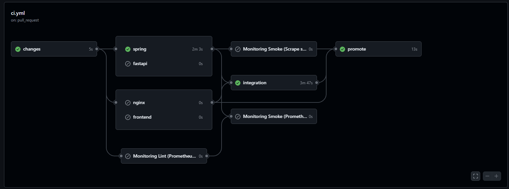
- 변경된 코드만 감지해서 CI 진행

**변경 감지 로직**:
```yaml
- id: filter
  uses: dorny/paths-filter@v3
  with:
    filters: |
      spring: 'backend/bk-spring-dev/**'
      fastapi: 'backend/bk-fastApi-dev/**'
      frontend: 'frontend/**'
      nginx: 'dev/nginx/**'
```

**테스트 환경 분리**:
| 환경 | Profile | DB | 용도 |
|------|---------|-----|------|
| 개발 | `dev` | PostgreSQL (dev) | 일상 개발 |
| 부하 테스트 | `stress` | PostgreSQL (stress) | k6 테스트, 매 테스트마다 초기화 |
| 운영 | `prod` | PostgreSQL (prod) | 실제 서비스 |

<a id="lm-devops-k6-load-architecture"></a>
<a id="lm-devops-stress-mode-lifecycle"></a>
**Stress Test 프로세스**:
- **격리된 환경 구축**: 운영 데이터에 영향을 주지 않도록 `stress` 전용 프로파일과 별도의 데이터베이스 인스턴스를 활용하여 테스트 환경을 자동 구성
- **시나리오 기반 검증**: k6를 활용하여 인증(Auth), 쓰기(Write), 읽기(Read) 등 주요 유즈케이스별 부하 시나리오를 실행하고 지표를 수집
- **CDN 바이패스(Bypass) 분석**: Cloudflare 등 외부 네트워크 레이어의 변수를 배제하고, 오리진 서버의 순수 처리 성능을 정교하게 측정하기 위해 직접 연결 방식의 부하 테스트를 병행
- **단계적 부하 증가**: 500 VU에서 최대 2,000 VU까지 점진적으로 부하를 높이며 시스템의 임계 지점을 파악하고 성능 병목을 진단

</details>

---

### 2. FastAPI 빌드 최적화 (30GB → 1GB, 20분 → 98초)

| 항목 | Before | After | 개선 |
|------|--------|-------|------|
| 이미지 크기 | 26GB | 1GB | **96% 감소** |
| 빌드 시간 | 1004초 | 98초 | **90% 단축** |

| Before (26GB) | After (1GB) |
|:---:|:---:|
| 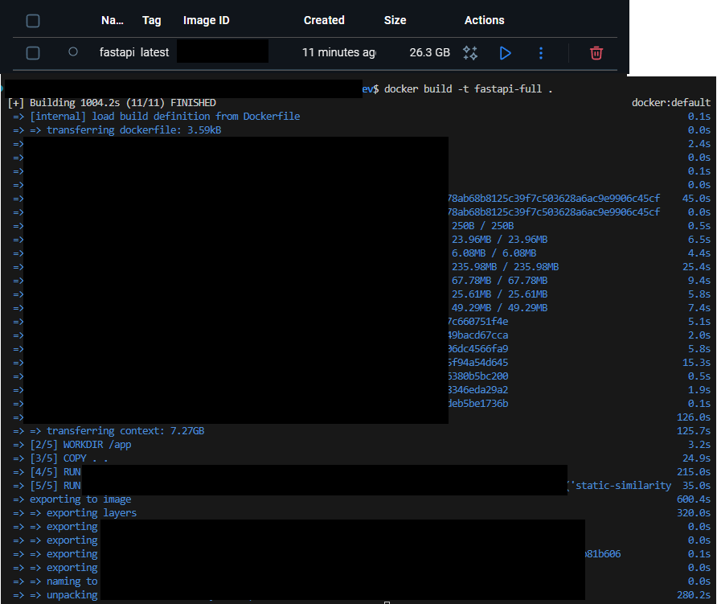 | 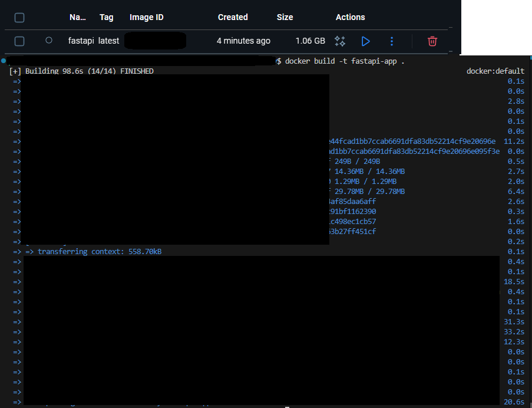 |

| 고민 | 결정 | 이유 |
|------|------|------|
| CI 빌드 시간이 너무 오래 걸림 (GitHub Actions 프리티어 한계) | **ML 라이브러리 이미지에서 제외** | 안티 패턴이지만 비용 vs 속도 Trade-off |
| 로컬 `.venv/`, `.cache/` 폴더가 이미지에 포함됨 | **`.dockerignore` 활용** | 로컬 환경 파일 빌드 컨텍스트에서 제외 (~15GB 절감) |
| `sentence-transformers`가 PyTorch 포함 (~3GB) | **optional dependency 분리** | `pyproject.toml`에서 `[ml]` 익스트라로 분리 |
| 매번 라이브러리 다운로드 | **멀티스테이지 + deps 레이어 캐싱** | 의존성 변경 없으면 캐시 재사용 |
| ML 모델 런타임 다운로드 지연 | **볼륨 마운트 + 런타임 설치 스크립트** | `/app/.cache` 영속화, 필요 시 `install_ml_deps.py` 실행 |

**Trade-off**: ML 기능이 필요할 때 런타임에 `install_ml_deps.py` 스크립트로 설치 (첫 실행 시 약 5분 소요)

<details>
<summary>🔍 구현 결과</summary>

**`.dockerignore` 전략** (대용량 파일 제외):
```dockerignore
.venv/              # 로컬 가상환경 (~3-5GB)
**/.venv/
.cache/             # ML 모델 캐시 (~10-20GB)
**/.cache/
sentence-transformers/    # 다운로드된 모델 (~5-10GB)
**/sentence-transformers/
```

**`pyproject.toml` 전략** (ML 라이브러리 분리):
```toml
[project.optional-dependencies]
ml = [
    "sentence-transformers>=2.6.0",  # PyTorch 포함 ~2-3GB
]
```

**FastAPI Dockerfile 전략**:
```dockerfile
# deps 스테이지: 의존성만 설치 (캐시 재사용)
FROM python:3.11-slim AS deps
COPY pyproject.toml uv.lock ./
RUN .venv/bin/uv sync --frozen --no-install-project

# runtime 스테이지: deps 기반으로 앱 코드만 추가
FROM deps AS runtime
COPY . .
```

**`install_ml_deps.py` 전략** (런타임 ML 설치):
```python
# CPU 전용 PyTorch 선설치 (GPU wheel 방지 → 용량 절감)
run_pip(["install", "--index-url", CPU_INDEX_URL, TORCH_SPEC])

# 프로젝트 ML 익스트라 설치
run_pip(["install", ".[ml]"])
```
- **조건부 설치**: `sentence_transformers` 모듈이 없을 때만 설치
- **CPU 전용**: GPU wheel 대신 CPU wheel 사용으로 ~1GB 절감

**용량 절감 상세**:
| 최적화 항목 | 절감 용량 |
|------------|----------|
| `.dockerignore` → `.venv/` 제외 | ~3-5GB |
| `.dockerignore` → `.cache/` 제외 | ~10-15GB |
| optional dependency 분리 | ~2-3GB |
| CPU 전용 PyTorch | ~1GB |
| **총 절감** | **~25GB** |

</details>

---

<a id="lm-devops-edge-security"></a>
### 3. 홈서버 보안 (VPN 제어)

| 고민 | 결정 | 이유 |
|------|------|------|
| 홈서버 외부 접속 시 보안 문제 | **라우터 포트 최소화** | 443, 80 포트만 외부 오픈 |
| 개발/배포 시 SSH 접속 필요 | **WireGuard VPN** | VPN 연결 시에만 SSH 허용 |
| SSH 비밀번호 브루트포스 공격 | **비밀번호 접속 비활성화** | 키 기반 인증만 허용 |
| VPN 키 유출 시 대응 | **VPN 키 분리 관리** | CI용/개인용 키 분리, 즉시 무효화 가능 |
| CI에서 홈서버 배포 방법 | **CI에서 VPN 설치 → 배포 → VPN 제거** | 임시 VPN 연결로 보안 유지 |

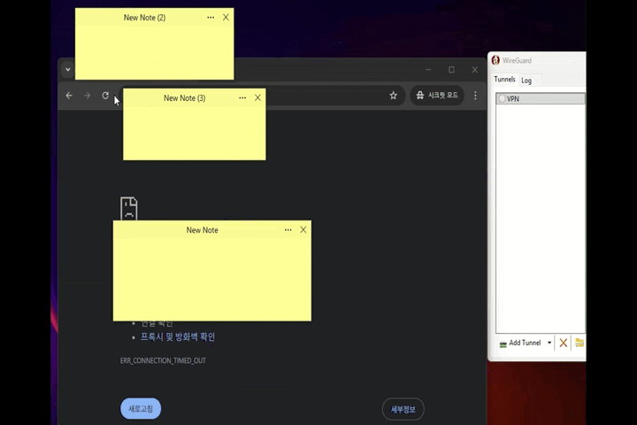

<details>
<summary>🔍 구현 결과</summary>

**SSH 접근 제어**:
| 항목 | 설정 | 효과 |
|------|------|------|
| **SSH 포트 접근** | VPN 내부망에서만 허용 | 외부에서 SSH 포트 스캔 불가 |
| **비밀번호 접속** | `PasswordAuthentication no` | 브루트포스 공격 차단 |
| **루트 로그인** | `PermitRootLogin no` | 루트 직접 접근 차단 |
| **인증 방식** | SSH 키 + VPN 키 이중 인증 | 두 키 모두 필요 |

**CI VPN 배포 전략** (`deploy-via-wireguard.yml`):
```yaml
steps:
  - name: Install WireGuard
    run: sudo apt-get install -y wireguard

  - name: Setup WireGuard
    run: |
      echo "${{ secrets.WIREGUARD_CONFIG }}" > wg0.conf
      sudo wg-quick up ./wg0.conf

  - name: Deploy Services  # 배포 작업
    # ...

  - name: Teardown WireGuard  # 항상 실행
    if: always()
    run: sudo wg-quick down ./wg0.conf
```

**보안 레이어**:
| 레이어 | 보호 방식 |
|--------|----------|
| **CloudFlare** | IP 은폐, DDoS 방어, WAF |
| **라우터** | 443만 포트포워딩, SSH 포트 외부 차단 |
| **WireGuard** | VPN 키 인증 시에만 내부망 접속 |
| **SSH** | 비밀번호 비활성화, SSH 키 인증만 허용 |
| **CI** | 임시 VPN 연결 후 즉시 해제 |

</details>

---

<a id="lm-devops-nginx-runtime-validation"></a>
### 4. Nginx 런타임 검증 (빌드 시 에러 방지)

| 고민 | 결정 | 이유 |
|------|------|------|
| Nginx 설정 문제가 있어도 CI에서 그냥 빌드됨 | **런타임 환경변수 템플릿** | 런타임에 envsubst로 설정 생성 |
| 템플릿 변수 미치환 시 에러 | **validate_template_variables** | 미치환 변수 발견 시 컨테이너 시작 차단 |
| CI에서 설정 검증 방법 | **DEBUG=true 모드** | 상세 로그 출력으로 문제 발견 |

<details>
<summary>🔍 구현 결과</summary>

**런타임 검증 스크립트** (`validation.sh`):
```sh
validate_template_variables() {
    local found_vars=$(find /etc/nginx -name '*.conf' -exec grep -l '\${' {} \;)
    if [ -n "$found_vars" ]; then
        log_error "처리되지 않은 템플릿 변수 발견:"
        exit 1  # 컨테이너 시작 차단
    fi
}

validate_nginx_syntax() {
    if nginx -t; then
        log_info "Nginx 설정 검증 성공!"
    else
        exit 1
    fi
}
```

**DEBUG 모드** (`docker-compose.yml`):
```yaml
nginx:
  environment:
    - DEBUG=true  # CI에서만 활성화
```

</details>

---

### 5. CPU 프로파일링 가이드 (JVM 성능 분석)

| 고민 | 결정 | 이유 |
|------|------|------|
| DB/캐시는 정상인데 CPU 사용률 높음 | **JFR/async-profiler** | JVM 메서드별 CPU Hotspot 분석 |
| 도커 컨테이너에서 프로파일링 어려움 | **컨테이너 내 도구 배포** | `jcmd`, `profiler.sh` 직접 실행 |
| Flame Graph 분석 방법 | **Grafana + Prometheus 연계** | 병목 메서드 시각화 |

**Trade-off**: 프로파일링 도구 설치 시 컨테이너 크기 증가 → 필요 시에만 임시 배포

<details>
<summary>🔍 구현 결과</summary>

**성능 분석 방법론**:
- **런타임 프로파일링**: JVM의 이벤트를 수집하는 **JFR(Java Flight Recorder)**을 활용하여 CPU Hotspot, 메모리 할당 패턴, 스레드 병목을 실시간으로 분석
- **Flame Graph 시각화**: **async-profiler**를 통해 시스템 콜과 자바 메서드 스택을 덤프하고, Flame Graph로 시각화하여 가장 많은 리소스를 점유하는 코드 경로를 식별
- **커널/라이브러리 분석**: 컨테이너 환경에서 발생하는 시스템 I/O 및 네이티브 라이브러리 호출을 추적하여 인프라 레이어의 성능 저하 요인을 진단

</details>

---

### 6. 홈서버 네트워크 관리 (Dynamic DNS & SSL)

유동 IP 환경인 홈서버에서 안정적인 도메인 연결과 SSL 인증서 자동 갱신을 위해 `docker-compose.network-utils.yml`을 별도로 운용

| 서비스 | 이미지 | 역할 |
|--------|--------|------|
| **DDClient** | `linuxserver/ddclient` | 유동 IP 변경 시 CloudFlare DNS 레코드 자동 업데이트 |
| **Certbot** | `certbot/dns-cloudflare` | DNS-01 챌린지 방식으로 SSL 인증서 발급 및 자동 갱신 |

<details>
<summary>🔍 구현 디테일</summary>

**Certbot (DNS-01 Challenge)**:
- **왜 DNS 챌린지인가?**: 홈서버 포트(80)가 막혀있거나 내부망에 있을 때도 인증서 발급 가능
- **자동 갱신**: 12시간마다 인증서 만료 확인 후 갱신
- **CloudFlare 연동**: `cloudflare.ini`를 통해 API 인증

```yaml
certbot:
  image: certbot/dns-cloudflare
  command:
    - |
      certbot certonly --dns-cloudflare \
      --dns-cloudflare-credentials /secrets/cloudflare.ini \
      -d "${NGINX_PRIMARY_DOMAIN}" \
      --non-interactive --agree-tos
```

**DDClient (DDNS)**:
- **IP 모니터링**: 주기적으로 공인 IP 확인
- **DNS 업데이트**: IP 변경 감지 시 CloudFlare에 새 IP 전송 ('A' 레코드)

</details>

---

<a id="lm-devops-troubleshooting-patterns"></a>
### 7. Cloudflare Tunnel (Zero Trust 네트워크)

| 고민 | 결정 | 이유 |
|------|------|------|
| 공유기 포트포워딩(80/443) 보안 위험 | **Cloudflare Tunnel** | 인바운드 포트 오픈 제거, IP 숨김 |
| 외부에서 직접 서버 IP 접근 가능 | **아웃바운드 연결** | 서버 → Cloudflare 방향으로만 연결 |
| SSL 인증서 관리 필요 | **Full (Strict) 모드 + Certbot** | Cloudflare↔서버 간 HTTPS, 인증서 자동 갱신 |

**Trade-off**: WireGuard VPN은 UDP 프로토콜이라 Tunnel 미지원 → 기존 UDP 포트포워딩 유지

<details>
<summary>🔍 구현 결과</summary>

**아키텍처 변경**:
| 구분 | 기존 (Port Forwarding) | 변경 후 (Cloudflare Tunnel) |
|------|------------------------|----------------------------|
| **연결 방식** | 외부 → 공유기(인바운드) → 서버 | 서버(cloudflared) → Cloudflare(아웃바운드) |
| **공유기 설정** | 80/443 포트포워딩 필수 | 포트포워딩 제거 |
| **DNS** | A 레코드 (공인 IP 노출) | CNAME 레코드 (UUID.cfargotunnel.com) |
| **보안** | 공인 IP 노출 | IP 완전 숨김 + WAF 보호 |

**주요 설정**:
```yaml
# /etc/cloudflared/config.yml
tunnel: <터널명>
credentials-file: /etc/cloudflared/<UUID>.json

ingress:
  - hostname: lifenavigation.store
    service: http://localhost:80  # Full (Strict): Nginx에서 SSL 처리, 유효한 인증서 필수
  - service: http_status:404
```

**트러블슈팅 핵심**:
| 이슈 | 원인 | 해결 |
|------|------|------|
| 400 Bad Request | `service: https://localhost:443` 설정 | `http://localhost:80`으로 변경 |
| 301 무한 루프 | Nginx 강제 HTTPS 리다이렉트 | 80포트 블록에서 301 제거 |

**VPN 예외**:
- WireGuard(UDP 51820)는 Tunnel 미지원 → 기존 포트포워딩 + A 레코드(DNS Only) 유지

**SSL 모드 비교**:
| 모드 | 인증서 요구사항 | 보안 수준 |
|------|---------------|----------|
| Flexible | 불필요 | ❌ 암호화 안 됨 |
| Full | 자체 서명 OK | ⚠️ 중간자 공격 취약 |
| **Full (Strict)** | **유효한 CA 인증서** | ✅ 권장 |

**Certbot 자동 갱신 (Full Strict 필수 요소)**:
- Let's Encrypt 인증서 발급 + **12시간마다 만료 확인**
- DNS-01 챌린지: 포트 80 없이도 인증서 갱신 가능
- Cloudflare API 연동으로 자동화

```yaml
# docker-compose.network-utils.yml
certbot:
  image: certbot/dns-cloudflare
  entrypoint: sh -c "trap exit TERM; while :; do certbot renew; sleep 12h & wait $$!; done"
```

</details>

---

### 의사결정 요약

| 영역 | 선택 | 대안 (검토 후 제외) |
|------|------|---------------------|
| CI/CD | GitHub Actions + 변경 감지 | Jenkins (오버스펙) |
| 배포 | WireGuard VPN | SSH 포트 오픈 (보안 ↓) |
| FastAPI 빌드 | 멀티스테이지 + deps 분리 | 단일 스테이지 (이미지 ↑) |
| Nginx 검증 | 런타임 템플릿 + DEBUG 모드 | 빌드 시점 검증 (유연성 ↓) |
| 외부 접속 | Cloudflare Tunnel | 포트포워딩 (IP 노출) |

---

<a id="lm-devops-compose-topology"></a>
<a id="lm-devops-observability-pipeline"></a>
## 🏗️ 인프라 아키텍처

홈서버 환경에서 보안과 안정성을 최우선으로 구성

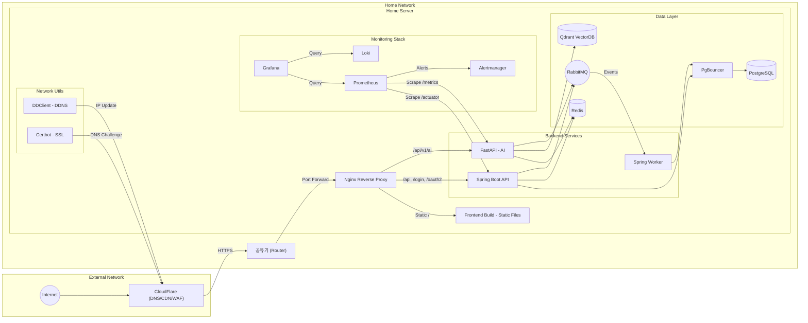

---

## 🐳 Docker Container 구성

### Docker Compose 파일 구조

| 파일 | 용도 |
|-----|-----|
| `docker-compose.database.yml` | PostgreSQL, PgBouncer, Redis, RabbitMQ, Qdrant |
| `docker-compose.network-utils.yml` | Certbot, DDClient |
| `docker-compose.dev.yml` / `prod.yml` | Nginx, Spring API/Worker, FastAPI |
| `docker-compose.monitoring.yml` | Prometheus, Grafana, Loki, Alertmanager |

- 그라파나 대시보드 모니터링 
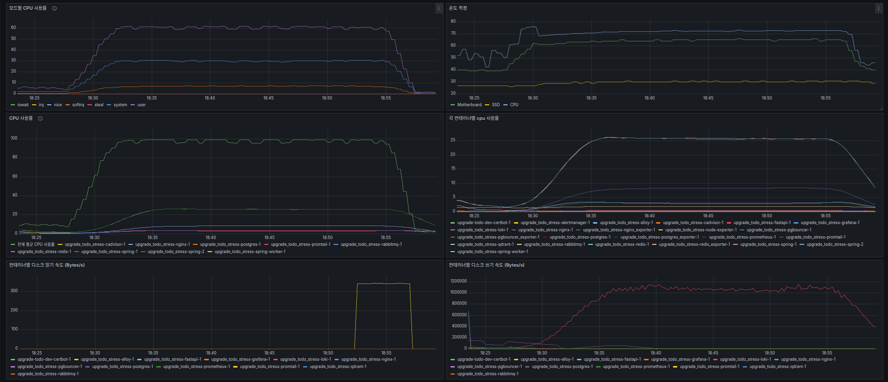
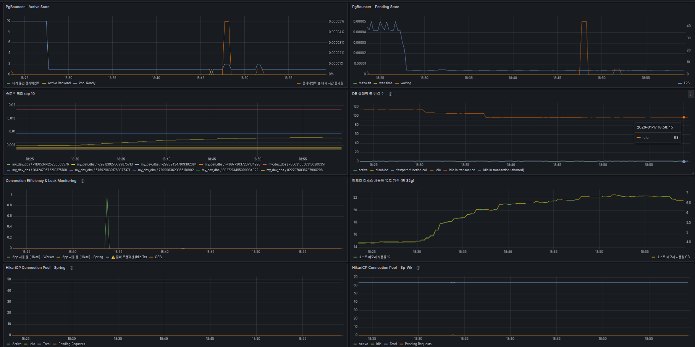
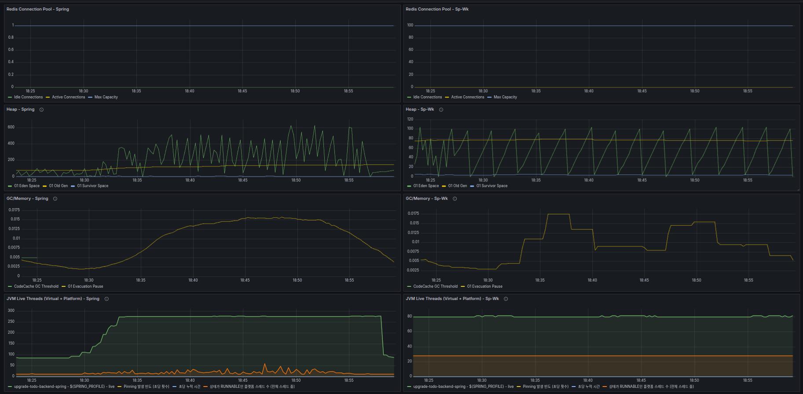
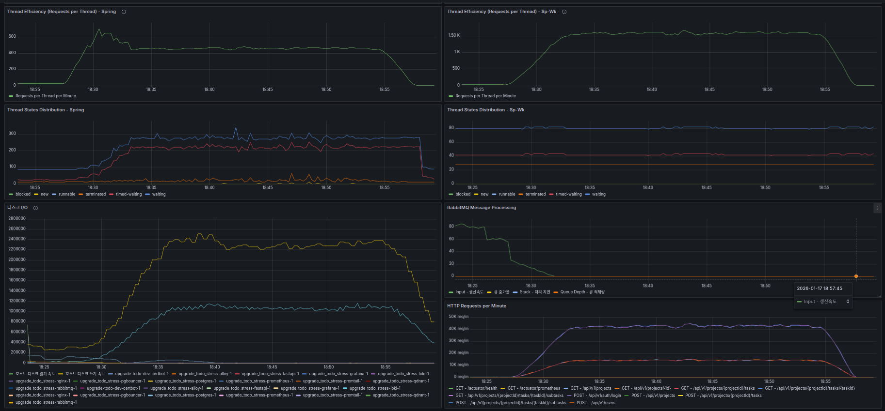
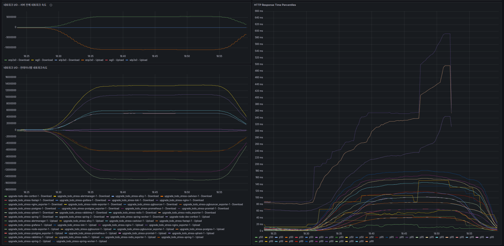

<a id="lm-devops-docker-build-map"></a>
### Docker 빌드 전략

#### 멀티스테이지 빌드

| 이미지 | Build Stage | Runtime Stage | 최적화 |
|-------|-------------|---------------|--------|
| Spring | `gradle:8.5-jdk21-alpine` | `eclipse-temurin:21-jre-alpine` | fat JAR |
| FastAPI | `python:3.11-slim` (deps) | deps 기반 runtime | uv.lock |
| Nginx | `node:22-alpine` (frontend) | `nginx:1.25-alpine` | pnpm 캐시 |

#### 빌드 캐시 최적화

```dockerfile
# Gradle 캐시
RUN --mount=type=cache,target=/root/.gradle ./gradlew build

# pnpm 캐시
RUN --mount=type=cache,target=/root/.pnpm-store pnpm install

# uv 캐시 (Python)
RUN .venv/bin/uv sync --frozen
```

#### 보안 강화

- **Non-root 사용자**: 모든 런타임 이미지에서 `appuser` 사용
- **Read-only 파일시스템**: docker-compose에서 `read_only: true` 설정
- **Healthcheck 내장**: Dockerfile 레벨에서 헬스체크 정의

---

## 🚀 CI/CD Pipeline (GitHub Actions)

<a id="lm-devops-ci-integration-gate"></a>
### CI Pipeline Flow (`ci.yml`)

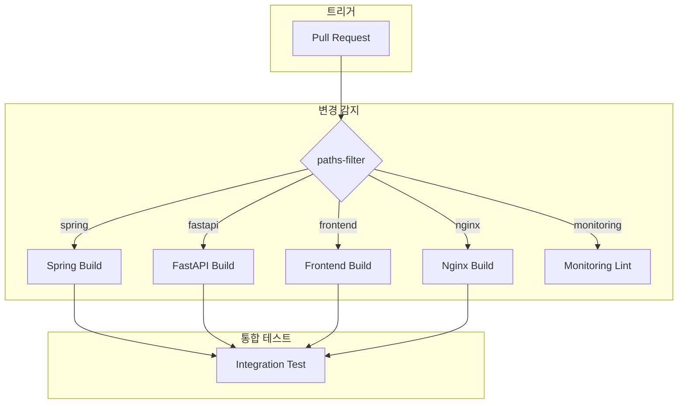

<a id="lm-devops-cd-wireguard"></a>
<a id="lm-devops-image-promotion"></a>
### Deploy Pipeline Flow (`deploy-via-wireguard.yml`)

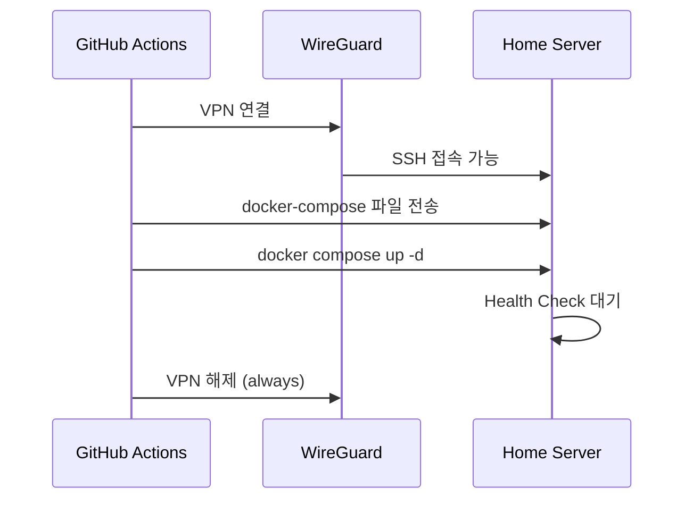

---

## 🛡️ Nginx & Security

### Nginx 역할

| 역할 | 설명 |
|------|------|
| **Reverse Proxy** | 외부 요청을 내부 컨테이너로 라우팅 |
| **Static File Serving** | 프론트엔드 빌드 파일 직접 서빙 |
| **SSL Termination** | Let's Encrypt 인증서 관리 |
| **런타임 설정** | 환경변수 기반 동적 설정 생성 |

### 라우팅 구조

| 경로 | 대상 | 설명 |
|-----|------|------|
| `/api/v1/ai/*` | FastAPI | AI 서비스 |
| `/api/*`, `/login/*`, `/oauth2/*` | Spring | 메인 백엔드 |
| `/` | 정적 파일 | 프론트엔드 |

### 런타임 검증 프로세스

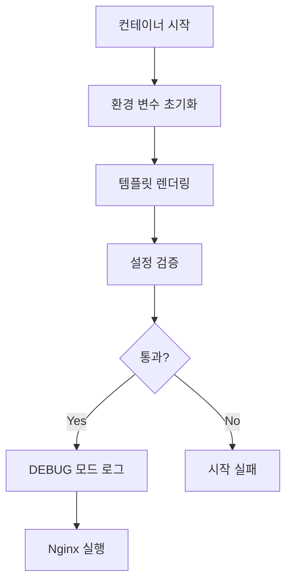

### 성능 최적화 설정

- **HTTP/2**: `http2 on` + `http2_max_concurrent_streams 256`
- **Keep-Alive**: `keepalive_requests 100000`, `keepalive_timeout 120s`
- **Gzip 압축**: text, css, json, javascript
- **Upstream Keep-Alive**: `keepalive 100` (커넥션 재사용)

---

### 7. 개발 환경 표준화 (Mise)

| 고민 | 결정 | 이유 |
|------|------|------|
| 프로젝트별 런타임(Node, pnpm 등) 버전 불일치 | **Mise (mise.toml)** | 런타임 버전 자동 관리 및 프로젝트별 격리 |
| 개발환경 구축의 번거로움 | **한 줄 설정** | `mise install` 하나로 모든 도구 즉시 셋업 |

**구현 및 사용**:
- **환경 통합**: 프론트엔드(Node 22, pnpm 10) 및 백엔드 등 모노레포 전체의 로컬 도구 버전을 한곳에서 관리
- **`mise.toml`**:
  ```toml
  [tools]
  node = "22"
  pnpm = "10.18.0"
  ```
- **셋업**: `mise install` -> `pnpm install` 순으로 누구나 동일한 환경 구축

---

## 📈 성능 성과

### CI/CD 성과

| 지표 | Before | After | 개선 |
|------|--------|-------|------|
| **수동 배포 시간** | 30분 | 0분 (자동) | **100% 자동화** |
| **FastAPI 빌드 시간** | 1004초 | 98초 | **90% 단축** |
| **FastAPI 이미지** | 26GB | 1GB | **96% 감소** |

### 보안 성과

| 항목 | 상태 | 구현 방식 |
|------|------|----------|
| **외부 SSH 접근** | ❌ 차단 | VPN 없이 불가 |
| **IP 노출** | ❌ 은폐 | CloudFlare Proxy |
| **DDoS 방어** | ✅ 적용 | CloudFlare WAF |

---

## ✨ 배운 점 (Lessons Learned)

### 자동화의 가치

> **"귀찮고 반복적이라고 느끼면 자동화로 만들기"**

- 수동 배포 30분 → 자동화에 1주일 투자 → 이후 수백 번 배포가 0분
- GitHub Actions 초기 설정이 복잡하지만, 장기적으로 엄청난 시간 절약
- **반복 작업은 무조건 자동화 대상**

### 빌드 최적화

> **"이미지 크기 = 비용 (저장소, 네트워크, 배포 시간)"**

- FastAPI 26GB → 1GB: `.dockerignore`, 멀티스테이지, 의존성 분리
- 처음엔 "그냥 빌드되면 됐지" 했지만, CI 비용과 배포 시간이 문제가 됨
- **최적화는 나중에 하면 된다는 = 빚 + 이자**

### 홈서버 보안

> **"편의성과 보안은 Trade-off"**

- 외부 SSH 오픈 vs VPN Only: 보안을 선택하고 CI VPN 배포로 편의성 보완
- CloudFlare로 IP 은폐 + WAF → DDoS 걱정 없음
- **보안 레이어는 여러 겹이 좋다**

### 검증 자동화

> **"에러는 빨리 발견할수록 좋다"**

- Nginx 설정 오류 → 배포 후에야 발견 → 런타임 검증으로 해결
- `validate_template_variables`로 미치환 변수 즉시 차단
- **CI에서 잡을 수 있으면 CI에서 잡기**

---

## 🔮 향후 개선 계획

### 🔥 우선순위 높음
- [ ] **자동 롤백 메커니즘 추가** - 배포 실패 시 서비스 가용성을 즉시 확보하기 위해 이전 성공 버전으로 자동 복구
- [ ] **Blue-Green 배포 구현** - 홈서버 리소스 한계 내에서 다운타임 없는 무중단 배포 환경 구축

### 📌 중간 우선순위
- [ ] **Terraform으로 인프라 코드화** - 수동 설정을 최소화하고 인프라 변경 이력을 코드로 관리 (IaC)
- [ ] **모니터링 알림 고도화** - 장애 발생 시 즉각 대응을 위한 Slack/Discord 임계치 알림 연동

### 💡 장기 계획
- [ ] Kubernetes 전환 - 서비스 규모 확장 시 오케스트레이션 고도화 (현재는 Docker Compose로 비용 효율적 운영 중)
- [ ] ArgoCD GitOps 도입 - 선언적 배포 관리를 통한 운영 복잡도 제거
