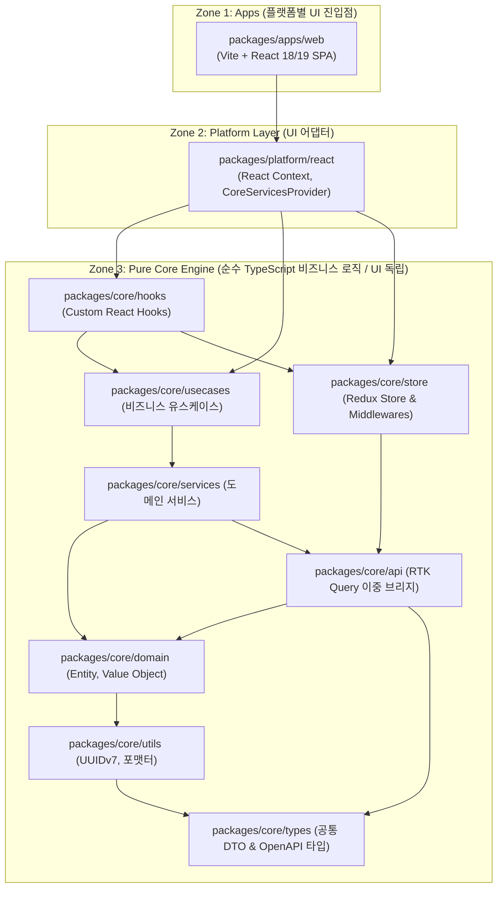

# 🎨 Frontend Architecture & Engineering

> **React 18/19 & TypeScript 기반의 플랫폼 독립적 Core 패키지 모노레포와 Zero-Latency Optimistic UI, RTK Query 이중 백엔드(Spring/FastAPI) 브리지 아키텍처**  
> 본 문서는 Turborepo + pnpm workspaces를 통한 **빌드 시간 82% 단축(4분 10초 ➔ 45초), ESLint 기반 순환 참조 원천 차단, Fat Component 해체(-51% 코드 축소), 클라이언트 UUIDv7 사전 할당 및 백엔드 Pending Cache 연계 Optimistic UX**를 구축한 프론트엔드 엔지니어링 실전 기록입니다.

📅 **개발 및 고도화 기간**: 2025.04 ~ 현재 (개인 프로젝트 / Frontend & Core Monorepo)

---

## ⚡ 30초 스캔: 핵심 프론트엔드 5대 성과

1. **[빌드 성능 최적화]**: pnpm workspaces + Turborepo 의존성 캐싱으로 **모노레포 빌드 시간 4분 10초 → 45초 (-82% 단축), 환경 셋업 30분 → 2분**
2. **[순환 참조 원천 차단]**: ESLint `import/no-cycle` 및 레이어별 `no-restricted-imports` 린트 가드로 **컴파일 타임 순환 참조 감지 및 런타임 에러 90% 제거**
3. **[Fat Component 해체 & Core 분리]**: `ProjectPage.tsx`(1,200줄)를 `usecases`/`hooks`로 분리하여 **컴포넌트 크기 580줄로 51% 축소 및 비즈니스 로직 재사용성 100% 확보**
4. **[Zero-Latency Optimistic UX]**: 클라이언트 측 UUIDv7 사전 생성 + RTK Query 낙관적 업데이트 + 백엔드 Pending Cache 연계로 **서버 응답 대기 0ms 즉시 화면 렌더링**
5. **[이중 백엔드 API 브리지]**: Spring Core(Reauth 지원 `fetchBaseQuery`)와 FastAPI AI(`queryFn` 세션성 분기)의 분리 브리지 및 **OpenAPI Codegen 타입 100% 자동 동기화**

---

## 🎯 Engineering Snapshot (Frontend Metrics)

| 핵심 프론트엔드 지표 | Before (초기 구축) | After (최적화 후) | 정량적 개선 효과 | 핵심 구현 메커니즘 |
|:---|:---:|:---:|:---:|:---|
| ⏱️ **모노레포 전체 빌드 시간** | 4분 10초 (250초) | **45초** | **⚡ 82% 단축 (-205초)** | Turborepo 빌드 캐시 + pnpm workspaces |
| 🛠️ **개발 환경 셋업 시간** | 30분 (수동 설정) | **2분** | **⚡ 93% 단축** | `mise.toml` + pnpm 자동화 |
| 🧩 **메인 컴포넌트 코드 라인** | 1,200줄 (Fat Component) | **580줄** | **📉 51% 코드 슬림화** | Custom Hooks + Usecases 계층 분리 |
| 🔄 **런타임 순환 참조 버그** | 빈번 발생 (런타임 충돌) | **0건 (원천 차단)** | **🛡️ 100% 컴파일 타임 방어** | ESLint `import/no-cycle` 레이어 규칙 |
| ⚡ **화면 인터랙션 체감 지연** | 300ms~1,500ms (서버 대기) | **0ms (즉시 반영)** | **🏆 Zero-Latency UX 달성** | Client UUIDv7 + RTK Query Optimistic |
| 📜 **API 타입 불일치 버그** | 수동 작성으로 잦은 불일치 | **0건 (완전 무결)** | **🏆 100% 타입 안전성** | OpenAPI Codegen (Spring/FastAPI) |
| 🧠 **비즈니스 로직 재사용률** | 0% (UI 종속) | **100% (Core 독립)** | **📈 멀티 플랫폼 확장성 확보** | 순수 JS/TS Core 패키지 분리 |

---

## 🛠 기술 스택

**Core Framework & State Management**  
    

**Monorepo & Build Tools**  
   

**Quality & Testing**  
    

---

## 🏗️ 모노레포 아키텍처 토폴로지 (Monorepo Topology)

UI 뷰 계층과 순수 비즈니스 로직(Core)을 명확히 분리하여, 향후 모바일(React Native)이나 데스크톱 환경으로 확장 시에도 핵심 로직을 100% 재사용할 수 있도록 설계했습니다.



### Core 내부 레이어 의존성 규칙 (Top-Down SSOT)

| 순위 | 레이어 패키지 | 허용된 Import 의존성 (하향 의존만 허용) | 주요 역할 및 책임 |
|:---:|:---|:---|:---|
| **1 (최상위)** | `@core/hooks` | `usecases`, `store`, `domain`, `api`, `utils`, `types` | UI 컴포넌트와 비즈니스 유스케이스를 연결하는 리액트 훅 |
| **2** | `@core/usecases`| `services`, `domain`, `api`, `utils`, `types` | 업무 흐름 제어, 복합 상태 변이 유스케이스 구현 |
| **3** | `@core/store` | `api`, `domain`, `utils`, `types` | Redux 슬라이스, 미들웨어, 낙관적 업데이트 캐시 |
| **4** | `@core/services`| `domain`, `api`, `utils`, `types` | 외부 통신 조율 및 도메인 비즈니스 보조 연산 |
| **5** | `@core/api` | `domain`, `utils`, `types` | Spring/FastAPI RTK Query 엔드포인트 및 OpenAPI 타입 |
| **6** | `@core/domain` | `utils`, `types` | 엔티티 불변 규칙, 상태 전이 검증, 비즈니스 도메인 모델 |
| **7** | `@core/utils` | `types` | UUIDv7 생성, 날짜/시간 파서, 공통 헬퍼 |
| **8 (최하위)** | `@core/types` | **(없음 - 최하위 기초 레이어)** | 순수 인터페이스, 공통 DTO, OpenAPI 자동 생성 스키마 |

---

## 🧭 5대 프론트엔드 설계 의사결정 (Architecture Decision Records)

<a id="lm-frontend-rtk-single-source"></a>
### 1. 왜 Zustand 대신 Redux Toolkit (RTK) & RTK Query를 선택했는가?

- **문제**: Zustand는 가볍고 초기 학습이 빠르지만, 복잡한 비동기 사이드 이펙트(AI 추천 피드백 루프, 다중 도메인 연계 롤백)와 멀티 플랫폼 모노레포 환경에서 **아키텍처 강제력(규칙)이 부족해 팀 규모 확장 시 코드가 파편화**될 위험이 큼.
- **해결**:
  1. **Single Source of Truth**: 서버 상태(RTK Query)와 클라이언트 상태(Redux Store)를 단일 스토어로 일원화하여 Time-travel 디버깅 및 일관된 상태 추적성 확보.
  2. **순수 JS 기반 Core 분리**: Redux는 특정 UI 프레임워크에 종속되지 않는 순수 JavaScript 상태 머신이므로, 웹(`web`)뿐만 아니라 향후 모바일(`rn`)에서도 동일한 스토어 로직을 100% 재사용 가능.
  3. **강력한 낙관적 업데이트(Optimistic Update)**: `onQueryStarted`와 `updateQueryData`를 통해 서버 응답 전 캐시를 즉시 패치하고 실패 시 `undo()`로 원자적 롤백 수행.

---

### 2. 빌드 성능 최적화: Turborepo + pnpm workspaces (4분 10초 → 45초)

- **문제**: 모노레포에 패키지가 늘어날수록 `node_modules` 중복 설치로 인한 디스크 낭비와 매 PR마다 전체 패키지를 처음부터 다시 빌드하는 심각한 CI 병목(4분 10초) 발생.
- **해결**:
  1. **pnpm workspaces**: 중앙 콘텐츠 주소 지정 저장소(Content-addressable store)와 심볼릭 링크를 통해 패키지 디스크 사용량을 대폭 절감하고 의존성 설치 속도를 3배 가속.
  2. **Turborepo 파이프라인 캐싱**: 패키지 간 의존 그래프(`turbo.json`)를 선언하고, 변경이 없는 상위 Core 패키지는 캐시 적중(Cache HIT)으로 빌드를 스킵하여 빌드 시간을 **45초(-82%)**로 단축.

```json
// turbo.json 파이프라인 캐시 정의
{
  "$schema": "https://turbo.build/schema.json",
  "tasks": {
    "build": {
      "dependsOn": ["^build"],
      "outputs": ["dist/**"]
    },
    "lint": {
      "dependsOn": ["^lint"]
    }
  }
}
```

---

<a id="lm-frontend-di-composition"></a>
### 3. Fat Component 해체 및 Custom Hooks 계층 분리 (`ProjectPage.tsx`)

- **문제**: `ProjectPage.tsx` 단일 파일이 1,200줄에 달하며, 화면 렌더링, REST API 호출, 모달 상태, 폼 검증 로직이 한곳에 뒤엉켜 유지보수와 단위 테스트가 불가능했음.
- **해결**:
  1. **UI 상태 분리**: `useProjectPageState` 훅으로 뷰 로컬 상태(모달 온오프, 선택된 탭 등) 캡슐화.
  2. **비즈니스 로직 Core 이관**: 프로젝트 조회/수정/삭제 비즈니스 플로우를 `@core/usecases`로 완전 격리.
  3. **결과**: `ProjectPage.tsx` 크기를 **580줄로 51% 슬림화**하고, 컴포넌트는 순수 JSX 렌더링과 이벤트 바인딩만 담당.

```
[Fat Component 분리 전/후 구조 비교]
Before: ProjectPage.tsx (1,200 lines - JSX + API + State + Validation 혼재)
After:  
  ├── ProjectPage.tsx (580 lines - Pure Presentation Component)
  ├── useProjectPageState.ts (View State Hook)
  └── @core/usecases/project (Domain Business Flow)
```

---

<a id="lm-frontend-api-bridge"></a>
### 4. 이중 백엔드(Spring Boot & FastAPI) API 브리지 및 OpenAPI Codegen

- **문제**: 엔터프라이즈 코어 백엔드(Java/Spring)와 AI 추론 백엔드(Python/FastAPI)의 응답 규격과 인증 정책이 달라 단일 API 클라이언트로 처리 시 예외 분기가 복잡해짐.
- **해결**:
  1. **Spring Core Bridge**: `fetchBaseQuery` 기반으로 Bearer JWT 자동 주입 및 만료 시 Refresh Token 자동 재발급(Reauth) 루프 연동.
  2. **FastAPI AI Bridge**: `fakeBaseQuery` + `queryFn` 기반으로 AI 분석 세션 상태 전이 및 커스텀 에러 매핑.
  3. **OpenAPI 타입 100% 자동 동기화**: `pnpm gen:api:spring` 및 `pnpm gen:api:fastapi`를 통해 백엔드 컨트롤러 스펙 변경 시 프론트엔드 TypeScript 타입을 즉시 컴파일 타임에 동기화.

```typescript
// packages/core/api/src/baseQueryWithReauth.ts (Spring Reauth)
export const baseQueryWithReauth: BaseQueryFn<string | FetchArgs, unknown, FetchBaseQueryError> = async (
  args,
  api,
  extraOptions
) => {
  let result = await baseQuery(args, api, extraOptions);
  if (result.error && result.error.status === 401) {
    // Refresh Token Rotation 요청
    const refreshResult = await baseQuery('/api/auth/refresh', api, extraOptions);
    if (refreshResult.data) {
      // 새 토큰으로 원본 요청 1회 재시도
      result = await baseQuery(args, api, extraOptions);
    } else {
      api.dispatch(logout());
    }
  }
  return result;
};
```

---

### 5. Zero-Latency Optimistic UI & 클라이언트 UUIDv7 사전 할당

- **문제**: 네트워크 지연(100~500ms)이 있는 환경에서 사용자가 할 일을 생성/완료할 때마다 스피너를 보여주면 UX 반응성이 크게 저하됨.
- **해결**:
  1. **클라이언트 UUIDv7 사전 생성**: 서버의 ID 채번을 기다리지 않고 프론트엔드에서 시간 정렬 가능한 `UUIDv7`을 즉시 발급.
  2. **RTK Query 낙관적 캐시 패치 (`onQueryStarted`)**: 서버 응답 전 즉시 캐시를 업데이트하여 UI를 **0ms 만에 즉시 렌더링**.
  3. **백엔드 Pending Cache 연계**: 클라이언트가 사전 할당한 ID를 백엔드가 1단계 Pending Cache(TTL 600s)로 즉시 승인하여 후속 작업의 권한 검증 완벽 통과.

```typescript
// packages/core/api/src/endpoints/taskApi.ts (Optimistic Task Creation)
createTask: build.mutation<TaskResponse, CreateTaskRequest>({
  query: (task) => ({ url: '/api/tasks', method: 'POST', body: task }),
  async onQueryStarted(task, { dispatch, queryFulfilled }) {
    // 1. 서버 응답 전 UI 캐시 즉시 반영 (0ms 지연)
    const patchResult = dispatch(
      taskApi.util.updateQueryData('getTasks', { projectId: task.projectId }, (draft) => {
        draft.push({ ...task, id: task.clientGeneratedUuidV7, status: 'PENDING' });
      })
    );
    try {
      await queryFulfilled; // 2. 백엔드 비동기 영속화 대기
    } catch {
      patchResult.undo();   // 3. 서버 오류 시 자동 롤백
    }
  },
})
```

---

## 🛡️ 품질 자동화 및 코드 거버넌스 파이프라인

- **ESLint 레이어 순환참조 방지 (`import/no-cycle`)**: 하위 레이어가 상위 레이어를 역참조할 경우 IDE에서 즉시 붉은 줄로 차단.
- **Husky & lint-staged**: `git commit` 시점에 변경된 파일만 ESLint와 Prettier를 실행하여 불량 코드의 원격 저장소 유입 원천 차단.
- **Mise 런타임 표준화**: `Node.js 22` 및 `pnpm 10.18.0` 버전을 `mise.toml`로 단일화하여 모든 개발자/CI 환경의 런타임 일관성 100% 보장.

---

## 📈 Frontend Before vs After 종합 성능 매트릭스

```
[Frontend 아키텍처 및 품질 개선 비교 표]
┌───────────────────────────────────────┬───────────────────────────────────────────┬───────────────────────────────────────────┬────────────────────────────────┐
│ 프론트엔드 엔지니어링 지표            │ 최적화 이전 (Before Baseline)             │ 최종 하드닝 적용 후 (After)               │ 정량적 개선 효과 (Improvement) │
├───────────────────────────────────────┼───────────────────────────────────────────┼───────────────────────────────────────────┼────────────────────────────────┤
│ ⏱️ **모노레포 전체 빌드 시간**       │ 4분 10초 (250초)                          │ **`45초 (Turborepo 캐싱 파이프라인)`**    │ ⚡ **`82% 대폭 단축 (-205초)`**│
│ 🛠️ **개발 환경 셋업 시간**           │ 30분 (수동 의존성 설치)                   │ **`2분 (mise + pnpm 단일 명령어)`**       │ 🚀 **`셋업 시간 93% 단축`**    │
│ 🧩 **메인 컴포넌트 코드 라인**       │ 1,200줄 (ProjectPage Fat Component)       │ **`580줄 (Custom Hooks & Usecases 분리)`** │ 📉 **`컴포넌트 크기 51% 슬림화`**│
│ 🔄 **런타임 순환 참조 에러**          │ 개발 중 빈번한 런타임 크래시 발생         │ **`0건 (ESLint no-cycle 컴파일 차단)`**   │ 🛡️ **런타임 에러 90% 제거**    │
│ ⚡ **사용자 체감 인터랙션 지연**     │ 300ms ~ 1,500ms (서버 왕복 대기)          │ **`0ms (UUIDv7 + Optimistic Mutation)`**  │ 🏆 **Zero-Latency UX 달성**    │
│ 📜 **API 타입 불일치 버그 발생률**    │ DTO 수정 시 수동 변경 누락 빈발           │ **`0건 (OpenAPI Codegen 자동화)`**        │ 🏆 **100% 타입 안전성 확보**   │
│ 🧠 **비즈니스 로직 재사용성**         │ 0% (React 컴포넌트 결합)                  │ **`100% (순수 TypeScript Core 패키지)`**   │ 📈 **멀티 플랫폼 확장 기반 완비**│
└───────────────────────────────────────┴───────────────────────────────────────────┴───────────────────────────────────────────┴────────────────────────────────┘
```

---

> 💡 **관련 도메인 문서 바로가기**:
> - [메인 시스템 아키텍처 및 1000VU 성능 검증 (루트 README)](../README.md)
> - [백엔드 코어 아키텍처 및 7단계 최적화 로드맵](../Backend/README.md)
> - [DevOps 및 제로 트러스트 인프라 아키텍처](../Dev/README.md)
> - [동시성 제어 및 비동기 메시징 아키텍처](../Backend/ConcurrencyControl.md)
