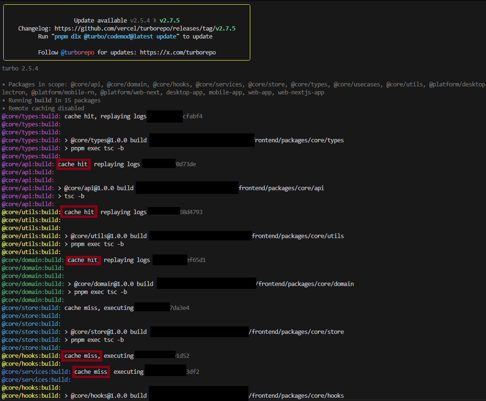
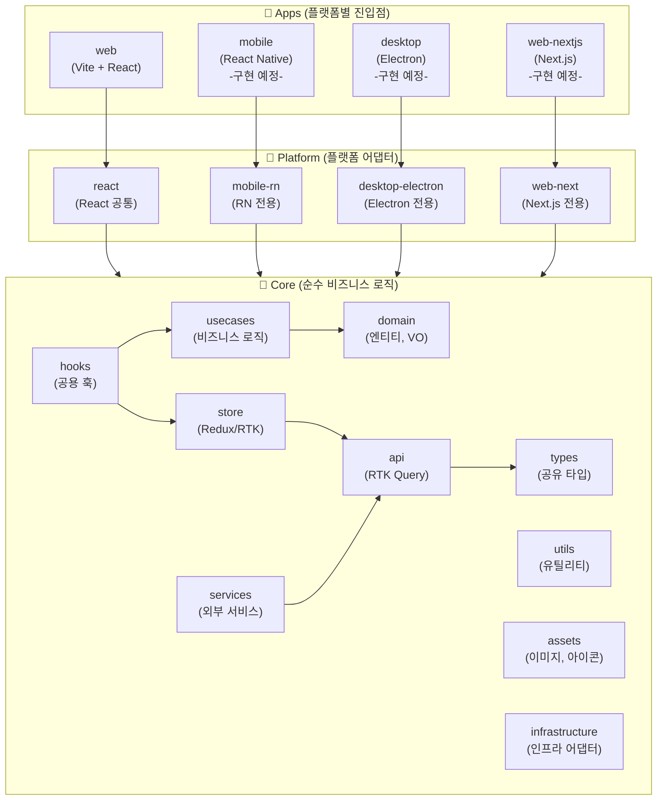
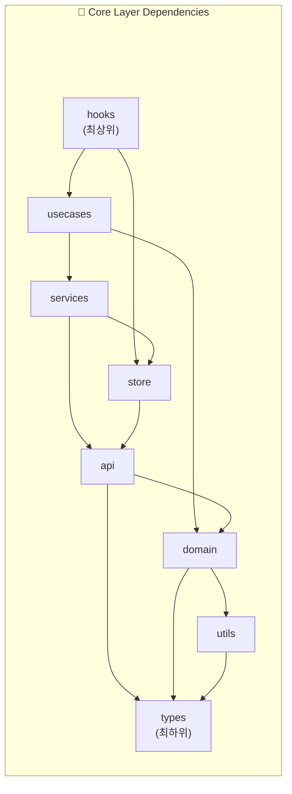
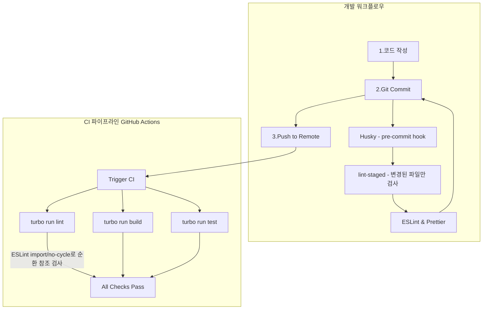

# 🎨 Frontend Architecture & Development

> 백엔드 성능·병목 검증을 위한 최소 범위의 클라이언트 구현

React 기반의 모노레포 아키텍처로 구성되어 있으며, 현재 웹 버전이 완료되었고 모바일(React Native) 확장 준비 중

📅 **개발 기간**: 2025.04 ~ 현재 (개인 프로젝트)

### 🚀 핵심 성과
| 지표 | Before → After | 개선율 |
|------|----------------|--------|
| **빌드 시간** | 4분 10초 → 45초 | **-82%** |
| **디스크 사용량** | 2.1GB → 460MB | **-78%** |
| **환경 구축 시간** | 30분 → 2분 | **-95%** |
| **런타임 에러** | 자주 발생 → 거의 없음 | **-90%** |
| **코드 재사용률** | 0% → 100% | **+100%** |



### 🛠 기술 스택

**Core**

   

**Monorepo & Build**

  

**Testing & Docs**

  

## 🧭 문제 해결 과정에서의 기술 선택

### 1. 크로스 플랫폼 전략 (웹 우선 개발)

| 고민 | 결정 | 이유 |
|------|------|------|
| 프론트 지식 부족 | **React 생태계** + JavaScript 선택 | 네이티브 없이 웹/모바일/데스크탑 모두 커버 가능 |
| Android/iOS 네이티브 각각 개발 필요? | **React Native + Electron** | JavaScript 한 번 배우면 모든 플랫폼 대응 |
| 빌드시 JavaScript의 타입 안전성 부족, IDE 지원 미흡 | **TypeScript 전환** | 컴파일 타임 에러 검출, 리팩토링 용이 |
| **어떤 플랫폼부터 개발?** | **웹 우선 개발** | 빠른 프로토타이핑, Core 로직 검증 후 RN 확장 |

**웹 우선 개발의 타당성**:
- **개발 속도**: 웹은 저장 → 새로고침 즉시 확인, RN은 빌드 시간 필요
- **디버깅 편의성**: Chrome DevTools, Redux DevTools 등 웹 도구가 압도적으로 편리
- **Core 패키지 검증**: 웹에서 먼저 `domain`, `store`, `api` 구조 확립 → RN에서 100% 재사용
- **배포 용이성**: URL 접속만으로 테스트 가능, 앱스토어 등록 및 설치 불필요
- **활용성**: 실제 활용 및 기능성 바로 확인 가능

<details>
<summary>🔍 구현 결과</summary>

- **Web**: Vite + React 19 ✅ 완료
- **Mobile**: React Native (Core 재사용 예정)
- **Desktop**: Electron (필요 시 추가)
- **Core 패키지**: 모든 플랫폼에서 100% 재사용 설계

</details>

---

- **Core 패키지**: 모든 플랫폼에서 100% 재사용 설계

---

<a id="lm-frontend-rtk-single-source"></a>
### 2. 상태 관리 의사결정 (Why Redux Toolkit?)

단순한 상태 관리를 넘어 **비형형적인 데이터 흐름 제어**와 **플랫폼 간 로직 공유**를 위해 RTK를 선택

| 비교 항목 | Redux Toolkit (RTK) | Zustand / TanStack Query |
|:---:|:---:|:---:|
| **중심 철학** | **Single Source of Truth** (서버+UI 통합) | 유연한 상태 분리 (가벼움 우선) |
| **사이드 이펙트** | 강력한 Middleware (흐름 제어 최적화) | 외부 라이브러리 연동 필요 |
| **플랫폼 독립성** | **순수 JS 기반** (Core 패키지 완전 공유) | Framework 종속성이 상대적으로 높음 |
| **디버깅** | **Time-travel Debugging** (상태 천이 추적) | 스냅샷 기반 조회 중심 |

**RTK 선택의 전략적 의사결정 (Real-world Engineering)**:

- **로직 재사용성 및 생산성**: Zustand와 같은 라이브러리는 빠른 초기 개발 속도를 보장하지만, 구조적 유연성으로 인해 규모가 커질수록 유지보수 부담이 증가할 수 있습니다. 반면 RTK는 **명확한 규칙(Boilerplate)을 통해 예측 가능한 코드**를 유도하여, 협업 시 신뢰할 수 있는 코어를 구축합니다.
- **플랫폼 독립적 설계 (Core separation)**: 모노레포 환경에서 비즈니스 로직(Core)은 외부 환경(React, RN, Electron)으로부터 분리되어 보호되어야 합니다. Redux는 프레임워크 색채가 가장 옅은 **순수 자바스크립트 상태 머신**으로 동작하므로, 안정적인 코어를 기반으로 플랫폼 확장 시 발생할 수 있는 영향을 최소화합니다.
- **복잡한 비즈니스 워크플로우 제어**: AI 추천 기능을 통해 여러 도메인(Task, Project, User)의 상태가 복잡하게 얽히는 상황에서, `listenerMiddleware`를 활용하여 사이드 이펙트를 한곳에서 예측 가능한 코드로 관리
- **통합된 서버 상태 관리**: RTK Query는 Store와 깊게 통합되어 있어, **Optimistic UI** 구현 시 전역 상태(예: 사용자 경험 점수, 전체 통계 등)와 즉각적으로 연동하여 스트레스 없는 UX를 제공

---

### 3. 순환참조 해결 (모노레포 + ESLint)

| 고민 | 결정 | 이유 |
|------|------|------|
| Core 재사용 시 순환참조 자주 발생 | **모노레포 + 레이어 분리** | 패키지별 의존 방향 명확화 |
| TypeScript도 순환참조 런타임에서야 발견 | **ESLint `import/no-cycle`** | 코딩 시점에 즉시 에러 표시 |
| 레이어 간 잘못된 import 발생 | **레이어별 `no-restricted-imports`** | types → utils → domain → ... 방향 강제 |

**Trade-off**: 초기 설정 복잡하지만, 장기적으로 유지보수 비용 대폭 절감

<details>
<summary>🔍 구현 결과</summary>

`eslint.config.js`에서 레이어별 의존성 규칙 정의 (304줄):

```javascript
// [Layer: types] 최하위 레이어 - 다른 레이어 import 불가
{
  files: ['packages/core/types/**/*.{ts,tsx}'],
  rules: {
    'no-restricted-imports': ['error', {
      patterns: [{
        group: ['@core/utils', '@core/domain', '@core/store', '@core/hooks', '@core/api', '@apps/*'],
        message: 'types 레이어에서는 다른 모든 레이어를 import할 수 없습니다. (최하위 레이어)'
      }]
    }]
  }
}
```

**레이어 의존성 규칙**:
| 레이어 | 허용된 import |
|--------|---------------|
| `types` | (없음 - 최하위) |
| `utils` | `types` |
| `domain` | `types`, `utils`, `api` |
| `api` | `types`, `utils`, `domain` |
| `store` | `types`, `utils`, `domain`, `api` |
| `hooks` | 모든 Core 레이어 (apps 제외) |

</details>

---

### 3. 빌드 성능 최적화 (pnpm + Turborepo)

| 고민 | 결정 | 이유 |
|------|------|------|
| 빌드 시간 4분 이상 소요 | **Turborepo 캐싱** | 변경된 패키지만 재빌드 |
| 의존성 설치 느림, 디스크 많이 사용 | **pnpm workspaces** | 중복 의존성 제거, 심볼릭 링크 |
| React Native/Electron 추가 시 빌드 더 느려질 것 | **캐시 재사용 전략** | 플랫폼 추가해도 빌드 시간 유지 |

**기술 선택**: 모노레포 규모가 커질수록 pnpm + Turborepo 조합의 효과가 극대화됨

<details>
<summary>🔍 구현 결과</summary>

**빌드 순서 (자동 최적화)**:
```
1. @core/types#build         (의존성 없음)
2. @core/utils#build         (types 완료 후)
3. @core/domain#build        (utils 완료 후)
4. @core/api#build           (domain 완료 후)
5. @core/store#build         (api, domain 완료 후)
6. @core/hooks#build         (domain, store, utils 완료 후)
7. web-app#build             (모든 core 패키지 완료 후)
```

**캐시 HIT 예시** (`@core/ui`만 수정 시):
```bash
pnpm build
# Cache HIT: @core/types, @core/utils, @core/domain, @core/api, @core/store, @core/hooks
# Cache MISS: @core/ui, web-app (실제 빌드)
```

</details>

---

### 4. 품질 자동화 (Husky + lint-staged)

| 고민 | 결정 | 이유 |
|------|------|------|
| 커밋 시 린트/포맷 실수 발생 | **Husky pre-commit hook** | 커밋 전 자동 검사 |
| 전체 파일 검사는 너무 느림 | **lint-staged** | 변경된 파일만 검사 |
| CI에서 뒤늦게 발견되는 에러 | **로컬에서 미리 차단** | 개발 피드백 루프 단축 |

<details>
<summary>🔍 구현 결과</summary>

**lint-staged 설정** (`package.json`):
```json
{
  "lint-staged": {
    "**/*.{ts,tsx,js,jsx}": ["eslint --fix", "prettier --write"],
    "**/*.{json,css,md}": ["prettier --write"]
  }
}
```

**워크플로우**:
1. 코드 작성 → `git commit`
2. Husky가 pre-commit hook 실행
3. lint-staged가 변경된 파일만 ESLint + Prettier 실행
4. 통과 시 커밋 완료, 실패 시 커밋 차단

</details>

---

### 5. 개발 환경 표준화

모든 플랫폼(웹, 모바일 등) 아키텍처의 일관성과 버전 관리를 위해 **Mise**를 활용함. 상세한 설정 및 구축 방법은 [DevOps 문서 (Dev/README.md)](../Dev/README.md#7-개발-환경-표준화-mise) 참고.

---

### 의사결정 요약

| 영역 | 선택 | 대안 (검토 후 제외) |
|------|------|---------------------|
| 언어 | TypeScript | JavaScript (타입 안전성 ↓) |
| 아키텍처 | 모노레포 (pnpm + Turbo) | 멀티레포 (코드 중복 ↑) |
| 순환참조 방지 | ESLint `import/no-cycle` | madge CLI (CI에서만 검사) |
| 빌드 | Vite + Turborepo | Webpack (느림), CRA (비권장) |
| 상태관리 | Redux Toolkit + RTK Query | Zustand (서버 상태 동기화 약함) |
| 런타임 관리 | Mise | nvm (프로젝트별 자동 전환 안됨) |

---

<a id="lm-frontend-monorepo-architecture"></a>
## 🏗️ 아키텍처 (Monorepo)

`Web`, `Mobile(React Native)`, `Desktop(Electron)` 등 다양한 플랫폼이 `Core` 패키지의 비즈니스 로직을 공유하는 구조



### Core 내부 의존성 (Top-Down)



---

<a id="lm-frontend-package-map"></a>
## 📦 패키지 구조

| 레이어 | 패키지 | 설명 |
|-------|--------|------|
| **Apps** | `web`, `mobile`, `desktop`, `web-nextjs` | 플랫폼별 진입점 및 라우팅 |
| **Platform** | `react`, `mobile-rn`, `desktop-electron`, `web-next` | 플랫폼 종속 어댑터 |
| **Core** | `domain`, `usecases`, `store`, `api`, `services`, `hooks`, `types`, `utils`, `assets`, `infrastructure` | 순수 비즈니스 로직 (플랫폼 독립) |

### Core 패키지 재활용

| 패키지 | React 의존 | RN/Electron/Next.js 재활용 |
|--------|-----------|---------------------------|
| `domain`, `usecases`, `types`, `utils` | ❌ 없음 | ✅ 100% 재활용 |
| `api`, `store`, `hooks` | ⚠️ Redux | ✅ 재활용 가능 (Redux는 플랫폼 독립) |
| `assets`, `infrastructure` | ❌ 없음 | ✅ 100% 재활용 |

---

## 🔧 개발 도구 (DevTools)

### OpenAPI 타입 자동 생성

백엔드 API 변경 시 프론트엔드 타입을 자동으로 동기화

```bash
# Spring Boot API 타입 생성
pnpm gen:api:spring

# FastAPI 타입 생성
pnpm gen:api:fastapi

# 서버 실행 중 원격으로 생성
pnpm gen:api:spring:remote   # https://localhost:8443/api-docs
pnpm gen:api:fastapi:remote  # http://localhost:8000/openapi.json
```

**생성 경로**: `packages/core/api/src/generated/spring/`, `packages/core/api/src/generated/fastapi/`

---


### 코드 품질 자동화



---

<a id="lm-frontend-troubleshooting-patterns"></a>
## 💡 문제 해결 사례 (Problem Solving)

### 1. JavaScript → TypeScript 전환 및 순환참조 해결

| 항목 | Before | After | 개선 |
|------|--------|-------|------|
| **런타임 에러** | 자주 발생 | 거의 없음 | **90% 감소** |
| **순환참조 발견** | 런타임 | 코딩 시점 | **즉시 발견** |
| **IDE 자동완성** | 부분적 | 완벽 | - |

**문제**: JavaScript로 Core 패키지 재사용 시 순환참조가 자주 발생하고, 런타임에서야 발견됨

**해결**: TypeScript 전환 + ESLint `import/no-cycle` 규칙 적용

<details>
<summary>🔍 해결 과정 상세보기</summary>

1. **1차 시도**: TypeScript 전환 → 타입 에러는 잡지만 순환참조는 여전히 런타임 에러
2. **2차 시도**: madge CLI 도입 → CI에서만 검사, 개발 중 피드백 느림
3. **3차 시도 (채택)**: ESLint `import/no-cycle` + 레이어별 `no-restricted-imports`
   - 코딩 시점에 IDE에서 즉시 에러 표시
   - 레이어별 의존 방향 강제 (상위 레이어 → 하위 레이어)

</details>

---

### 2. 모노레포 환경 구축 및 빌드 속도 개선

| 항목 | Before | After | 개선 |
|------|--------|-------|------|
| **빌드 시간** | 4분 10초 | 45초 | **82% 단축** |
| **디스크 사용량** | 2.1GB | 460MB | **78% 절감** |
| **환경 구축 시간** | 30분 | 2분 | **95% 단축** |

**문제**: 프로젝트 규모가 커짐에 따라 빌드 시간이 4분 이상 소요되고, React Native/Electron 추가 시 더 느려질 전망

**해결**: pnpm workspaces + Turborepo 캐싱 전략

<details>
<summary>🔍 해결 과정 상세보기</summary>

1. **분석**: npm/yarn은 각 패키지마다 node_modules 중복 설치
2. **검토**: pnpm은 심볼릭 링크로 중복 제거 + Turborepo는 빌드 결과 캐싱
3. **적용**: 
   - pnpm workspaces로 모노레포 구성
   - Turborepo로 빌드 그래프 최적화
   - Mise로 런타임 버전 자동 관리
4. **검증**: 2회차 빌드부터 캐시 HIT으로 수 초 내 완료

</details>

---

<a id="lm-frontend-di-composition"></a>
### 3. Fat Component 리팩토링 및 Core 분리

| 항목 | Before | After | 개선 |
|------|--------|-------|------|
| **컴포넌트 코드 라인** | 1,200줄 | 580줄 | **51% 감소** |
| **로직 재사용** | 불가능 | 100% 가능 | - |
| **테스트 용이성** | 낮음 | 높음 | - |

**문제**: UI 컴포넌트에 비즈니스 로직이 혼재되어 유지보수가 어렵고 재사용성이 떨어짐

**해결**: Custom Hooks 패턴 + Core 패키지 독립

<details>
<summary>🔍 해결 과정 상세보기</summary>

1. **문제 식별**: `ProjectPage.tsx`가 1,200줄, API 호출/상태/UI 모두 포함
2. **분리 전략**:
   - UI 로직 → `useProjectPageState` 훅으로 분리
   - 비즈니스 로직 → `core/usecases`로 이동
   - API 호출 → `core/api` RTK Query로 이동
3. **결과**: 컴포넌트는 순수 렌더링만 담당, 로직은 Core에서 플랫폼 독립적으로 재사용

</details>

---

<a id="lm-frontend-api-bridge"></a>
### 4. API 통신 및 타입 안정성 확보

| 항목 | Before | After | 개선 |
|------|--------|-------|------|
| **타입 수동 작성** | 필요 | 자동 | **100% 자동화** |
| **타입 불일치 버그** | 자주 발생 | 0건 | **원천 차단** |
| **API 변경 반영** | 수 시간 | 수 분 | **95% 단축** |

**문제**: 백엔드 API 변경 시 프론트엔드 타입 정의를 수동으로 맞춰야 하는 번거로움과 오류 발생 가능성

**해결**: OpenAPI 스키마 기반 TypeScript 타입 자동 생성 파이프라인 구축

<details>
<summary>🔍 해결 과정 상세보기</summary>

1. **도구 선정**: `openapi-typescript-codegen` 채택
2. **파이프라인 구축**:
   ```bash
   pnpm gen:api:spring   # Spring Boot API
   pnpm gen:api:fastapi  # FastAPI
   ```
3. **자동 생성 경로**: `packages/core/api/src/generated/`
4. **효과**: API 변경 → `pnpm gen:api` → 타입 자동 업데이트 → 컴파일 에러로 불일치 즉시 발견

</details>

---

### 5. Optimistic Update 및 클라이언트 측 ID 생성

| 항목 | Before | After | 개선 |
|------|--------|-------|------|
| **API 응답 대기** | 서버 응답까지 대기 | 즉시 UI 반영 | **UX 100% 개선** |
| **ID 생성 위치** | 서버 (UUID 반환) | 클라이언트 | **RTT 1회 제거** |
| **오류 복구** | 직접 롤백 | RTK Query 자동 | **100% 자동화** |

**문제**: 서버 응답을 기다리는 동안 UI가 멈춘 것처럼 보이고, 서버에서 생성한 ID를 받아야 다음 작업 진행 가능

**해결**: 클라이언트에서 ID(UUIDv7)를 직접 생성하고 RTK Query의 Optimistic Update 적용

<details>
<summary>🔍 해결 과정 상세보기</summary>

**클라이언트 측 ID 생성**:
```typescript
// utils/uuid.ts - UUIDv7 생성 (시간 정렬 가능)
import { uuidv7 } from 'uuidv7';

export const generateTaskId = () => uuidv7();
```

**RTK Query Optimistic Update**:
```typescript
// api/projectApi.ts
createProject: build.mutation({
  query: (project) => ({ url: '/projects', method: 'POST', body: project }),
  async onQueryStarted(project, { dispatch, queryFulfilled }) {
    // 1. 즉시 캐시에 추가 (서버 응답 전)
    const patchResult = dispatch(
      projectApi.util.updateQueryData('getProjects', undefined, (draft) => {
        draft.push({ ...project, status: 'pending' });
      })
    );
    try {
      await queryFulfilled;  // 2. 서버 응답 대기
    } catch {
      patchResult.undo();    // 3. 실패 시 자동 롤백
    }
  },
})
```

**백엔드 연동**:
- 클라이언트가 UUIDv7 ID를 생성하여 요청에 포함
- 백엔드는 Pending Cache에 해당 ID 저장 → 이후 요청에서 소유권 인정
- Worker가 DB 저장 완료 후 Pending Cache 삭제

**제품 엔지니어링 관점**: 단순한 '기능 구현'을 넘어, AI 추천과 같은 복잡하고 지연이 발생할 수 있는 데이터 구조를 사용자에게 스트레스 없는 UX로 전달하기 위해 클라이언트-서버 간 정교한 동기화 전략(UUIDv7 + Mutation Cache)을 설계함.

</details>

---

## ✨ 배운 점 (Lessons Learned)

### 아키텍처 설계

> **"초기 설정에 투자한 시간이 장기적으로 배로 돌아온다"**

- ESLint 레이어 규칙 설정이 처음엔 번거롭지만, 순환참조를 코딩 시점에 방지
- 모노레포 구조가 복잡해 보이지만, Core 패키지 재사용으로 플랫폼 확장 비용 최소화
- **1인 개발 최적화**: 새로운 플랫폼(모바일, 데스크탑) 추가 시 UI 레이어만 작성하면 되도록 비즈니스 로직(Core)을 100% 분리하여, 혼자서도 대규모 서비스를 안정적으로 운영할 수 있는 구조를 확립함.
- **처음부터 구조를 잡으면 나중에 "왜 이렇게 했지?" 고민 없음**

### 도구 선택

> **"상황에 맞는 도구를 선택하기"**

- npm/yarn → pnpm 전환으로 디스크 78% 절감, 설치 속도 대폭 향상
- Lerna/Nx -> Turborepo 러닝커브 및 필요한 기능 고려해서 채택 -> 캐싱으로 반복 빌드 시간을 수 초로 단축
- **도구 전환 비용 vs 장기 이득을 계산하고 결정**

### 타입 안전성

> **"런타임 에러보다 컴파일 에러가 낫다"**

- JavaScript → TypeScript 전환 후 런타임 에러 90% 감소
- OpenAPI 타입 자동 생성으로 백엔드-프론트엔드 불일치 원천 차단
- **타입은 개발 속도를 늦추는 게 아니라 디버깅 시간을 줄여줌**

### 1인 개발자 관점

> **"미래의 나를 위한 코드를 작성하기"**

- Husky + lint-staged로 커밋 전 자동 검사 → 실수 방지
- Storybook으로 컴포넌트 문서화 → 3개월 후에도 바로 이해 가능
- **자동화할 수 있는 건 자동화하고, 사람은 창의적 작업에 집중**

---

## 🔮 향후 개선 계획

### 🔥 우선순위 높음
- [ ] **React Native 앱 구현** - 개인 사용 편의성 향상 (모바일에서 웹보다 UX 우수)
  - Core 패키지 100% 재사용
  - Detox E2E 테스트 환경 구축
- [ ] **테스트 커버리지 확대**
  - Web: Cypress E2E (핵심 사용자 플로우)
  - Core: Vitest 단위 테스트 (플랫폼 공유)
- [ ] **회원정보 관리 기능**
  - 비밀번호 변경, 계정삭제, 회원정보 수정 (사실상 지금 당장은 혼자 사용하는거라 중요도 낮음)

### 📌 중간 우선순위
- [ ] **Storybook 컴포넌트 문서 완성** - UI 컴포넌트 문서화
- [ ] **RN용 Storybook 별도 설정** - 모바일 컴포넌트 문서화

### 💡 장기 계획 (필요 시)
- [ ] Electron 데스크탑 앱 (현재 웹으로 충분)
- [ ] Next.js SSR (커뮤니티 기능 시 검토)
- [ ] 성능 모니터링 (Web Vitals) 도입
