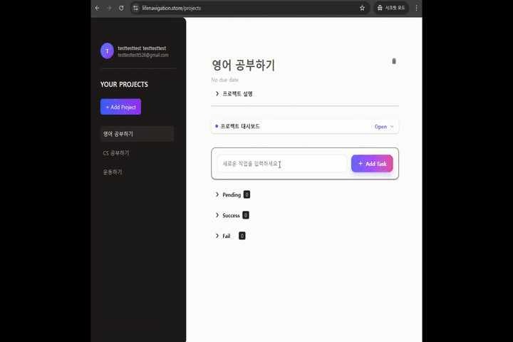
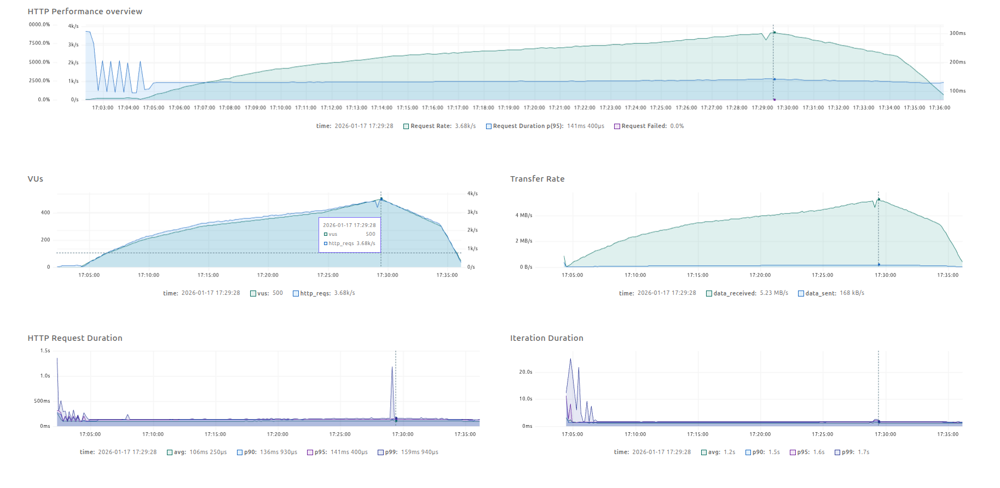
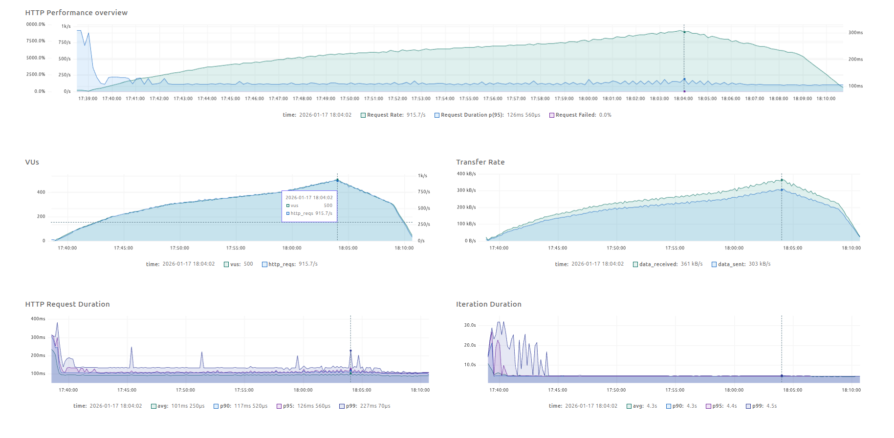
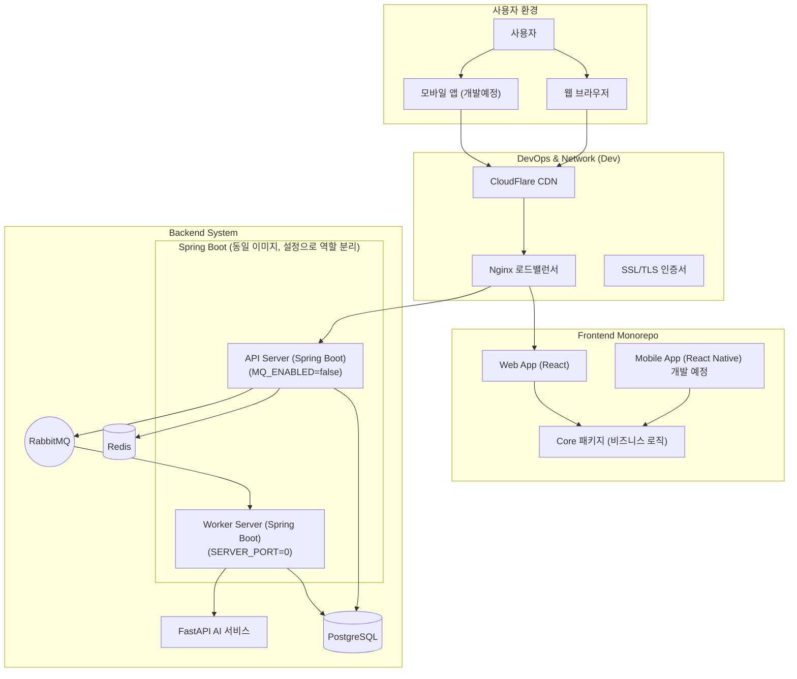

# Life Navigation

> 할 일을 실패한 이유를 분석하고,  
> 다음에 성공할 수 있도록 계획을 다시 설계해주는 AI 기반 TODO 서비스

> 이 프로젝트는 개인 서비스 형태를 갖고 있지만,
> 운영 중 웹 서비스에서 발생하는 **성능 저하, 트래픽 증가, 운영 비용 문제**를
> Java/Spring 기반으로 해결한 사례를 담고 있습니다.

📅 **개발 기간**: 2025.04 ~ 현재 (BE / FE / DevOps 전 영역 담당)

---

## ⚡ TL;DR (1분 요약)
- 실제 운영 중 발생한 성능 병목과 비용 문제를 **재현 가능한 부하 테스트**로 검증하며 해결한 웹 서비스
- **실패한 Todo를 원인-패턴으로 구조화해 다음 행동을 재설계하는 서비스**
- 캐시 / 비동기 / 아키텍처 전환을 통해 p95 지연 **최대 86% 개선**
- 운영 중 발생한 **문제를 줄이기 위한 설계 판단**과 구현 과정
- 1인 개발 환경에서, **협업 가능성을 염두에 두고 역할을 분리해 구현**
- 세부 아키텍처와 구현 근거는 필요 시 참고하시면 됩니다.

---

## 🎯 Engineering Snapshot

| 지표 | Before → After | 개선율 |
|:---:|:---:|:---:|
| **읽기 p95** | 975ms → **141ms** | **-86%** |
| **쓰기 p95** | 1.9s → **126ms** | **-93%** |
| **읽기 RPS** | 972 → **3,680** | **+279%** |
| **쓰기 RPS** | 373 → **916** | **+146%** |
| **월 운영 비용** | AWS → **0원** | 홈서버 전환 |

> ※ 위 수치는 단순 성능 과시가 아닌, **운영 환경에서 발생할 수 있는 문제를 확인하기 위한 지표**입니다.

**검증 방식(요약)**: k6 32분 단계 부하(최대 500VU) + Grafana, test 환경 완전 격리, 4.7M+ 요청 실패율 0.0000%

👈(클릭) 검증 방식 상세 

- k6 부하 테스트 (500 VU, 32분 프로파일) + Grafana 모니터링
  - **테스트 프로파일**: `2m@100, 3m@200, 5m@300, 10m@400, 5m@500, 5m@300, 2m@0` (총 32분, 단계적 부하)
- **테스트 환경**: AMD Ryzen 7 5800U / 32GB RAM / PostgreSQL15 (단일 노드 홈서버, Docker Compose)
- **데이터 규모 및 로직**:
  - **읽기 (Cache Warm-up)**: 유저 500명 기준, **총 6,500여 개**의 실 데이터(프로젝트 500/테스크 1.5천/서브테스크 4.5천)를 Setup 단계에서 구축 및 캐시 예열 후 조회 성능 측정
  - **쓰기 (Load Logic)**: 32분 프로파일 완주 시 **약 150만 건 이상**의 데이터 생성 트랜잭션(프로젝트/테스크/서브테스크)이 발생하는 극한 환경에서, 비동기 처리가 지연 없이 DB에 반영되는지 E2E 검증
- **실행 격리**: `test` 전용 프로파일과 분리된 DB 스키마/Redis DB를 사용하여 운영 환경 데이터와 물리적·논리적 격리
- HTTP 실패율: **0.0000%** (4.7M+ 요청)

> 본 서비스는 실제 운영 중인 웹 서비스로,
> 트래픽 증가와 응답 지연 문제를 해결하는 과정에서
> **재현 가능한 부하 테스트**를 통해 성능·비용·운영 복잡도를 비교·확인했습니다.

---

## 📋 제품 개요

### 문제
- 기존 TODO 앱은 **"기록"만** 하고 **실패 원인은 다루지 않는다**
- 실패한 TODO는 개선 없이 계속 남아있음 → 계속 실패하게 됨

### 해결
- 사용자의 **실패 패턴을 AI가 자동 분석** → 성공 가능한 **세부 Task로 자동 재구성**
- 과거 성공/실패 이력을 학습하여 **개인화된 추천** 제공

### 실제 사용 흐름

---

## 💡 핵심 가치 (Key Engineering Values)

각 파트별 상세 기술적 의사결정과 성과는 아래 링크에서 확인 가능

### 🛠️ 핵심 기술 하이라이트 (Engineering Pillars)

#### ⚙️ [Backend](./Backend/README.md): "운영 문제 해결 기반 아키텍처 결정"
- 초기 WebFlux 도입 후 운영 복잡도 문제로 **MVC + Virtual Threads로 전환**
- DDD + Hexagonal Architecture로 **유지보수 부담을 줄이기 위한 구조 설계**
- **Transactional Outbox 패턴**으로 데이터 정합성 보장
- 단계적 성능 개선으로 **읽기 RPS +279%, 쓰기 RPS +146%** 달성
- 👉 [Backend 상세 보기](./Backend/README.md)

#### 🎨 [Frontend](./Frontend/README.md): "실제 사용 흐름 재현을 위한 구현"

> ※ 프론트엔드는 실제 API 사용 흐름과 사용자 요청 패턴을 재현하기 위한 범위로 구현되었습니다.

- **Zero-Latency UX**: **Optimistic UI + UUIDv7** 전략으로 응답 지연 최소화 체험 제공
- **로직 재사용성 극대화**: 비즈니스 로직(Core)을 플랫폼 독립적으로 설계하여 **웹/앱 로직 100% 공유**
- **빌드 효율성 확보**: Turborepo 빌드 시간 **82% 단축**
- 👉 [Frontend 상세 보기](./Frontend/README.md)

#### 🚀 [DevOps](./Dev/README.md): "비용 0원의 고효율 인프라"
- **이미지 96% 경량화**: ML 라이브러리 분리 및 멀티스테이지 빌드로 **26GB → 1GB** 절감
- **빌드 속도 90% 단축**: 레이어 캐싱 및 .dockerignore 최적화로 **1004초 → 98초** 단축
- **철저한 보안망**: **WireGuard VPN** 전용 SSH 및 **Cloudflare Tunnel**로 공인 IP 완전 은폐

> **0원 운영의 리스크 대응**:
> - 🔒 **보안**: 외부 SSH 차단 (VPN Only), Cloudflare WAF/DDoS 방어
> - 📊 **모니터링**: Prometheus + Grafana + Slack 알림 (5xx > 5%, p95 > 800ms)
> - 🔄 **복구**: 트래픽 임계점 도달 시 클라우드 재전환 가능한 구조 (Docker Compose 기반)

### 🔗 Dashboard LearnMore Quick Links
- [Backend Dashboard Index](./Backend/README.md#dashboard-learnmore-index)
- [Frontend Dashboard Index](./Frontend/README.md#dashboard-learnmore-index)
- [DevOps Dashboard Index](./Dev/README.md#dashboard-learnmore-index)

#### 🤖 AI 코칭 기능

> ※ AI 기능은 서비스 품질 개선을 위한 분석 파이프라인의 일부로 분리 구성되어 있습니다.

- 외부 LLM 활용 + Qdrant VectorDB로 실패 패턴 구조화 (AI 분석 파이프라인 확장 가능 구조로 설계)
- 👉 [Backend README - AI 서비스 분리](./Backend/README.md#4-ai-서비스-분리-fastapi)에서 상세 확인

---

## 🚀 문제 해결 과정에서의 기술 선택

### 1. WebFlux → Spring MVC + Virtual Threads
> **비동기 모델이 항상 성능을 보장하지 않는다는 점을 운영 환경에서 검증**
- **문제**: WebFlux + SecurityContext 전파 오버헤드로 순수 MVC보다 느림
- **결정**: MVC + Virtual Thread로 전환 → I/O 대기 시간 효율화
- **결과**: 읽기 p95 **975ms → 141ms** (-86%)

### 2. Redis 캐싱 + @Cacheable 순서 최적화
- **문제**: 읽기 병목 (TODO는 읽기:쓰기 = 10:1 이상)
- **결정**: Redis Cache-Aside + `@Cacheable` → `@Transactional` 순서 조정
- **결과**: 캐시 히트 시 DB 커넥션 점유 제거, 읽기 RPS **+279%**

### 3. API/Worker 분리 + RabbitMQ 배치 처리
- **문제**: 동기 DB 저장이 응답 시간 병목
- **결정**: API → Redis Pending → MQ → Worker → DB (비동기)
- **결과**: 쓰기 p95 **1.9s → 126ms** (-93%)

📊 성능 테스트 결과 상세 (성능 검증에 관심 있는 경우)

### 읽기 성능 테스트 (500 VU)

- **RPS**: 3,680 / **Latency**: Avg 106ms, p95 141ms

### 쓰기 성능 테스트 (500 VU)

- **RPS**: 916 / **Latency**: Avg 101ms, p95 126ms

### 성능 한계 검증 테스트 (최대 2,000 VU)
| 지표 | 읽기 | 쓰기 |
|:---:|:---:|:---:|
| **RPS** | 4,310 | 2,820 |
| **p95** | 633ms | 610ms |
| **HTTP 실패율** | 0.0045% | 0.0002% |

👉 **[7단계 상세 분석 및 k6 테스트 결과 확인](./Backend/README.md#1-아키텍처-진화-7단계-성능-최적화)**

### 현재 구조에서 고려한 다음 단계
- 단일 노드 구축에서 트래픽 증가 상황을 가정한 시스템 구조 확장성 고려
- 메시징 병목을 대비한 구조적 확장 여지 확보
- 실제 사용자 행동 데이터 기반 튜닝은 향후 과제

### Storage Strategy & Scalability

현재 서비스는 PostgreSQL + Redis 기반으로 운영되고 있습니다.

- **트랜잭션 정합성**과 관계성이 중요한 데이터는 RDB에 저장
- **읽기 빈도가 높은 데이터**는 Redis 캐시 계층으로 분리
- **비동기 처리**(RabbitMQ)를 통해 쓰기 부하를 분산

향후 데이터 특성에 따른 저장소 최적화가 가능한 구조로 설계되었습니다.

---

## 📚 Deep Dive

| 영역 | 문서 | 핵심 내용 |
|------|------|----------|
| **성능 개선** | [Backend README](./Backend/README.md#1-아키텍처-진화-7단계-성능-최적화) | 단계적 성능 개선 과정, k6 테스트 결과, Grafana 대시보드 |
| **아키텍처** | [Backend README](./Backend/README.md#설계-의사결정-design-decisions) | DDD + Hexagonal, Outbox 패턴, CQRS |
| **운영/보안** | [Dev README](./Dev/README.md) | CI/CD 자동화, VPN 보안, Cloudflare Tunnel |
| **프론트엔드** | [Frontend README](./Frontend/README.md) | Optimistic UI, 모노레포 구조, Turborepo |

---

## 🏗️ 전체 시스템 아키텍처

프론트엔드부터 인프라까지 전체 데이터 흐름을 시각화

## 🔄 데이터 흐름 및 기술 스택

### Frontend <-> Backend 통신
- **REST API**: 기본적인 CRUD 작업 및 실시간성이 필요한 조회 통신
- **WebSocket (예정)**: 실시간 알림 및 상태 업데이트
- **Optimistic UI**: 비동기 처리를 위한 프론트엔드 낙관적 업데이트 지원

### Backend 처리 흐름
1. **API 요청 수신**: Nginx를 거쳐 Spring Boot API 서버로 도착
2. **인증/인가**: JWT 기반 인증 및 AOP 기반 권한 검증
3. **CQRS**: 읽기 요청은 Redis 캐시 또는 DB 조회, 쓰기 요청은 트랜잭션 처리
4. **비동기 작업**: 오래 걸리는 작업이나 부가 작업을 RabbitMQ로 발행하여 Worker (spring boot) 처리

### DevOps 인프라
- **Docker Compose**: 전체 서비스의 컨테이너 오케스트레이션
- **CI/CD**: GitHub Actions를 통한 자동 빌드 및 배포
- **Monitoring**: Prometheus & Grafana를 통한 시스템 상태 관제

---

> 이 문서는 의사결정의 요약이며, 각 선택의 맥락과 비용은 면접에서 설명할 수 있습니다.
>
> ※ 면접 과정에서 아키텍처/테스트 시나리오/성능 데이터 중심으로 상세한 재현 및 설명이 가능합니다.
> 보안/운영 정책상 소스 코드는 비공개로 관리되고 있는 점 양해 부탁드립니다.
