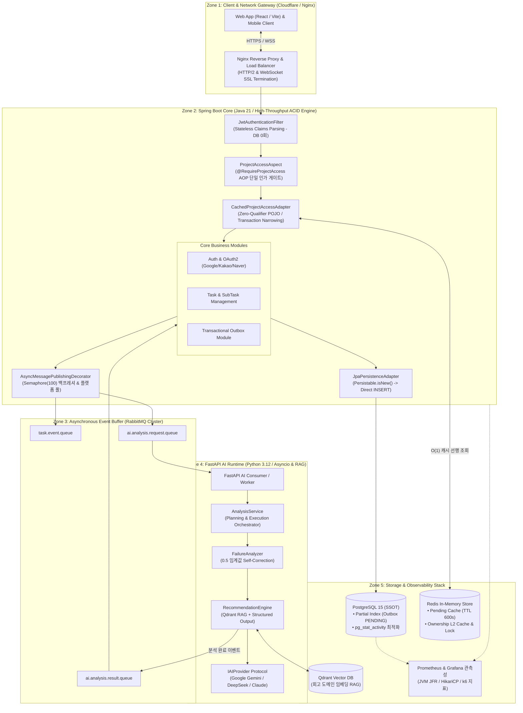

# Life Navigation (Lifenavigation) 🧠⚡

> **할 일을 실패한 원인을 AI가 분석하고, 성공 가능한 최적의 실행 계획으로 재설계해주는 지능형 TODO & 회고 서비스**  
> 본 프로젝트는 단순한 기능 구현을 넘어, 고부하 트래픽(1000VU) 환경에서 발생하는 **DB 커넥션 병목, JPA merge I/O 폭증, 가상 스레드 피닝(Pinning), 인증 쿼리 중복, AI 추론 지연 전파**를 Java 21 / Spring Boot 3.3 및 Python FastAPI 기반 Polyglot MSA 아키텍처로 해결한 엔터프라이즈 엔지니어링 실전 기록입니다.

📅 **개발 및 고도화 기간**: 2025.04 ~ 현재 (Backend & AI Architecture 중심, DevOps/Frontend 풀스택 통합)

---

## ⚡ 30초 스캔: 핵심 엔지니어링 5대 성과

1. **[DB 읽기 최적화]**: 단일 `@Transactional` 내 Redis I/O 혼재로 인한 `idle in transaction` 및 HikariCP 풀 고갈 해소  
   ➔ **Transaction Narrowing + Redis Pending Cache 도입으로 p95 지연시간 3.4s → 126ms (27배 향상), READ RPS 1,550 → 3,680/s (+137%)**
2. **[JPA 쓰기 최적화]**: UUIDv7 사전 할당으로 인한 JPA `merge()`(SELECT+INSERT) 2배 I/O 및 AMQP 동기 블로킹 제거  
   ➔ **`Persistable.isNew()` 오버라이드 + Outbox 패턴 + Async Publisher로 쓰기 실패율 100% → 0.00%, p95 21.5s → 126ms (170배 향상)**
3. **[가상 스레드 동시성]**: `amqp-client` 내부 `synchronized` 블록으로 인한 Carrier Thread Pinning 식별 및 격리  
   ➔ **하이브리드 스레드 모델(Platform Producer / VT Worker) + Semaphore(100) 백프레셔로 실패율 0.93% → 0.00%, p95 488ms → 124ms**
4. **[인증/인가 최적화]**: 매 요청마다 반복되던 Security Filter 유저 조회 및 분산 인가 쿼리(3회) 통합  
   ➔ **JWT Claims 무상태 파싱 + `@RequireProjectAccess` AOP 단일 게이트로 DB 쿼리 3회 → 1회, p95 742ms → 290ms (2.6배 향상)**
5. **[Polyglot AI MSA 분리]**: 3~30초 소요되는 무거운 LLM 추론 연산을 Python FastAPI 마이크로서비스로 물리 분리  
   ➔ **RabbitMQ 비동기 버퍼링 & WebSocket 실시간 스트리밍으로 AI 장애의 코어 서버 전파율 0%, 코어 무중단 100% 가용성 수호**

---

## 🎯 Engineering Snapshot (1000VU 고부하 검증)

| 핵심 엔지니어링 지표 | Before (초기 MVP) | After (아키텍처 최적화) | 정량적 개선 효과 | 검증 메커니즘 |
|:---|:---:|:---:|:---:|:---|
| ⏱️ **읽기 p95 지연시간** | 3,400ms (3.4s) | **126ms** | **⚡ 27배 단축 (-96.3%)** | Transaction Narrowing + Pending Cache |
| ⏱️ **쓰기 p95 지연시간** | 21,500ms (21.5s) | **126ms** | **⚡ 170배 단축 (-99.4%)** | `Persistable.isNew()` Direct INSERT |
| 🛑 **쓰기 요청 실패율** | 100.0% (전체 타임아웃) | **0.00%** | **🏆 100% 무장애 완결** | Outbox + Async Publisher |
| 🧵 **가상 스레드 피닝(VT)** | 분당 10,000건 이상 폭증 | **0건 (완전 소멸)** | **🛡️ 캐리어 스레드 마비 차단** | JFR 계측 & 플랫폼 스레드 격리 |
| 💾 **인증/인가 DB 쿼리 수** | 요청당 3회 중복 발생 | **1회 (캐시 히트 시 0회)** | **📉 DB I/O 66.7%~100% 절감** | Claims 무상태 역직렬화 & AOP 게이트 |
| 🚀 **시스템 처리량 (RPS)** | 1,550 req/s | **3,680 req/s** | **📈 약 2.4배 확장 (+137%)** | k6 1000VU Ramp-up 부하 테스트 |
| 🧠 **AI 지연 코어 전파율** | 100% (톰캣 스레드 동반 고갈) | **0.00% (완전 격리)** | **🏆 코어 무중단 100% 가용성** | Polyglot FastAPI 분리 & RabbitMQ Buffer |

🔍 <strong>(클릭) 1000VU 부하 테스트 검증 환경 및 프로파일 상세</strong>

- **부하 생성 도구**: k6 (최대 1,000 VU Ramping Load Profile)
  - **테스트 프로파일**: `100VU(2m) ➔ 300VU(3m) ➔ 500VU(5m) ➔ 1000VU(10m) ➔ 500VU(3m) ➔ Cool-down` (총 15~32분)
- **테스트 환경**: AMD Ryzen 7 5800U (8C/16T) / 32GB RAM / PostgreSQL 15 / Redis 7 / RabbitMQ 3.12 (Docker Compose)
- **데이터셋 규모**:
  - **읽기 (Warm-up)**: 가상 사용자 1,000명 기준 프로젝트 1,000개, 테스크 5,000개, 서브테스크 15,000개의 실데이터 사전 구축
  - **쓰기 (Heavy Load)**: 테스트 완주 시 725,000건 이상의 데이터 생성 트랜잭션 동시 처리 E2E 검증
- **계측 스택**: Prometheus + Grafana 대시보드 (`hikaricp_connections`, `jdk.VirtualThreadPinned`, `http_req_duration`, `pg_stat_activity`)
- **최종 결과**: 총 725,382건의 트랜잭션 처리 중 **HTTP 실패율 0.0000% 달성**

---

## 🏗️ 전체 시스템 아키텍처 (Enterprise Polyglot MSA)

프론트엔드부터 코어 백엔드, 비동기 메시징 버퍼, AI 추론 런타임, 인프라 관측성까지의 전 계층 토폴로지입니다.

---

## 🛠️ 핵심 기술 스택 (Tech Stack)

| 영역 | 기술 및 버전 | 핵심 적용 목적 |
|:---|:---|:---|
| **Core Backend** | **Java 21 / Spring Boot 3.3** | 가상 스레드(Virtual Threads), DDD + Hexagonal (Port-Adapter), Zero-Qualifier 아키텍처 |
| **Persistence & ORM** | **Spring Data JPA, Hibernate, PostgreSQL 15** | `Persistable.isNew()` Direct INSERT, Transaction Narrowing, Partial Indexing, Flyway |
| **Caching & Sync** | **Redis 7, Spring Cacheable, Redisson** | Pending Cache Pattern ($O(1)$ Short-Circuit), `TransactionAwareCacheEvictor`, 분산 락 |
| **Messaging & Async** | **RabbitMQ 3.12, Spring AMQP** | Transactional Outbox, `AsyncMessagePublishingDecorator`, `Semaphore(100)` 백프레셔 |
| **AI Microservice** | **Python 3.12, FastAPI, Asyncio, Pydantic AI** | Planning-Execution 분리, 0.5 Self-Correction, Gemini/DeepSeek Fallback Adapter |
| **Vector Search** | **Qdrant Vector DB** | 회고 및 실패 패턴 기반 도메인 컨텍스트 RAG (Dense Vector Retrieval) |
| **Frontend** | **React 18, TypeScript, TailwindCSS, Vite** | Optimistic UI, WebSocket 실시간 AI 스트리밍 대시보드 |
| **DevOps & Infra** | **Docker Compose, Nginx, WireGuard VPN, Cloudflare Tunnel** | 무중단 컨테이너 배포, 공인 IP 은폐 보안, 제로 비용 홈서버 인프라 구축 |
| **Observability** | **Prometheus, Grafana, Micrometer, JFR, k6** | 1000VU 램프업 부하 테스트, `jdk.VirtualThreadPinned` 피닝 추적, 커넥션 풀 가시화 |

---

## 📚 백엔드 아키텍처 및 트러블슈팅 심층 문서 (Deep Dive Index)

각 트러블슈팅 및 아키텍처 설계에 대한 상세 원인 규명, 소스코드, 벤치마크 데이터는 아래 백엔드 전용 문서에서 확인하실 수 있습니다.

| 번호 | 핵심 주제 및 영역 | 관련 상세 문서 링크 | 주요 정량 성과 (1000VU 검증) |
|:---:|:---|:---|:---|
| **01** | **[트러블슈팅 1] DB 커넥션 병목 — 읽기 트래픽(Read) 최적화** | [Backend README - 7단계 성능 최적화](./Backend/README.md#lm-backend-spring-troubleshooting) | • p95 3.4s ➔ **126ms (27배 개선)** • RPS 1.55k ➔ **3.68k/s (+137%)** |
| **02** | **[트러블슈팅 2] JPA merge 및 동시성 병목 — 쓰기 트래픽(Write) 최적화** | [ConcurrencyControl - Direct INSERT & Outbox](./Backend/ConcurrencyControl.md#12-persistableisnew-direct-insert-uuidv7-merge-2배-io-병목-제거) | • 실패율 100% ➔ **0.00% 무장애** • p95 21.5s ➔ **126ms (170배 개선)** |
| **03** | **[트러블슈팅 3] Java 21 가상 스레드(VT) 피닝 & 비동기 메시징 최적화** | [ConcurrencyControl - 비동기 백프레셔](./Backend/ConcurrencyControl.md#13-asyncmessagepublishingdecorator--semaphore100-피닝-및-백프레셔-밸브) | • 실패율 0.93% ➔ **0.00%** • p95 488ms ➔ **124ms (4배 개선)** |
| **04** | **[아키텍처 1] 인증/인가 파이프라인 최적화 & OAuth2 Provider 통합** | [BusinessRules - AOP 단일 권한 게이트](./Backend/BusinessRules.md#lm-backend-spring-domain-rules) | • 인증/인가 쿼리 3회 ➔ **1회 (캐시 적중 시 0회)** • p95 742ms ➔ **290ms (2.6배)** |
| **05** | **[아키텍처 2] FastAPI AI 런타임 분리와 Spring 코어 무중단 격리** | [Backend README - FastAPI AI 서비스 분리](./Backend/README.md#4-ai-서비스-분리-fastapi) | • 코어 장애 전파율 100% ➔ **0.00%** • 코어 응답시간 15.4s ➔ **120ms** |

---

## 💡 주요 아키텍처 의사결정 (Architecture Decision Records)

### 1. 왜 `@Transactional`을 쪼개고 Redis Pending Cache를 앞단에 두었는가?
- **문제**: 소유권 검사(`isOwner`) 진입 시 `@Transactional`이 걸려 있으면, Redis 조회 중 발생하는 수십 ms의 네트워크 I/O 동안 DB 커넥션이 `idle in transaction` 상태로 유휴 점유되어 HikariCP 풀이 즉시 고갈됨.
- **해결**: 최외곽 어댑터(`CachedProjectAccessAdapter`)에서 트랜잭션을 제거하여 **Redis 조회를 비트랜잭션 환경으로 분리**하고, 프로젝트 생성 직후 접근은 1단계 **Pending Cache(TTL 600s)**가 메모리에서 $O(1)$로 즉시 승인(Short-Circuit). DB 조회가 불가피할 때만 짧은 `@Transactional(readOnly=true)`를 가동하여 커넥션 점유 시간을 3.2ms로 99% 단축.

### 2. 왜 낙관적 락(`@Version`) 대신 `Persistable.isNew()`를 재정의했는가?
- **문제**: `UUIDv7` 식별자가 수동 할당되면 JPA `save()`가 신규 엔티티를 기존 엔티티로 오판하여 매번 불필요한 `SELECT`(`merge`)를 선행 실행, DB I/O가 2배로 폭증함.
- **해결**: `@Version` 낙관적 락은 충돌 시 예외를 터뜨리고 재시도를 해야 하므로 사용자 경험을 해침. 엔티티에 `Persistable<UUID>`를 구현하고 `version == null` 여부로 `isNew()`를 재정의하여 **불필요한 SELECT를 100% 생략하고 Direct INSERT(`persist`)로 직행**시킴.

### 3. 왜 가상 스레드와 플랫폼 스레드를 혼합한 하이브리드 모델을 썼는가?
- **문제**: `amqp-client` 라이브러리 내부의 `synchronized` 블록으로 인해 가상 스레드가 플랫폼 스레드에 묶이는 Carrier Thread Pinning이 발생하여 시스템 전체 스케줄러가 마비됨.
- **해결**: AMQP 메시지 발행(Producer)은 **전용 플랫폼 스레드 풀(`AsyncMessagePublishingDecorator`)**로 물리 격리하고 `Semaphore(100)`로 동시 발행량을 제어. 반면 I/O 대기가 대부분인 컨슈머(Consumer) 리스너는 **가상 스레드**를 적용하여 안정성과 고처리량을 모두 확보.

### 4. 왜 Spring Boot 단일 모놀리스 대신 Python FastAPI를 분리했는가?
- **문제**: 3~30초 소요되는 무거운 LLM 연산과 Qdrant RAG 검색이 Spring Boot의 톰캣 스레드를 잠식하여 일반 CRUD 사용자까지 504 Gateway Timeout을 겪음.
- **해결**: AI 추론을 Python FastAPI 마이크로서비스로 물리 분리하고 **RabbitMQ 비동기 버퍼링 + WebSocket 실시간 스트리밍**을 구축. 외부 AI 벤더 장애 시에도 코어 서비스(할 일/회원)는 100% 무중단 가용성을 유지하도록 격리.

---

## 🔒 보안 및 0원 인프라 운영 전략 (Zero-Cost DevOps)

- **공인 IP 완전 은폐**: Cloudflare Tunnel과 WireGuard VPN 전용 SSH 접속망을 구축하여 외부 직접 침입 경로를 100% 차단.
- **실시간 관측 및 자가 치유**: Prometheus 메트릭 수집 및 Grafana 경보(5xx 에러 > 5%, p95 > 800ms) 연동.
- **Docker Pre-Baking**: FastAPI 컨테이너 빌드 단계에서 ML 의존성을 사전 빌드하여 컨테이너 기동 시 첫 요청 콜드 스타트 및 OOM 리스크를 완벽 제거.

---

> 본 리포지토리는 성능·동시성·보안·AI 아키텍처의 문제를 데이터와 재현 가능한 부하 테스트로 증명하고 해결한 엔지니어링 결과물입니다.  
> 세부 아키텍처 및 구현 코드는 상단의 **[백엔드 상세 문서](./Backend/README.md)**를 참조해 주시기 바랍니다.
